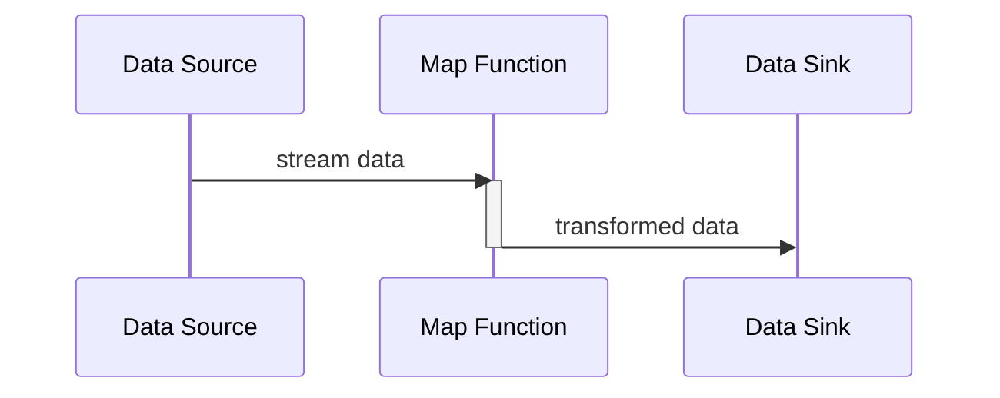

## Map Transformation

### Description

The Map Transformation pattern is a fundamental technique in stream processing paradigms, inspired by functional programming. It involves applying a function to each element within a data stream to transform its content or structure. This transformation is pivotal for tasks such as data cleansing, format unification, and real-time data manipulation.

In a Map Transformation, each input element is processed individually and transformed into an output element. The mapping function is typically pure, maintaining the same input-output relationship for each invocation, which ensures consistency across transformations.

### Context

Map Transformation is widely used in scenarios requiring real-time data manipulation in a streaming environment. Examples include:

- Normalizing text data for case-insensitive operations (e.g., converting text to lowercase).
- Extracting specific fields from complex data structures (e.g., extracting the "device id" from JSON logs).
- Enriching data by adding additional information (e.g., appending a calculated timestamp or latency).

### Architectural Diagram

Below is a simple Mermaid UML Sequence Diagram demonstrating a Map Transformation in a stream processing context:



### Implementation Example

Here's an example of applying a Map Transformation using Java Streams API:

```java
import java.util.List;
import java.util.stream.Collectors;
import java.util.stream.Stream;

public class MapTransformationExample {
    public static void main(String[] args) {
        List<String> messages = Stream.of("Hello World", "Map Transformation", "Data Stream")
                                      .map(String::toLowerCase)  // Map Transformation to lowercase
                                      .collect(Collectors.toList());

        messages.forEach(System.out::println);  // Prints all messages in lowercase
    }
}
```

### Best Practices

1. **Stateless Functions**: Ensure the map function is stateless and side-effect-free to maintain idempotency and predictability.
   
2. **Efficiency**: Optimize the map function for performance, especially in high-throughput systems, as it runs on each element.

3. **Atomicity**: Make transformations atomic to avoid unintended state changes in multi-threaded environments.

4. **Scalability**: Leverage frameworks that facilitate parallel execution for better scalability (e.g., Apache Spark, Flink).

### Related Patterns

- **Filter Pattern**: Often used before or after Map Transformation to include or exclude certain elements based on a condition.
- **Reduce Pattern**: Complements Map Transformation by aggregating elements into a single summary result.
- **Windowing Pattern**: Used to group stream elements into windows for batch processing.

### Additional Resources

- [Functional Programming in Java](https://www.oreilly.com/library/view/functional-programming-in/9781449365509/)
- [Stream Processing with Apache Kafka](https://www.confluent.io/resources/kafka-streams/)

### Summary

Map Transformation is a vital design pattern for processing each element in a data stream, allowing for flexible data evolution and real-time insights. When combined with other patterns and best practices, it greatly enhances the capabilities of a stream processing architecture, providing a robust solution for modern data processing needs.
