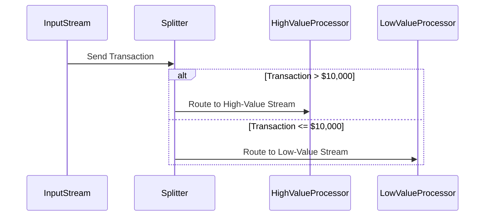

## Overview of Split Transformation

Split Transformation is a pivotal design pattern in stream processing architectures, allowing the division of a data stream into multiple sub-streams based on specific criteria or conditions. This enables different parts of a stream to be processed independently and possibly by different processing components, providing a flexible and efficient way to handle diverse data processing requirements.

### Architectural Approach

The Split Transformation pattern is employed in scenarios where an incoming data stream contains heterogeneous messages that need to be processed differently based on certain attributes, such as type, content, or even metadata associated with each message. The pattern is crucial in streamlining workflows by ensuring that only relevant data reaches a specific processing unit.

Key components of this architecture include:

1. **Splitter Component**: This is responsible for evaluating each message in the stream against predefined conditions to route it to the appropriate sub-stream.

2. **Condition Evaluators**: Sets of rules or expressions used to determine the routing path for each message, often implemented using simple conditional logic or more complex rule engines.

3. **Output Sub-Streams**: Distinct streams that each represent a specific processing pathway based on the conditions defined.

### Example Use Case

Consider a stream of financial transactions, which need to be processed using different fraud detection routines depending on the transaction value. Transactions over $10,000 might undergo a more stringent fraud analysis than those of smaller value.

```java
// Example in Java using Apache Kafka Streams
StreamsBuilder builder = new StreamsBuilder();

KStream<String, Transaction> transactions = builder.stream("transactions-input");

// Split the stream into high-value and low-value transactions
KStream<String, Transaction>[] branches = transactions.branch(
    (key, transaction) -> transaction.getValue() > 10000, // High-value branch
    (key, transaction) -> transaction.getValue() <= 10000 // Low-value branch
);

KStream<String, Transaction> highValueTransactions = branches[0];
KStream<String, Transaction> lowValueTransactions = branches[1];

highValueTransactions.to("high-value-output");
lowValueTransactions.to("low-value-output");

KafkaStreams streams = new KafkaStreams(builder.build(), new Properties());
streams.start();
```

### Benefits and Best Practices

- **Scalability**: By parallelizing the processing workloads across different streams, Split Transformation supports scalable and responsive stream processing systems.
  
- **Flexibility**: Allows for easy adaptation and expansion of processing logic to cater to changing business requirements.

- **Modularity**: Each sub-stream can be processed independently, fostering a modular architecture where processing logic is decoupled and isolated.

**Best Practices**:

- Ensure condition evaluators are optimized to minimize latency and processing overhead.
- Implement robust error handling mechanisms in the splitter component to manage malformed data streams.
- Use observability tools to monitor the throughput and performance of each sub-stream for efficient load balancing.

### Diagrams

Here's a sequence diagram illustrating the flow:



### Related Patterns

- **Filter**: Similar to Split Transformation but focuses on removing unwanted messages rather than routing to specific streams.
- **Aggregator**: In contrast, Aggregator combines multiple messages from a stream, often used in conjunction with Split Transformation for more complex workflows.

### Additional Resources

- [Apache Kafka Streams Documentation](https://kafka.apache.org/documentation/streams/)
- [Designing Data-Intensive Applications by Martin Kleppmann](https://www.oreilly.com/library/view/designing-data-intensive-applications/9781491903063/)

## Summary

The Split Transformation pattern is integral to effective stream processing architectures, enabling the division and specialized handling of data streams. By leveraging this pattern, organizations can achieve responsive, scalable, and modular stream processing systems that effectively support diverse data processing needs.
