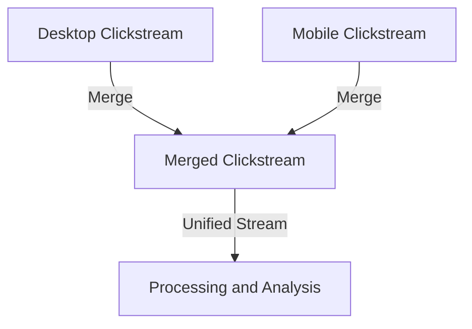

## Overview

The **Merge Streams** pattern involves consolidating multiple data streams into a single cohesive stream. This pattern is essential when similar types of events are produced from multiple sources, such as merging clickstream data collected from both desktop and mobile applications for combined analysis. 

## Applicability

This pattern is particularly useful in scenarios where different data-producing entities generate related or similar data types that need to be processed in a unified manner. By merging streams:

- You ensure more straightforward end-to-end data processing pipelines.
- You can apply uniform analytic operations to combined data sets.
- You maintain a seamless data handling infrastructure, allowing for scalable data integration.

## Architectural Approaches

### Centralized Merge Nodes

In a centralized architecture, a dedicated service is responsible for receiving and merging streams. It collects data from various sources and integrates them before forwarding the unified stream to downstream processing components.

### Distributed Merge Nodes

In distributed streaming platforms like Apache Kafka, you can distribute the merging responsibilities across various processing nodes, aiming to ensure load balancing and fault tolerance.

### Stream Modernization Tools

Modern runtime environments, such as Apache Flink and Google Cloud Dataflow, natively support data stream merging using specific operators that simplify the overall data pipeline development.

## Best Practices 

- **Schema Consistency**: Ensure data schemas are synchronized across different streams to avoid conflicts during merging.
- **Timeliness and Order**: Implement strategies to handle data out-of-order or time discrepancies across streams.
- **Distinct Stream Identification**: Inject identifiers into merged data to trace back to the original data sources.
- **Fault Tolerance**: Consider adopting fault resilient design, as data duplication or loss can occur when merging streams.

## Example Code

Here's an example using Apache Kafka Streams to merge two streams:

```java
KStream<String, ClickEvent> desktopStream = builder.stream("desktop-clicks");
KStream<String, ClickEvent> mobileStream = builder.stream("mobile-clicks");

KStream<String, ClickEvent> mergedStream = desktopStream.merge(mobileStream);

mergedStream.to("merged-clicks-topic");
```

## Diagrams



## Related Patterns

- **Splitter**: This pattern divides a single data stream into multiple streams based on specific routing logic or criteria.
  
- **Aggregator**: This pattern collects data from various streams and performs aggregation functions to generate higher-level data analytics.

## Additional Resources

- **Kafka Streams Documentation**: Offers an in-depth exploration of stream processing using Kafka.
- **Apache Flink Stream Processing**: Provides detailed tutorials on implementing stateful stream processing.
- **Google Cloud Dataflow**: Facilitates advanced stream processing capabilities over vast datasets in real-time.

## Summary

The **Merge Streams** pattern empowers architectural designs requiring the consolidated analysis and processing of data across multiple sources. By ensuring data from different streams is unified for processing, system complexity is reduced, and data handling becomes more efficient. Implementing this pattern effectively enhances the analytic capabilities and scalability of data processing pipelines.
