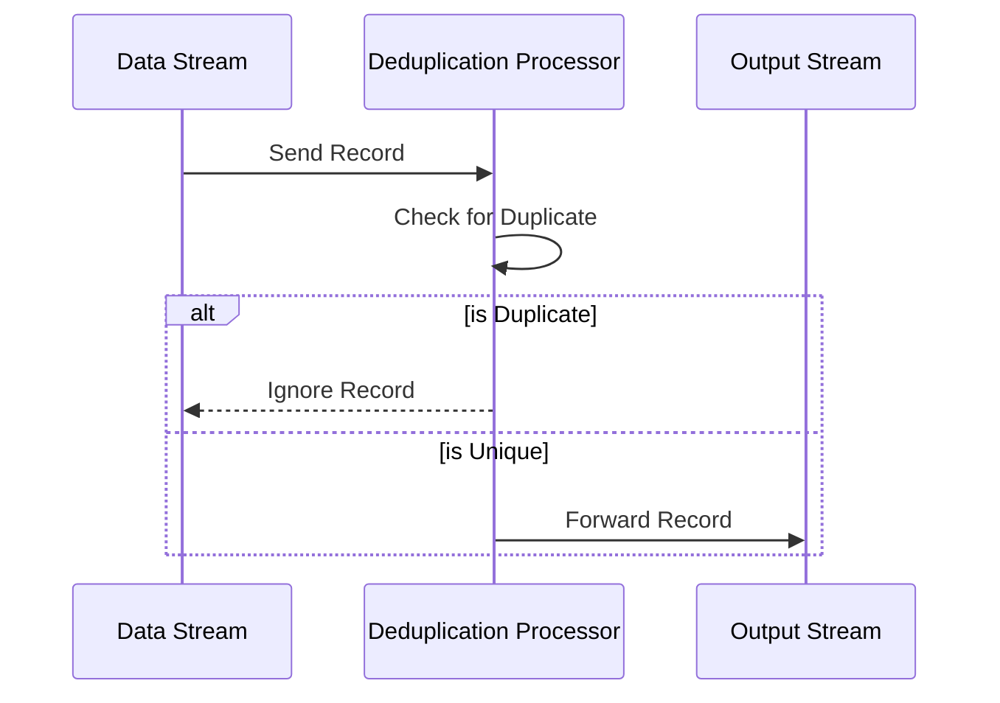

**Deduplication Transformation**

## Description

The Deduplication Transformation pattern is designed to remove duplicate records from a data stream in order to ensure that each unique record or event is processed only once. This pattern is essential in use cases where duplicate data can occur due to retries, delayed delivery, or other anomalies within an unreliable network or data infrastructure. By implementing this pattern, systems can maintain data integrity and avoid redundant processing and resource wastage.

## Architectural Approaches

To effectively implement the Deduplication Transformation pattern in stream processing systems, several architectural approaches can be applied:

1. **Hash-Based Deduplication**:
   - Create a hash of the record's unique identifier (e.g., event ID).
   - Use a distributed data store to keep track of seen hashes and filter out duplicates.

2. **Time-Windowed Deduplication**:
   - Define a time window within which records are considered for deduplication.
   - Maintain a state store to track records within the current window and discard those already seen.

3. **Bloom Filter**:
   - Utilize a probabilistic data structure like a Bloom filter to check if an element has been observed before.
   - This approach is memory-efficient but might allow occasional false positives.

4. **Idempotent Processing**:
   - Design consumers to be idempotent, where processing the same record multiple times yields the same result.
   - Deduplicate downstream based on the result's effect rather than input.

## Best Practices

- **Choose the Right Key**: Ensure that the deduplication key accurately represents the uniqueness of records.
- **Tune Time Windows**: Optimize the size of time windows to balance between memory usage and latency.
- **Persist Deduplication State**: Safely persist state information to ensure reliability across restarts and failures.
- **Handle Late Data**: Define strategies for dealing with late-arriving records. This can involve extending deduplication windows or implementing mechanisms to compensate for delays.

## Example Code

Below is a simplified illustration of deduplication in a Kafka Streams application using Java:

```java
KStream<String, Event> input = builder.stream("input-topic");
KStream<String, Event> deduplicated = input
    .selectKey((key, value) -> value.getId()) // Using event ID as the deduplication key
    .groupByKey()
    .reduce((aggValue, newValue) -> newValue, 
            Materialized.as("deduplication-store")) // Ensuring only unique events are kept
    .toStream();

deduplicated.to("output-topic");
```

## Diagrams

### Deduplication Transformation Flow



## Related Patterns

- **Idempotent Receiver**: Ensures that a service can handle duplicate delivery of the same message without side effects.
- **Event Sourcing**: A pattern that captures changes as a sequence of events, which can help in building a reconstructible state that naturally tolerates duplication.

## Additional Resources

- [Kafka Streams Documentation](https://kafka.apache.org/documentation/streams/)
- [Managing and Testing Data Stream Deduplication](https://www.confluent.io/blog/)
- [When to Use Bloom Filters](https://en.wikipedia.org/wiki/Bloom_filter)

## Summary

The Deduplication Transformation pattern is a crucial component in stream processing pipelines that encounter duplicate messages or events. By implementing suitable architectural approaches such as hash-based deduplication, time-windowed mechanisms, or leveraging probabilistic data structures like Bloom filters, it is possible to maintain the quality and efficiency of real-time data processing systems. Understanding the operational considerations and related patterns helps optimize data handling in distributed systems.
