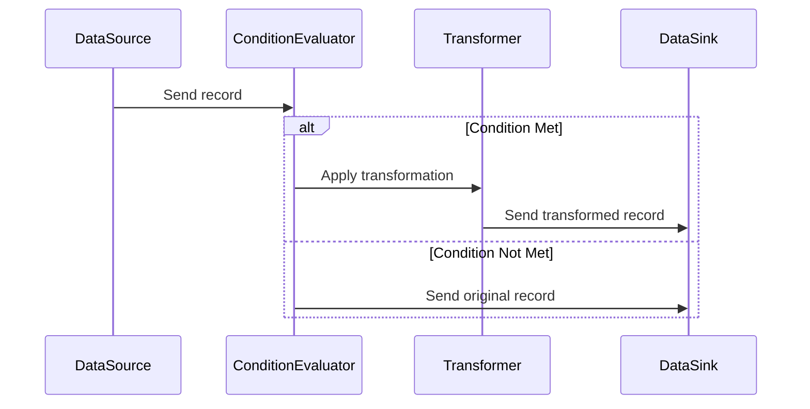

## Introduction

In the realm of stream processing, it's often necessary to apply transformations selectively based on the characteristics of the data. The **Conditional Transformation** pattern addresses this need by enabling the application of transformations to data streams only when specific conditions are satisfied.

## Description

The Conditional Transformation pattern allows structured and efficient handling of data transformations, ensuring that only data meeting certain criteria is altered. This is especially critical in scenarios involving large volumes of data where unnecessary transformations could lead to performance bottlenecks or security risks, such as exposure of sensitive information.

## Application Areas

- **Data Masking for Sensitive Information**: A common use case is the application of data masking techniques to sensitive information such as credit card numbers or personally identifiable information (PII). The transformation is applied only when a record contains this type of data.
  
- **Data Enrichment**: Sometimes additional data needs to be appended to a record based on certain conditions, such as if a geolocation tag is missing.

- **Filtering and Alerting**: Transformation logic can decide to send alerts or filter data streams when certain conditions are met, for instance, when anomaly detection systems find unusual patterns in the data.

## Architectural Approach

1. **Condition Evaluation**: A module or function evaluates each record against predefined conditions.
2. **Conditional Execution**: If the conditions are met, a transformation function is applied; otherwise, the data is passed unchanged.
3. **Chain of Responsibility**: Multiple conditions and transformations can be applied in sequence using a chain of responsibility pattern, allowing for flexible and composable transformation logic.

## Example Code

The following is a simple illustration using Java and the Apache Kafka Streams library:

```java
import org.apache.kafka.streams.KafkaStreams;
import org.apache.kafka.streams.StreamsBuilder;
import org.apache.kafka.streams.kstream.KStream;
import org.apache.kafka.streams.kstream.Predicate;

public class ConditionalTransformationExample {
    public static void main(String[] args) {
      StreamsBuilder builder = new StreamsBuilder();
      KStream<String, String> input = builder.stream("input-topic");

      // Predicate to check for sensitive information
      Predicate<String, String> containsSensitiveInfo = (key, value) -> value.contains("creditcard");

      // Apply conditional transformation
      KStream<String, String> transformed = input.filter(containsSensitiveInfo)
          .mapValues(value -> {
              // Mask credit card numbers
              return value.replaceAll("\\d{4}-\\d{4}-\\d{4}-\\d{4}", "XXXX-XXXX-XXXX-XXXX");
          });

      transformed.to("output-topic");

      KafkaStreams streams = new KafkaStreams(builder.build(), /* configuration */);
      streams.start();
    }
}
```

## Diagram



## Related Patterns

- **Filter**: Filters records based on conditions, often used in conjunction with Conditional Transformation.
- **Data Masking**: Specifically applies transformations for obfuscating sensitive data.
- **Content Enricher**: Enhances incoming records with additional data based on conditions.

## Additional Resources

- *Designing Data-Intensive Applications* by Martin Kleppmann
- Apache Kafka and Kafka Streams Documentation
- Cloud provider-specific documentation for stream processing e.g., AWS Kinesis or Google Cloud Pub/Sub.

## Summary

The Conditional Transformation pattern is an essential tool for selectively applying transformations to data streams. By tailoring data transformations to specific conditions, systems can be optimized for performance, ensure data security, and maintain high integrity of processing tasks. This pattern finds extensive use across industries where data privacy, scalability, and efficiency are priorities.
