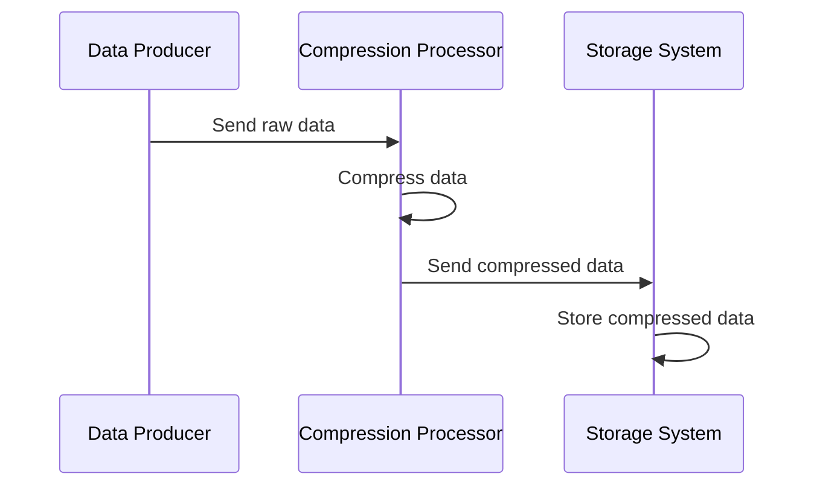

## Description
In the realm of data transformation patterns, the **Compression Transformation** pattern is employed to optimize data streams by reducing their size. This is typically achieved through compression algorithms which serve a dual purpose: reducing bandwidth consumption during data transmission and minimizing storage requirements on the receiving end. Especially beneficial in scenarios involving large datasets, such as multimedia files or extensive logs, this pattern is integral to efficient resource utilization in distributed systems.

## Architectural Approaches

### Use Cases
One of the primary use cases for compression transformation is streaming large binary objects, such as images or videos, to a storage service. By compressing these data streams before transmission, applications can achieve significant bandwidth savings and potentially improve throughput.

### Implementation Considerations
When implementing compression within stream processing:

- **Choice of Compression Algorithm**: This can significantly affect performance. Algorithms such as GZIP, LZ4, or Snappy each have trade-offs between compression speed and the compression ratio.
- **Latency and Throughput**: Depending on the use case, a balance between latency introduced by compression and the throughput benefits should be considered.
- **Error Handling**: Important to manage scenarios where compressed data might become corrupted during transit or storage.

## Example Code

Below is a simple example of how you might implement compression transformation using Apache Kafka Streams and the Snappy compression algorithm in Java.

```java
import org.apache.kafka.clients.producer.ProducerConfig;
import org.apache.kafka.common.serialization.Serdes;
import org.apache.kafka.streams.KafkaStreams;
import org.apache.kafka.streams.StreamsBuilder;
import org.apache.kafka.streams.Topology;
import org.apache.kafka.streams.kstream.KStream;
import java.util.Properties;

public class CompressionTransformation {
    public static void main(String[] args) {
        Properties props = new Properties();
        props.put(StreamsConfig.APPLICATION_ID_CONFIG, "compression-transformation");
        props.put(StreamsConfig.BOOTSTRAP_SERVERS_CONFIG, "localhost:9092");
        props.put(StreamsConfig.DEFAULT_KEY_SERDE_CLASS_CONFIG, Serdes.String().getClass());
        props.put(StreamsConfig.DEFAULT_VALUE_SERDE_CLASS_CONFIG, Serdes.ByteArray().getClass());

        // Set producer compression type to Snappy
        props.put(ProducerConfig.COMPRESSION_TYPE_CONFIG, "snappy");

        StreamsBuilder builder = new StreamsBuilder();
        KStream<String, byte[]> sourceStream = builder.stream("input-topic");

        KStream<String, byte[]> compressedStream = sourceStream.mapValues(value -> {
            // Compression logic using Snappy
            return Snappy.compress(value);
        });

        compressedStream.to("output-topic");

        Topology topology = builder.build();
        KafkaStreams streams = new KafkaStreams(topology, props);
        streams.start();
    }
}
```

## Diagrams



## Related Patterns

- **Batch Processing Patterns**: Similar goals of reducing size, although compression in batch processing typically focuses on post-aggregation stages.
- **Aggregation Transformation**: Often used alongside compression to further reduce data size through summarization before compression.

## Additional Resources

- [Kafka Streams Documentation](https://kafka.apache.org/documentation/streams/)
- [Data Compression Explained](https://www.data-compression.com/)

## Summary
Compression Transformation is a quintessential pattern in stream processing, particularly beneficial for bandwidth conservation and storage efficiency. Choosing the correct compression algorithm and implementing it effectively can lead to significant performance and cost benefits in large-scale data streaming scenarios. Balancing the trade-offs with latency and error management is crucial for optimal outcomes.
