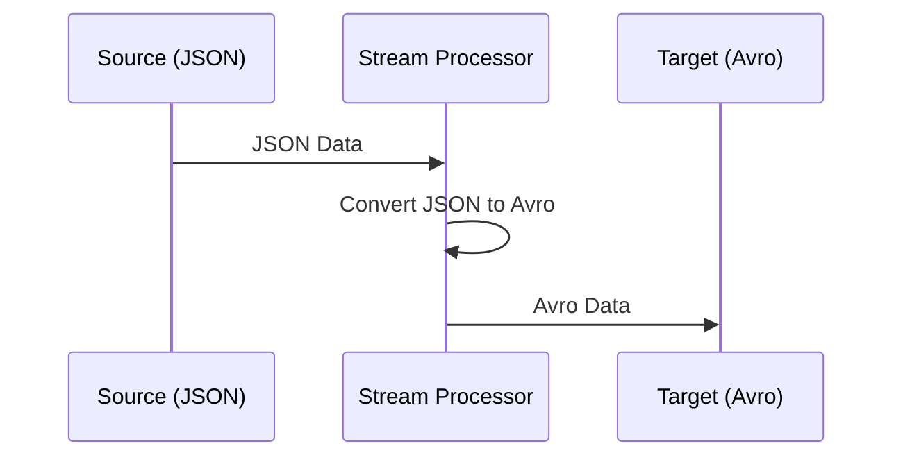

## Overview

Format Conversion is a critical design pattern in stream processing environments where data arrives in multiple formats and needs to be standardized or transformed to facilitate seamless processing, analytics, or storage. This pattern helps ensure data compatibility across various systems and simplifies downstream processing by converting data formats like XML, JSON, Avro, and Protocol Buffers.

## Architectural Approaches

1. **In-Stream Format Conversion**: Data is converted on-the-fly as it enters the stream processing system. This method minimizes latency and aligns data formats quickly to meet immediate downstream processing demands.

2. **Pre-Processing Conversion**: Data is transformed before entering the main processing pipeline. This is common when dealing with batch uploads or pre-defined sets of data that need to be in a specific format.

3. **Post-Processing Conversion**: After data has been processed, it is then converted into the required format for storage or integration with other services.

## Best Practices

- **Schema Management**: Implement a centralized schema registry to manage different data format schemas, which ensures consistent conversion processes across all stages of the pipeline.

- **Scalability Considerations**: Design the conversion processes to handle varying data loads efficiently. Utilize cloud services that offer auto-scaling for seamless scaling of conversion services.

- **Idempotency**: Ensure that conversions are idempotent so repeated operations don't produce different results, facilitating retry mechanisms in case of failures.

- **Error Handling**: Implement robust error handling mechanisms. Log conversion errors and employ strategies, such as dead-letter queues, to handle failed conversions without data loss.

## Example Code

### JSON to Avro Conversion with Kafka Streams (Java)

```java
import org.apache.kafka.streams.KafkaStreams;
import org.apache.kafka.streams.StreamsBuilder;
import org.apache.kafka.streams.kstream.KStream;

public class JsonToAvroStreamProcessing {
    public static void main(String[] args) {
        StreamsBuilder builder = new StreamsBuilder();
        
        KStream<String, String> jsonStream = builder.stream("input-topic");
        
        KStream<String, AvroRecord> avroStream = jsonStream.mapValues(jsonString -> {
            // Conversion logic using a JSON to Avro library
            AvroRecord avroRecord = convertJsonToAvro(jsonString);
            return avroRecord;
        });
        
        avroStream.to("output-topic");
        
        KafkaStreams streams = new KafkaStreams(builder.build(), getProperties());
        streams.start();
    }
    
    // Method to convert JSON String to AvroRecord
    private static AvroRecord convertJsonToAvro(String jsonString) {
        // Conversion implementation
        // Use Avro libraries for conversion
        // Example: AvroConverter.convert(jsonString);
        return new AvroRecord(); // Placeholder
    }
    
    private static Properties getProperties() {
        Properties props = new Properties();
        props.put("application.id", "json-to-avro-converter");
        props.put("bootstrap.servers", "localhost:9092");
        // Other necessary properties
        return props;
    }
}
```

## Diagram



## Related Patterns

- **Schema Evolution**: Collaborates with format conversion to manage data schema changes over time, ensuring backward or forward compatibility.

- **Message Enrichment**: Can be paired with format conversion to add context to the data after it has been converted to the desired format.

- **Data Aggregation**: Follows format conversion when aggregating data from different sources that share a common format post-conversion.

## Additional Resources

- [Apache Kafka Documentation](https://kafka.apache.org/documentation/)
- [Confluent Schema Registry](https://docs.confluent.io/platform/current/schema-registry/index.html)
- [Apache Avro Documentation](https://avro.apache.org/docs/)

## Summary

Format Conversion is an essential pattern for handling various data formats within stream processing environments. It bridges the gap between diverse data sources and the uniformity required by processing functions, ensuring data flows efficiently across systems. Implementing this pattern requires careful consideration of schema management, error handling, and scalability to seamlessly support data transformation needs in cloud-native architectures.
