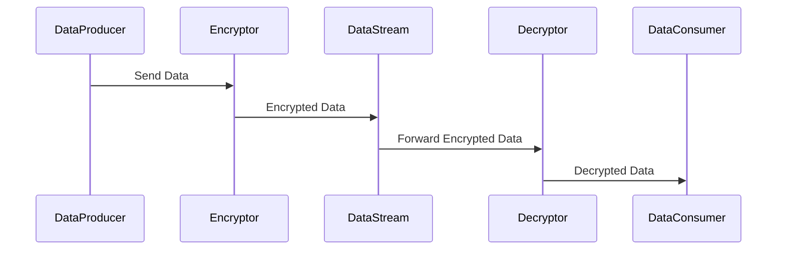

## Overview

The Encryption/Decryption Transformation pattern involves the process of encrypting or decrypting data as it flows through a data stream. This pattern is essential for ensuring data security, privacy, and compliance with legal standards such as GDPR or HIPAA. The transformation ensures that sensitive information remains protected from unauthorized access during transit or processing.

## Detailed Explanation

In a cloud-based environment, data often needs to move between different systems or components, which can expose it to various security risks. Encrypting data during transmission and decrypting it when it reaches its destination is crucial to maintaining its integrity and confidentiality.

- **Encryption** involves converting plaintext data into a secure format that can only be read by someone who has the decryption key.
- **Decryption** is the reverse process, transforming the encrypted data back to its original form using the correct key.

### Common Use Cases

- **Protecting PII**: Encrypt PII fields such as social security numbers, names, and addresses as they are processed and stored in databases or cloud storage services to comply with privacy regulations.
- **Securing Communication Channels**: Use encryption to secure data flowing through APIs or communication channels between microservices to prevent eavesdropping or data tampering.
- **Data Integrity Assurance**: Ensure that data has not been altered in transit by verifying it after decryption.

## Example Code

```java
import javax.crypto.Cipher;
import javax.crypto.KeyGenerator;
import javax.crypto.SecretKey;
import java.util.Base64;

public class EncryptionDecryptionExample {

    public static void main(String[] args) throws Exception {
        // Generating a secret key for encryption
        KeyGenerator keyGenerator = KeyGenerator.getInstance("AES");
        keyGenerator.init(256); // using AES with a key size of 256 bits
        SecretKey secretKey = keyGenerator.generateKey();

        // Original data
        String dataToEncrypt = "SensitiveInformation";

        // Encrypt the data
        Cipher encryptCipher = Cipher.getInstance("AES");
        encryptCipher.init(Cipher.ENCRYPT_MODE, secretKey);
        byte[] encryptedData = encryptCipher.doFinal(dataToEncrypt.getBytes());
        String encryptedDataString = Base64.getEncoder().encodeToString(encryptedData);
        System.out.println("Encrypted Data: " + encryptedDataString);

        // Decrypt the data
        Cipher decryptCipher = Cipher.getInstance("AES");
        decryptCipher.init(Cipher.DECRYPT_MODE, secretKey);
        byte[] decryptedData = decryptCipher.doFinal(Base64.getDecoder().decode(encryptedDataString));
        String decryptedDataString = new String(decryptedData);
        System.out.println("Decrypted Data: " + decryptedDataString);
    }
}
```

## Diagrams

Here is a sequence diagram for the Encryption/Decryption Transformation:



## Related Patterns

- **Data Masking**: Obscures specific data within a dataset to protect sensitive information.
- **Secure Messaging**: Ensures the integrity and confidentiality of messages sent between systems.
- **Tokenization**: Replaces sensitive data elements with non-sensitive equivalents or tokens.

## Additional Resources

- [NIST Encryption Standards](https://www.nist.gov/itl/encryption)
- [Cryptography in Cloud Security](https://aws.amazon.com/cloud-security/crypto/)
- [GDPR Compliance and Its Impact on Data Processing](https://gdpr-info.eu/)

## Summary

The Encryption/Decryption Transformation pattern is integral to cloud computing and data processing strategies where data security and privacy are paramount. Implementing this pattern requires careful choice of cryptographic techniques and key management practices to ensure robust protection of data as it moves through processing pipelines or over network channels. The incorporation of this pattern allows organizations to comply with regulatory requirements and gain trust from users by safeguarding their sensitive information.
