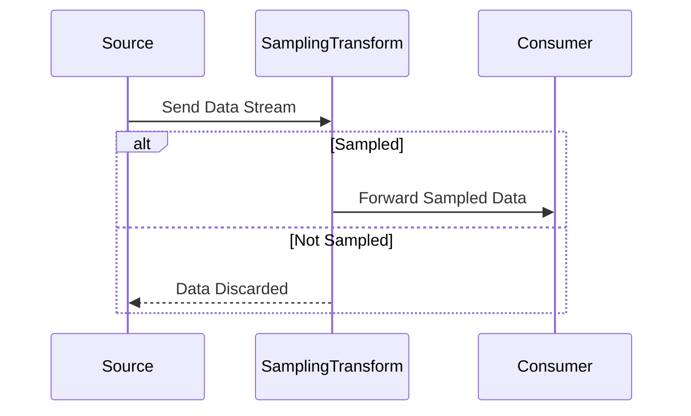

## Overview

The **Sampling Transformation** pattern is employed to select only a subset of input data for downstream processing in systems dealing with high-throughput data streams. This approach aims to reduce the computational and storage burden by focusing on a representative sample that can provide sufficient insight into the overall data trends or characteristics. Common applications include monitoring, analytics, logging, and diagnostics, where completeness is less critical than efficiency or speed.

### Use Cases

- **Network Performance Monitoring**: Monitoring tools often sample a fraction of the packets or requests to assess network performance metrics effectively without overloading the processing systems.
- **Data Aggregation**: Systems performing data aggregation use sampling to ensure high-quality, timely statistics without emphasizing every single event in data-boarding frameworks.
- **Real-time Analytics**: In scenarios such as tracking audience engagement in real-time during live streaming events, sampling is used to derive representative insights at scale.

### Implementation Strategy

1. **Sampling Rate Definition**: Define a clear policy or parameter (e.g., 10% selection) to guide the subset selection process based on requirements and system capacity.
2. **Random vs. Stratified Sampling**: Decide whether simple random sampling is appropriate, or whether stratified sampling (ensuring certain subsets criteria are always represented) is more beneficial.
3. **Integration into Stream Processing**: Use stream processing frameworks (such as Apache Kafka Streams, Apache Flink, or Apache Beam) that support sampling transformations as operators or custom functions.
4. **Testing & Validation**: Ensure the sampling provides statistically significant and valid results comparable to a full dataset.

### Example Code

Here's a simple example using Apache Flink to demonstrate a sampling transformation:

```java
DataStream<Event> eventDataStream = ...;

// Sampling with a simple 10% probability filter
DataStream<Event> sampledStream = eventDataStream
  .filter(event -> Math.random() < 0.1);

sampledStream.process(new SampledEventProcessor());
```

### Diagram

Here's a UML Sequence Diagram illustrating how data flows through a system employing the Sampling Transformation pattern:



### Related Patterns

- **Filter Pattern**: Similar but more selective with complex conditions applied rather than a simple probabilistic sampling.
- **Load Shedding Pattern**: Involves discarding select portions of data under conditions of overload.
- **Aggregation Pattern**: Often combined with sampling to calculate condensed views of large datasets.

### Additional Resources

- **Apache Flink Documentation**: [Flink sampling operations](https://flink.apache.org)
- **Apache Kafka Streams Documentation**: [Kafka Streams processing](https://kafka.apache.org/documentation/streams)
- **Sampling and Stream Processing Best Practices**: [Stream processing concepts](https://stream-processing-management.com)

## Final Summary

The Sampling Transformation pattern is vital in stream processing environments where data volume and processing load are major concerns. By strategically allowing a representative subset of data through the system, organizations can maintain efficiency and responsiveness, ensuring that gains in performance do not sacrifice significant trends within the data. Successfully implementing this pattern requires careful consideration of sampling methods, adequate testing, and clear alignment with broader data processing goals.
