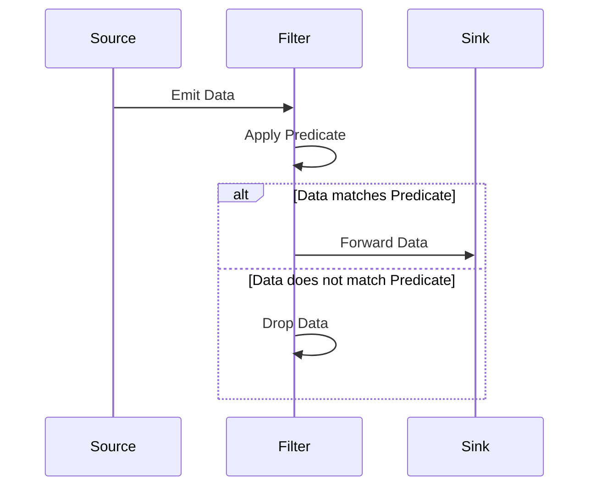

## Introduction

In the realm of real-time data processing, the **Filter Transformation** pattern is essential for managing and processing high-volume data streams efficiently. By removing elements that do not meet specified criteria, it enables systems to focus on relevant data only, thus improving performance and reducing computational burden.

## Pattern Overview

**Filter Transformation** is a stream processing pattern wherein data elements are selectively passed through based on user-defined predicates or conditions. It serves as a gatekeeper, allowing only the data that meets certain thresholds or conditions to continue through the data pipeline.

### Key Components:

- **Predicate Function**: The logical condition that elements must satisfy to be retained in the stream.
- **Stream Source**: The source emitting the continuous flow of data elements.
- **Filtered Stream**: The resulting stream after applying the filter criteria, containing only elements that satisfy the predicate.

## Applicability

This pattern is most effective in scenarios where:

- **Efficient Resource Utilization**: Processing resources are limited, so it's necessary to only process significant data.
- **Data Reduction**: There's a need to minimize the amount of data being transmitted or stored.
- **Targeted Processing**: Only specific data needs further processing, analysis, or storage.

## Example Use Case

Consider a log monitoring system for a large-scale web application. The filter transformation pattern can be used here to:

- **Filter Out Noise**: For instance, you may want to ignore log entries that are at the "DEBUG" level and process only "INFO", "WARN", and "ERROR" levels.
- **Real-time Monitoring**: Allow security alerts, errors, and significant warnings to be processed in real-time while ignoring routine entries.

### Example Code

Here's a simple example using the Java Stream API demonstrating filter transformation:

```java
import java.util.Arrays;
import java.util.List;

public class FilterExample {
    public static void main(String[] args) {
        List<String> logLevels = Arrays.asList("DEBUG", "INFO", "WARN", "ERROR");
        
        logLevels.stream()
                 .filter(level -> !level.equals("DEBUG"))
                 .forEach(System.out::println);
    }
}
```

## Diagrams

Below is a Mermaid UML Sequence Diagram illustrating the filter transformation:



## Best Practices

- **Select Efficient Predicates**: Ensure that the predicates used are not computationally expensive, as this could negate the benefits of using the filter.
- **Data Profiling**: Before applying filters, perform data profiling to understand the distribution and nature of data.
- **Dynamic Filtering**: Implement mechanisms to dynamically update filter conditions in response to evolving business requirements without downtime.

## Related Patterns

- **Map Transformation**: Applies a function to each data element, often used before or after filtering to transform data.
- **Partitioning**: Divides streams into manageable sections or windows based on specific criteria, often complementary to filtering.
- **Aggregation**: Synthesizes data from multiple elements into aggregated results, commonly used after filtering.

## Additional Resources

- [Apache Kafka Streams Documentation](https://kafka.apache.org/documentation/streams/)
- [Google Cloud Dataflow](https://cloud.google.com/dataflow/docs)
- [AWS Kinesis Data Streams](https://aws.amazon.com/kinesis/data-streams/)

## Summary

The **Filter Transformation** pattern plays a critical role in modern data stream processing architectures by ensuring that only pertinent and valuable data is processed, reducing resource consumption and enhancing the efficiency of downstream systems. Its ability to adapt and be applied in various contexts makes it a foundational pattern in any robust data streaming infrastructure.
