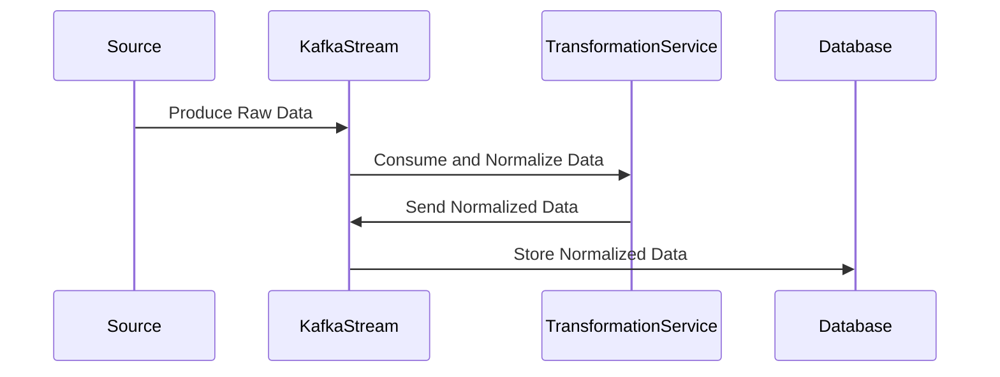

## Introduction

Normalization is a crucial design pattern in stream processing, particularly when dealing with data integration from diverse sources. It involves transforming data into a uniform scale or format, allowing for coherent analysis, aggregation, and processing. This is especially important in big data environments where data may come from disparate systems with varying formats, units, or scales.

## Problem Statement

In stream processing systems, data inputs are typically received from a multitude of sources, each with its own format and semantic conventions. This variability can introduce challenges in aggregating, comparing, and analyzing data. Without normalization, there could be significant issues related to data inconsistencies:

- **Inconsistent Units**: For example, temperature data arriving in both Fahrenheit and Celsius.
- **Variability in Formats**: Date formats such as MM-DD-YYYY and DD-MM-YYYY.
- **Scaling Disparities**: Different scales in measurements like currency.

## Solution

The solution is to apply normalization techniques during the ETL (Extract, Transform, Load) process of the data pipeline. This can be conducted using various methods depending on the nature of the inconsistency:

- **Unit Conversion**: Convert all measurements to a common unit (e.g., all temperatures to Celsius).
- **Standardized Formats**: Enforce consistent date and time formats across data.
- **Scale Adjustment**: Normalize values to a standard scale where necessary (e.g., currency exchange rates).

### Example Code

In a stream processing application using Apache Kafka Streams, Java can be utilized as follows for normalization:

```java
StreamsBuilder builder = new StreamsBuilder();

KStream<String, TemperatureReading> temperatureStream = builder.stream("temperature-events");

KStream<String, TemperatureReading> normalizedStream = temperatureStream.mapValues(reading -> {
    if (reading.getUnit().equalsIgnoreCase("F")) {
        double celsius = (reading.getValue() - 32) * 5.0 / 9.0;
        return new TemperatureReading(celsius, "C");
    }
    return reading; // Already in Celsius
});

normalizedStream.to("normalized-temperature-events");
```

### UML Sequence Diagram



## Best Practices

- **Schema Registry**: Use a schema registry to define uniform data formats and verify incoming data against these schemas.
- **Robust Monitoring**: Implement monitoring to detect and alert on deviations or anomalies in data formats.
- **Logging and Tracing**: Maintain detailed logs to trace the origin and transformation steps of data.

## Related Patterns

- **ETL Pattern**: Often used in conjunction with normalization where Extract, Transform, and Load processes incorporate normalization steps.
- **Data Masking Pattern**: To anonymize or mask sensitive data during normalization.
- **Validation**: To ensure data integrity and verify format compliance.

## Additional Resources

- [Apache Kafka Documentation](https://kafka.apache.org/documentation/)
- [Confluent Schema Registry](https://docs.confluent.io/platform/current/schema-registry/index.html)
- ["Streaming Systems" by Tyler Akidau et al.](https://www.oreilly.com/library/view/streaming-systems/9781491983874/) - A comprehensive guide to stream processing.

## Summary

Normalization is an essential pattern in data processing that enables systems to deal with heterogeneous data sources by converting data into a consistent format or scale. This transformation is key to ensuring data is usable, reliable, and ready for further analysis or processing, thereby supporting effective decision-making and analytics in stream processing systems.
