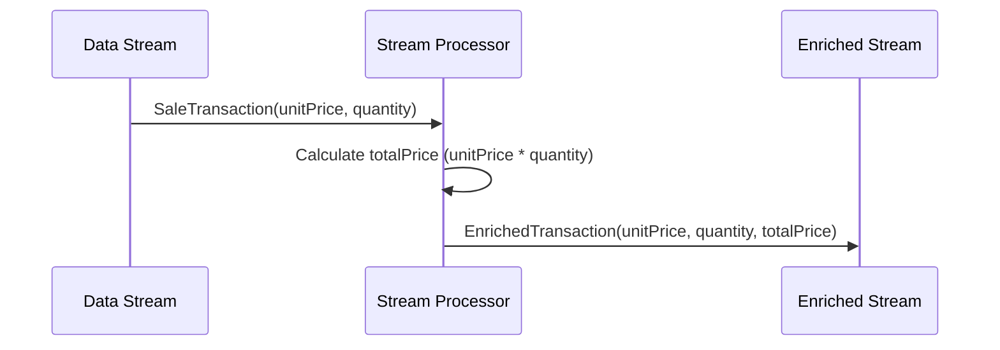

## Calculated Fields

### Description
The Calculated Fields pattern involves enriching incoming data streams by creating new fields that are derived from existing fields through various calculations. This pattern enhances the value of streaming data by providing additional context or insights, without altering the original data elements.

### Context and Problem
In streaming applications, there often arises a need to perform real-time calculations to derive new metrics or values. For example, in an e-commerce sales stream, each sales record has a `unit_price` and `quantity`. It would be beneficial to compute a `total_price` directly in the stream for each transaction. However, directly altering the source data can violate data integrity or introduce latency issues.

### Solution
To implement Calculated Fields, utilize the capabilities of stream processing frameworks that support real-time transformations and aggregations:

1. **Scenario Setup**: Identify the fields that require computation and the formula to be used.
2. **Data Flow**: As data flows through the processing pipeline, use operators to apply the specified calculations.
3. **Output Augmentation**: Emit the enriched data stream that includes both the original and the newly calculated fields.

### Example Code
Below is a Scala implementation using Apache Flink, a popular stream processing framework:

```scala
import org.apache.flink.streaming.api.scala._

case class SaleTransaction(unitPrice: Double, quantity: Int)

case class EnrichedTransaction(unitPrice: Double, quantity: Int, totalPrice: Double)

object CalculatedFieldsExample {
  def main(args: Array[String]): Unit = {
    val env = StreamExecutionEnvironment.getExecutionEnvironment

    val transactionStream: DataStream[SaleTransaction] = env
      .fromElements(
        SaleTransaction(100.0, 2),
        SaleTransaction(200.0, 1),
        SaleTransaction(150.0, 5)
      )

    val enrichedStream: DataStream[EnrichedTransaction] = transactionStream
      .map(trx => EnrichedTransaction(trx.unitPrice, trx.quantity, trx.unitPrice * trx.quantity))

    enrichedStream.print()

    env.execute("Calculated Fields Example")
  }
}
```

### Diagram


### Related Patterns
- **Filter**: Selecting only those rows from a data stream that meet certain criteria.
- **Aggregation**: Summarizing multiple events into a single item.
- **Mapping**: Transforming each element in a data stream through a defined function.

### Best Practices
- Ensure calculations are idempotent to maintain data accuracy.
- Avoid complex computations that can lead to performance bottlenecks.
- Utilize parallelism in stream processing frameworks to handle high-volume streams efficiently.

### Additional Resources
- [Apache Kafka Streams documentation](https://kafka.apache.org/documentation/streams/)
- [Apache Flink stream processing tutorials](https://ci.apache.org/projects/flink/flink-docs-stable/learn-flink/index.html)
- [Google Cloud Dataflow documentation](https://cloud.google.com/dataflow/docs)

### Summary
The Calculated Fields pattern is instrumental in enriching data streams by adding valuable derived data. It allows enterprises to perform on-the-fly analytics and deliver calculated metrics in real-time, thus facilitating enhanced decision-making processes based on enriched datasets.
