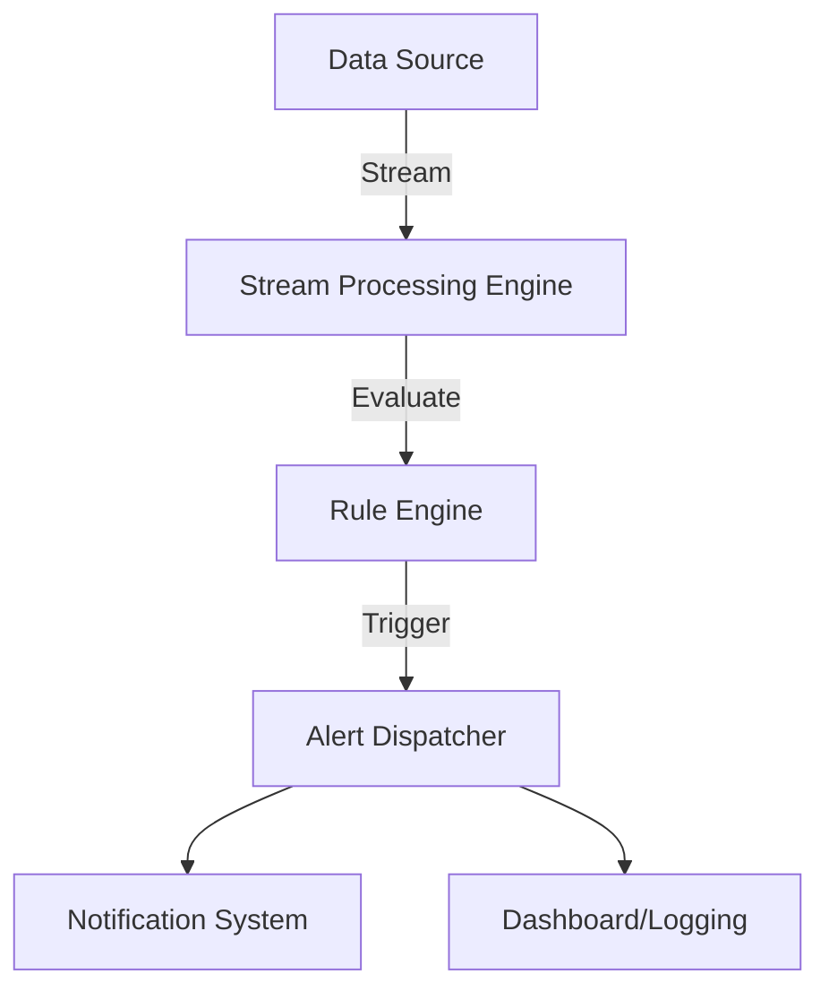

## Overview of Alert Generation Pattern

The Alert Generation pattern involves the detection of certain predefined conditions in a data stream to produce alerts. This pattern is particularly useful for real-time systems where immediate attention is required based on the occurrence of specific patterns or thresholds. Whether it's monitoring logs for error rate anomalies or financial transactions for fraud detection, this pattern is fundamental in maintaining safety, reliability, and security across various domains.

### Key Characteristics

- **Real-Time Processing**: Alerts are produced in real-time to enable prompt action.
- **Threshold/Condition-Based**: Uses thresholds or complex conditions to identify when to trigger alerts.
- **Scalability**: Must handle varying loads efficiently as data volume can spike unexpectedly.
- **Use of Complex Event Processing (CEP)**: Utilizes CEP tools to detect patterns and conditions over time.

## Architectural Approaches

Alert Generation systems are generally architected around stream processing platforms such as Apache Kafka Streams, Apache Flink, or Apache Samza. These platforms facilitate handling large volumes of data in real-time with low latency. Architecturally, a typical alert generation system may comprise the following components:

- **Data Ingestion Layer**: Captures incoming data streams and funnels them into the processing engine.
- **Rule Engine**: Evaluates data against pre-defined rules and thresholds using complex event processing (CEP).
- **Alert Dispatcher**: Notifies external systems and/or users when conditions are met.

### Diagram Overview



## Best Practices

1. **Define Clear Conditions**: Clearly define the conditions under which alerts should be generated to avoid unnecessary alarms.
2. **Optimize for Latency**: Ensure that the system processes data with minimum latency to deliver timely alerts.
3. **Scalable Infrastructure**: Use cloud-native solutions to dynamically scale processing resources based on load.
4. **Implement Rate Limiting**: Prevent global alert storms by establishing limits on alert frequency.
5. **Granular Alerting**: Customize alert granularity to range from simple threshold-based alerts to advanced pattern-induced alerts.

## Example Code

For illustration, here’s a simple example using Apache Kafka Streams in Java to generate alerts when error messages exceed a threshold in logs:

```java
StreamsBuilder builder = new StreamsBuilder();
KStream<String, String> logStream = builder.stream("logs");
          
KStream<String, String> errorAlerts = logStream
    .filter((key, value) -> value.contains("ERROR"))
    .groupByKey()
    .windowedBy(TimeWindows.of(Duration.ofMinutes(1)))
    .count()
    .filter((windowedKey, count) -> count > THRESHOLD)
    .mapValues(value -> "Error rate exceeded the threshold of " + THRESHOLD);

errorAlerts.to("alerts");

KafkaStreams streams = new KafkaStreams(builder.build(), props);
streams.start();
```

## Related Patterns

- **Threshold Detection**: Similar to alert generation but may not always involve real-time processing, often used in batch processing scenarios.
- **Data Filtering**: Precedes alert generation to ensure only relevant data is considered.

## Additional Resources

1. [The Kafka Streams Documentation](https://kafka.apache.org/documentation/streams/)
2. [Complex Event Processing using Apache Flink](https://ci.apache.org/projects/flink/flink-docs-stable/dev/libs/cep.html)
3. [Real-Time Analytics with Apache Storm](https://storm.apache.org/releases/current/Real-time-analytics.html)

## Summary

The Alert Generation pattern is integral to building responsive and resilient systems that require immediate attention to specific conditions detected in data streams. By leveraging advanced stream processing technologies and adhering to best practices, organizations can ensure timely, accurate alert delivery to maintain operational security, stability, and efficiency.
