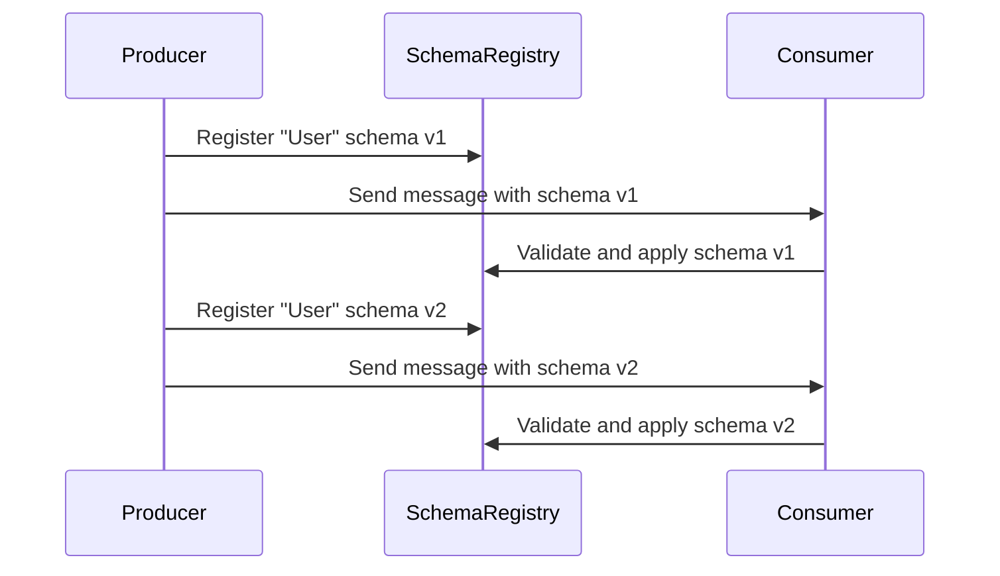

## Overview

Schema Evolution Handling is crucial in environments where data structures change over time. This design pattern ensures that your transformation logic can adapt to changes in data schemas, such as adding, removing, or modifying fields, without interrupting the data pipeline's existing operations.

Data systems often evolve to support new features, and those developments frequently involve schema changes in underlying data structures. It's essential for stream processing systems to handle these changes gracefully to maintain data integrity and application resilience.

## Architectural Approaches

1. **Schema Versioning**:
   - Maintain documentation and versions for every schema change. Each dataset or message has an associated version number to identify the structure it follows.
   
2. **Backwards Compatibility**:
   - Ensure that newer versions of your software can read data written with older schema versions.

3. **Forwards Compatibility**:
   - Enable older versions of your software to process new data structures by using flexible parsing logic (e.g., ignoring unknown fields).

4. **Dynamic Schema Handling**:
   - Use technologies such as Apache Avro, Protocol Buffers, or JSON Schema, which support dynamic schemas to facilitate flexible data processing.

## Best Practices

- **Use Flexible Data Serialization Formats**: Formats like Avro, Protocol Buffers, or JSON with Schema Validation for their capabilities in managing evolving data structures.
  
- **Coordinate Schema Changes**: Implement procedures to transition schemas, ensuring producers and consumers in your data pipelines are updated correctly.

- **Graceful Fallbacks**: Implement fallback logic to handle unexpected or dropped fields gracefully, such as default values or data augmentation techniques.

## Example Code

Here's a simple example using Avro to manage schema evolution:

```java
import org.apache.avro.Schema;
import org.apache.avro.generic.GenericData;
import org.apache.avro.generic.GenericRecord;

public class SchemaEvolutionExample {
    public static void main(String[] args) {
        String oldSchemaJson = "{ \"type\":\"record\", \"name\":\"User\", \"fields\":[{ \"name\":\"username\", \"type\":\"string\"}]}";
        String newSchemaJson = "{ \"type\":\"record\", \"name\":\"User\", \"fields\":[{ \"name\":\"username\", \"type\":\"string\"}, { \"name\":\"user_age\", \"type\":\"int\", \"default\":25}]}";

        Schema oldSchema = new Schema.Parser().parse(oldSchemaJson);
        Schema newSchema = new Schema.Parser().parse(newSchemaJson);
        
        GenericRecord recordOldSchema = new GenericData.Record(oldSchema);
        recordOldSchema.put("username", "john_doe");
        
        GenericRecord recordNewSchema = new GenericData.Record(newSchema);
        recordNewSchema.put("username", "john_doe");
        recordNewSchema.put("user_age", 30);

        System.out.println("Old Schema Record: " + recordOldSchema);
        System.out.println("New Schema Record: " + recordNewSchema);
    }
}
```

## Diagrams

### Schema Evolution Sequence Diagram



## Related Patterns with Descriptions

- **Data Transformation Pattern**: Adapt data from one schema to another, which might entail changes due to schema evolution.
- **Idempotent Receiver**: Helps ensure data is processed consistently despite schema changes by applying logic to prevent duplicate processing.

## Additional Resources

- [Schema Evolution in Kafka](https://kafka.apache.org/documentation/#schemaregistry)
- [Avro Schema Evolution Primer](https://avro.apache.org/docs/current/spec.html#Schema+Resolution)

## Summary

Schema Evolution Handling is an essential pattern in stream processing, accommodating changes in data formats without breaking existing pipelines. It involves approaches such as schema versioning, using flexible serialization formats, and managing dependency updates and compatibility. Mastering schema evolution empowers organizations to quickly adapt to data structure changes while ensuring consistency and reliability in processing data streams.
