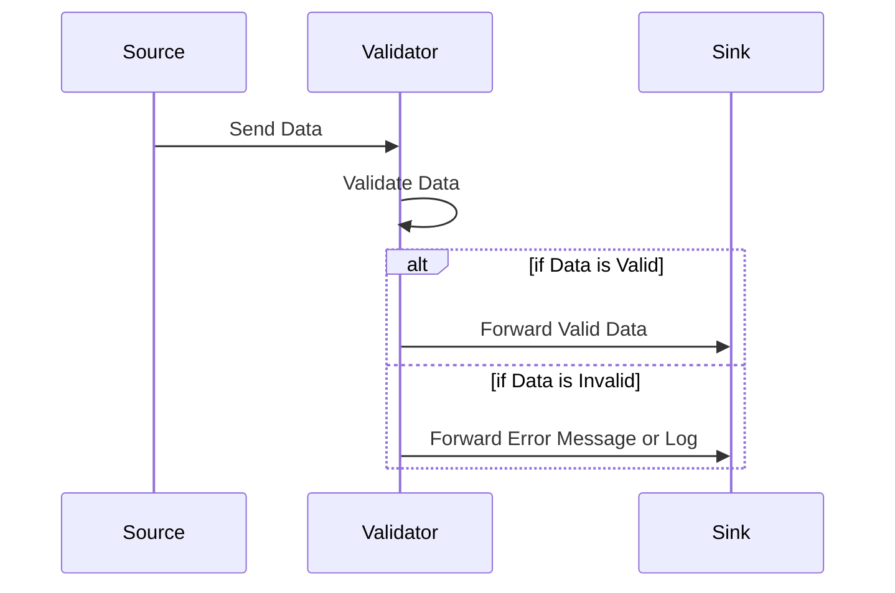

## Data Validation: Ensuring Data Quality and Integrity in Stream Processing

### Introduction

The Data Validation pattern is a crucial component of stream processing systems. It involves checking data against a set of predefined rules or constraints during processing to ensure its correctness and integrity. As data flows through the system, validating data ensures that only clean, reliable, and usable data is processed, thereby preventing errors and maintaining high data quality.

### Core Concepts

- **Rules and Constraints**: Data Validation is implemented through a series of rules that define what constitutes valid or acceptable data. These can include checking for the presence of required fields, ensuring data types are correct, validating data ranges, and checking against custom business logic.
  
- **Transformation Checks**: As data is transformed, each stage can implement validation checks tailored to the type and importance of the transformation. This ensures that any errors introduced during transformation are caught early and handled appropriately.

- **Error Handling**: When validation failures occur, it's imperative to have a robust error-handling mechanism. This could involve logging errors, alerting system operators, or routing erroneous data to a separate stream for further analysis or correction.

### Architectural Approaches

1. **Inline Validation**:
   - Validation is performed directly within the transformation pipeline. Each processing node or microservice includes validation logic that checks incoming data before processing or transforming it.

2. **Centralized Validation Service**:
   - A dedicated service handles validation, which is called by various parts of the stream processing system as data flows through. This centralized approach allows for consistent validation rules across all transformations.

3. **Schema Validation**:
   - Utilizing schemas (like Avro, JSON Schema) defines expectations for data structure and format. This approach automates part of the validation process, as data is automatically validated against the schema.

### Example Code

Below is an example of a stream processing pipeline implementing data validation using Apache Kafka Streams in Java:

```java
StreamsBuilder builder = new StreamsBuilder();
KStream<String, Order> orders = builder.stream("orders-topic");

KStream<String, Order> validatedOrders = orders.filter((key, order) -> isValid(order));

validatedOrders.to("validated-orders-topic");

private boolean isValid(Order order) {
  if (order.getAmount() < 0) return false;  // Amount should be positive
  if (order.getCustomerId() == null) return false;  // Customer ID is required
  // Add more validation rules as needed
  return true;
}

KafkaStreams streams = new KafkaStreams(builder.build(), props);
streams.start();
```

### Diagrams

Here’s a simplified sequence diagram using Mermaid to illustrate the Data Validation pattern:



### Related Patterns

- **Schema on Read**: Validate schema conformity of data when read, rather than when written, which ensures flexibility in handling data with evolving schemas.
  
- **Data Cleansing Pattern**: Focuses on correcting or removing erroneous data, often used in combination with Data Validation to enhance data quality.

### Additional Resources

- [Apache Kafka Streams Documentation](https://kafka.apache.org/documentation/)
- [JSON Schema Validation](https://json-schema.org/)
- [Avro Schemas](https://avro.apache.org/docs/current/)
  
### Summary

The Data Validation pattern is essential for maintaining data quality in stream processing systems. By integrating comprehensive validation checks using rules and constraints, systems can ensure that the data they propagate and transform is both accurate and reliable. This pattern plays a critical role in preventing faulty data from causing downstream issues, thereby enhancing overall system reliability and performance. Understanding and implementing robust validation strategies is vital for any cloud-based data processing architecture.
