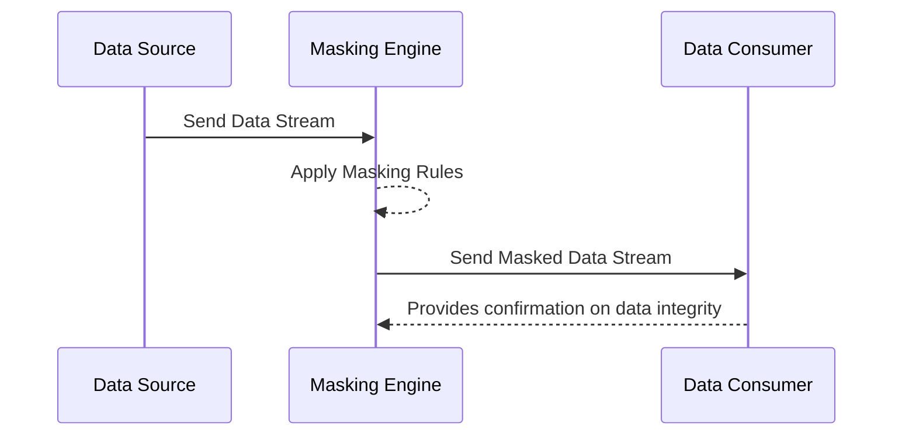

In the world of data-driven enterprises, ensuring data privacy and security is paramount. **Data Masking** emerges as a powerful design pattern that effectively conceals sensitive data within streams, thereby preventing unauthorized access and maintaining data privacy.

## Overview of Data Masking

Data Masking is a technique used to protect sensitive information in datasets. By obscuring the actual data without changing the operation and outcome of your applications or analytics, Data Masking enhances privacy and security. Typically employed on data at rest, in use, or in transit, this pattern replaces sensitive data with obfuscating characters, symbols, or similar dummy values.

### Common Use Cases
- **Masking Personal Identification Numbers**: In an organizational context, you might need to process social security numbers (SSNs), which can be masked in storage or as they move through operational pipelines.
- **Financial Data Concealment**: Masking credit card numbers, transaction IDs, or account numbers before analysis.
- **Healthcare Data Anonymization**: Protecting patient-identifiable information when using datasets for research or operational purposes.

## Architectural Approach

**Data Masking** is typically embedded as part of a broader data transformation or stream processing pipeline. Here's how you can conceptualize it architecturally:

1. **Data Source**: Begin with structured or unstructured data that might contain sensitive elements.
2. **Masking Engine**: Introduce a component responsible for applying masking rules. This can be pattern-based (e.g., regex for formats like XXX-XX-XXXX) or template-driven.
3. **Data Flow**: The masked data continues downstream, retaining usability for non-sensitive operations but omitting or obscuring protected information.
4. **Compliance Verification**: Ensure all masked data conforms to regulatory and compliance standards applicable to your domain.

### Best Practices
- **Define Clear Rules**: Establish and document standard masking rules and patterns relevant to the datasets at hand.
- **Automate and Integrate**: Seamlessly integrate masking within your CI/CD pipeline for consistent application across data streams.
- **Evaluate Impact**: Regularly audit and evaluate the effectiveness of masking protocols, ensuring that they do not significantly degrade data utility.
- **Log and Monitor**: Implement logging for data masking activities to detect irregularities.

## Example Code

Here's a simple example of masking a social security number in a stream processing context using Java:

```java
import java.util.regex.Pattern;
import java.util.regex.Matcher;

public class DataMasker {

    private static final Pattern ssnPattern = Pattern.compile("(\\d{3})-(\\d{2})-(\\d{4})");

    public static String maskSSN(String text) {
        Matcher matcher = ssnPattern.matcher(text);
        StringBuffer maskedText = new StringBuffer();

        while (matcher.find()) {
            String maskedSSN = matcher.group(1) + "-XX-XXXX";
            matcher.appendReplacement(maskedText, maskedSSN);
        }
        matcher.appendTail(maskedText);
        return maskedText.toString();
    }

    public static void main(String[] args) {
        String inputText = "My SSN is 123-45-6789";        
        System.out.println("Masked Text: " + maskSSN(inputText));
    }
}
```

## Diagrams

### Mermaid Sequence Diagram for Data Masking Process



## Related Patterns

- **Tokenization**: A security method often considered alongside data masking, which replaces sensitive information with non-sensitive equivalents called tokens.
- **Data Anonymization**: Broader data privacy strategy where data is processed to irreversibly prevent re-identification.

## Additional Resources

- [NIST Guidelines on Data Masking](https://www.nist.gov)
- [OWASP Data Malpractice Prevention Cheat Sheet](https://owasp.org)

## Summary

Data Masking is a robust pattern for safeguarding sensitive information within data streams. By effectively integrating it into your data processing workflows, organizations can better comply with privacy regulations and mitigate the risk of data breaches while maintaining the functional value of their datasets. With attention to clear masking rules and ongoing system monitoring, Data Masking serves as an essential tool in modern data protection strategies.
