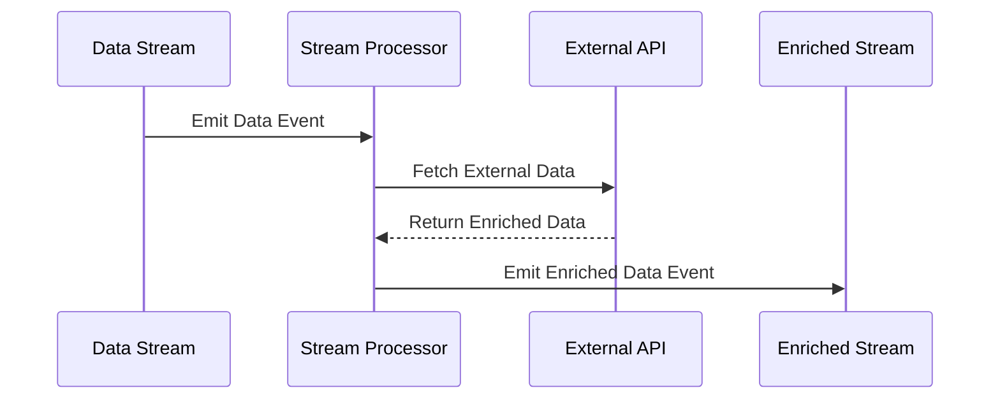

## Introduction

The "Enrich with External APIs" design pattern involves enhancing the data contained within a stream by leveraging information retrieved from external services or APIs. This pattern is particularly useful for integrating real-time contextual information into a data processing workflow. By using this approach, data streams can be enriched with additional metadata that can be used for better insights and decision-making processes.

## Detailed Explanation

In modern cloud-native architectures, it is common to encounter scenarios where the initial data stream lacks the entire context needed for comprehensive analysis and processing. By using external APIs, one can augment the data in the stream in real time, which can significantly enhance its value and applicability. For example, leveraging third-party APIs, such as weather providers, location services, or data enrichment platforms, allows businesses to append valuable information to their data streams.

### Architectural Approach

Here's a typical architectural workflow leveraging the "Enrich with External APIs" pattern:

1. **Source Stream**: Data events are ingested from a source, such as sensors, user activities, or IoT devices.
2. **API Call**: Each event or batch of events triggers a call to an external API to retrieve the additional data.
3. **Data Enrichment**: The returned data from the API is merged with the original stream data events.
4. **Output Stream**: The enriched data is output to a database, dashboard, or further processing pipeline.

### Example Code

Below is an example using Java and Kafka Streams to perform data enrichment by calling an external weather API:

```java
StreamsBuilder builder = new StreamsBuilder();
KStream<String, EventData> inputStream = builder.stream("input-topic");

KStream<String, EnrichedEventData> enrichedStream = inputStream.mapValues(eventData -> {
    ExternalApi api = new ExternalApi();
    WeatherData weather = api.getCurrentWeather(eventData.getLocation());

    EnrichedEventData enrichedEvent = new EnrichedEventData(eventData, weather);
    return enrichedEvent;
});

enrichedStream.to("enriched-output-topic", Produced.with(Serdes.String(), new EnrichedEventDataSerde()));
```

### Diagrams



## Related Patterns

- **Federated Queries**: Similar in concept, but primarily used for querying multiple databases or APIs in a unified way.
- **Circuit Breaker**: Utilized to manage and respond to failures in external API calls.

## Best Practices

- **Rate Limiting**: Avoid overwhelming API services with excessive requests by implementing rate limiting.
- **Caching**: Use caching strategies to minimize repeated API calls and reduce latency.
- **Error Handling**: Properly manage and handle failures or timeouts in API calls to maintain data stream integrity.
- **Monitoring**: Continuously monitor API performance to ensure data stream enrichment meets the required SLA.

## Additional Resources

- [Apache Kafka Streams Documentation](https://kafka.apache.org/documentation/streams)
- [Reactive Streams](https://www.reactive-streams.org/)

## Summary

The "Enrich with External APIs" pattern is a powerful tool for enhancing the capability of your data streams by fusing them with contextual information from external services. It is a valuable approach in many domains such as e-commerce, IoT, and financial services, where real-time data enrichment can yield significant benefits. By following best practices and related patterns, you can leverage external APIs without compromising the performance and reliability of your stream processing application.
