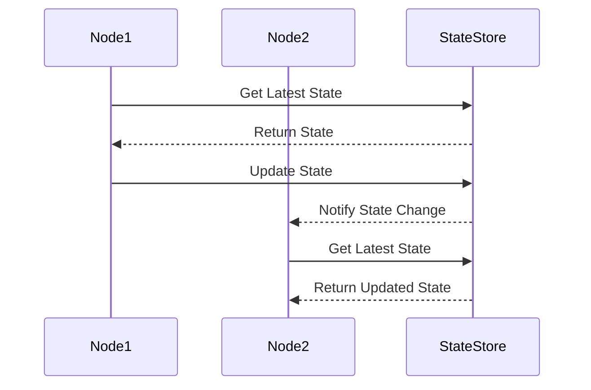

## Description

State Synchronization is a critical design pattern used in distributed stream processing systems to ensure state consistency across various components. Stream processing applications need to process data in real-time, often across multiple nodes in a cluster. Maintaining a consistent state across these nodes is essential for accurate computations and reliable system behavior.

State Synchronization allows distributed systems to coordinate state updates, ensuring that all nodes or components operate with a coherent view of the data. This pattern is particularly important when dealing with stateful operations, such as aggregations, windowed computations, or maintaining counters like in our example scenario.

## Architectural Approaches

1. **Centralized State Store**: Utilize a centralized database or state store (e.g., Apache Kafka, Redis) to manage state consistency across the system. All nodes read and write to this central store, ensuring they operate on the latest state.
   
2. **Stateful Stream Processing Frameworks**: Leverage frameworks like Apache Flink or Apache Beam, which provide built-in mechanisms for distributed state management. These frameworks handle state synchronization, allowing developers to focus on business logic.

3. **Event Sourcing**: Implement an event sourcing model where the system state is derived from a sequence of events. All changes to the state are stored as immutable events, allowing different components to replay the event log and synchronize their state.

4. **State Snapshotting**: Regularly take snapshots of the application state to a distributed store. Use these snapshots to recover state and ensure consistency in the event of failures or topology changes.

## Best Practices

- **Idempotent Operations**: Ensure that state updates are idempotent, meaning repeated application of the same operation yields the same result, in case messages are delivered more than once.
- **Consistent Hashing**: Use consistent hashing techniques to distribute state more evenly and reduce the risk of bottlenecks.
- **State Compaction**: Compact state data periodically to reduce storage requirements and improve access time.
- **Fault Tolerance**: Implement mechanisms for detecting and recovering from partial failures.

## Example Code

Below is an example code snippet illustrating state synchronization using Apache Flink, a popular stream processing framework.

```scala
import org.apache.flink.streaming.api.scala._
import org.apache.flink.streaming.api.windowing.time.Time

object StateSynchronizationExample {
  def main(args: Array[String]): Unit = {
    val env = StreamExecutionEnvironment.getExecutionEnvironment

    val textStream = env.socketTextStream("localhost", 9999)

    val counts = textStream
      .flatMap(_.split("\\s"))
      .map(word => (word, 1))
      .keyBy(0)
      .timeWindow(Time.seconds(5))
      .reduce((a, b) => (a._1, a._2 + b._2))

    counts.print()

    env.execute("State Synchronization Example")
  }
}
```

## Diagrams

Below is a mermaid sequence diagram illustrating the process of state synchronization in a distributed system.



## Related Patterns

- **CQRS (Command Query Responsibility Segregation)**: Separates command and query responsibilities, helping manage state in complex systems.
- **Event Sourcing**: Stores all changes to application state as a sequence of events.

## Additional Resources

- [Flink Stream Processing](https://flink.apache.org/flink-architecture.html)
- [Event Sourcing in Stream Processing](https://martinfowler.com/eaaDev/EventSourcing.html)
- [Stateful Stream Processing with Apache Kafka](https://kafka.apache.org/)

## Summary

State Synchronization is a foundational pattern in distributed stream processing systems, crucial for maintaining consistent and accurate state across components. By leveraging synchronization methods such as centralized state stores, stateful stream processing frameworks, and event sourcing, systems can achieve greater reliability and performance. Adhering to best practices and utilizing related patterns can further enhance the robustness of state management within your applications.
