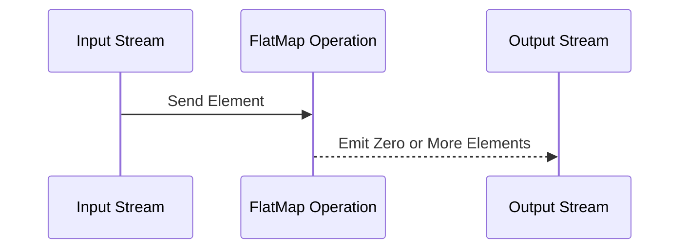

## FlatMap Transformation

### Description

The FlatMap Transformation pattern is a powerful and versatile design paradigm commonly used in the context of functional programming and stream processing. It allows for transforming each element in a dataset into zero, one, or multiple elements. This pattern is particularly beneficial for operations that involve splitting, expanding, or modifying the original dataset. 

A common use case for FlatMap Transformation is in processing streams of data where the output size is different from the input size, such as when you need to break down a complex element into simpler parts. For example, splitting sentences in a text stream into individual words for further analysis like word counting.

### Architectural Approach

In stream processing systems, such as Apache Flink, Apache Spark, or Kafka Streams, FlatMap operations are natively supported and optimized for performance. They exploit the distributed nature of these platforms to efficiently handle large-scale data transformations.

FlatMap takes a function that applies to each element of a source stream and returns a collection (or iterable) of elements, which are then flattened into the output stream. This approach is inherently parallel, making it suitable for use in distributed systems.

### Best Practices

- Ensure that the function used in FlatMap is pure to optimize for deterministic and side-effect-free transformations.
- Utilize lazy evaluation where possible to enhance performance and resource management.
- Combine FlatMap with other transformations, such as filter and map, to build robust data processing pipelines.
- Monitor and manage resource consumption, especially in distributed environments, to avoid excessive workloads caused by potentially large output data sizes.
  
### Example Code

Here is a simple example using Apache Spark to transform a list of sentences into lists of words using the FlatMap transformation:

```scala
import org.apache.spark.{SparkConf, SparkContext}

object FlatMapExample {
  def main(args: Array[String]): Unit = {
    val conf = new SparkConf().setAppName("FlatMapExample").setMaster("local")
    val sc = new SparkContext(conf)

    val sentences = sc.parallelize(Seq("The quick brown fox", "jumps over the lazy dog"))

    val words = sentences.flatMap(sentence => sentence.split(" "))

    words.foreach(println)
  }
}
```

### Diagrams

#### FlatMap Process Flow



### Related Patterns

- **Map Transformation**: Used to apply a transformation on each element of a collection to produce a new collection of the same size.
- **Filter Pattern**: Employed to retain elements in a dataset based on a specified condition.
- **Reduce Pattern**: Combines elements from a dataset to produce a single accumulated result.

### Additional Resources

- [Apache Spark - Transformations](https://spark.apache.org/docs/latest/rdd-programming-guide.html#transformations)
- [Functional Programming in Scala](https://www.manning.com/books/functional-programming-in-scala)
- [Kafka Streams - Stream Processing with Apache Kafka](https://kafka.apache.org/documentation/streams/)

### Summary

The FlatMap Transformation pattern is essential in the toolkit of engineers working on data transformation and stream processing tasks. By enabling the conversion of each element into zero or more other elements, it provides a flexible and efficient mechanism to handle complex data manipulation tasks in distributed systems. Whether you are splitting text data or expanding nested objects, FlatMap is a pattern that should be well-understood and appropriately applied for best results in functional and distributed computing environments.
