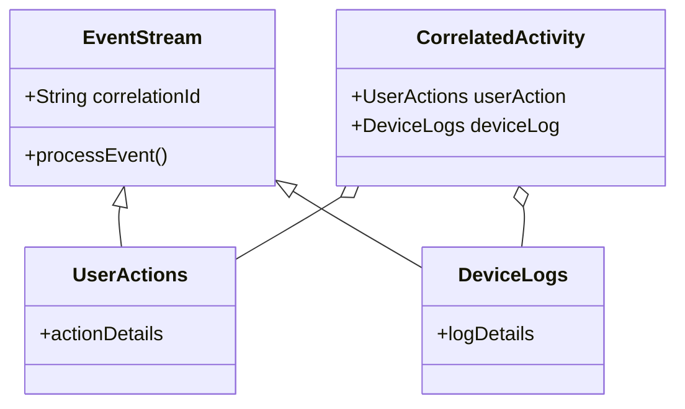

## Introduction

In today's interconnected world, data streams from various applications, devices, or services often need to be merged to obtain comprehensive insights. The Correlation Transformation pattern is a strategy employed in stream processing to associate events from different streams using unique correlation IDs or keys. This pattern allows systems to synthesize information from disparate sources, enabling analytics that reflect a holistic view of the operation or user behavior.

## Architectural Approach

### Key Characteristics

1. **Correlation ID/Key Usage**: Streams use identifiers such as user IDs, session IDs, transaction IDs, or any domain-specific keys to associate related events across different streams.
   
2. **Event Matching**: Systems rely on these identifiers to match and process events together.

3. **Timeliness and Order**: Considerations include ensuring that associated events are processed close to their occurrence even when they arrive out of sequence or across differing time windows.

4. **Data Consistency**: Special mechanisms such as buffering, state stores, and replay logic help maintain data consistency across correlated events.

### Implementation Considerations

- **Scalability**: Implementing this pattern at a large scale necessitates a robust underlying platform such as Apache Kafka, Apache Flink, or AWS Kinesis for streaming data.
  
- **Fault Tolerance**: Patterns of redundancy, checkpoints, and logging can cater to challenges in maintaining fault tolerance.
  
- **Latency**: Continuous balancing between processing workloads and acceptable system latency depending on the application's requirement.

## Best Practices

1. **Unique Key Maintenance**: Ensure that correlation IDs are consistently maintained across the stream sources.
   
2. **Windowing Techniques**: Use appropriate windowing techniques to capture time-bound correlated events effectively.
   
3. **State Management**: Leverage stateful processing to track and update beneficiaries.

4. **Fault Recovery**: Design systems with recovery checkpoints to handle partial failures during processing.


## Example Code

Here is an illustrative example using Apache Kafka Streams in Java:

```java
StreamsBuilder builder = new StreamsBuilder();
KStream<String, UserAction> userActionsStream = builder.stream("user-actions");
KStream<String, DeviceLogs> deviceLogsStream = builder.stream("device-logs");

KStream<String, CorrelatedActivity> joinedStream = userActionsStream.join(
    deviceLogsStream,
    (userAction, deviceLog) -> new CorrelatedActivity(userAction, deviceLog),
    JoinWindows.of(Duration.ofMinutes(5)),
    Joined.with(Serdes.String(), userSerdes, deviceSerdes)
);

joinedStream.to("correlated-activities");
```

## UML Diagram

Below is a simple Mermaid class diagram to illustrate the flow:



## Related Patterns

- **Event Sourcing**: Utilized for capturing event changes to reconstruct system state or workflows.
- **Data Aggregation**: Combining multiple records to achieve concise data summaries.
- **Complex Event Processing (CEP)**: Techniques for querying data in motion, effectively managing sequences of correlated events.
  
## Additional Resources

- [Confluent’s Guide to Stream Processing](https://www.confluent.io)
- [Apache Kafka Streams Documentation](https://kafka.apache.org/documentation/streams/)
- [AWS Kinesis Best Practices](https://docs.aws.amazon.com/streams)

## Summary

The Correlation Transformation pattern is fundamental when integrating multi-stream events to realize complex data insights. By leveraging streaming platforms and frameworks, it’s possible to correlate data effectively, maintaining consistency and performance at scale. This pattern is especially valuable in scenarios where multiple data flows converge to paint a complete picture of activities such as fraud detection, customer behavior analysis, or performance monitoring.
