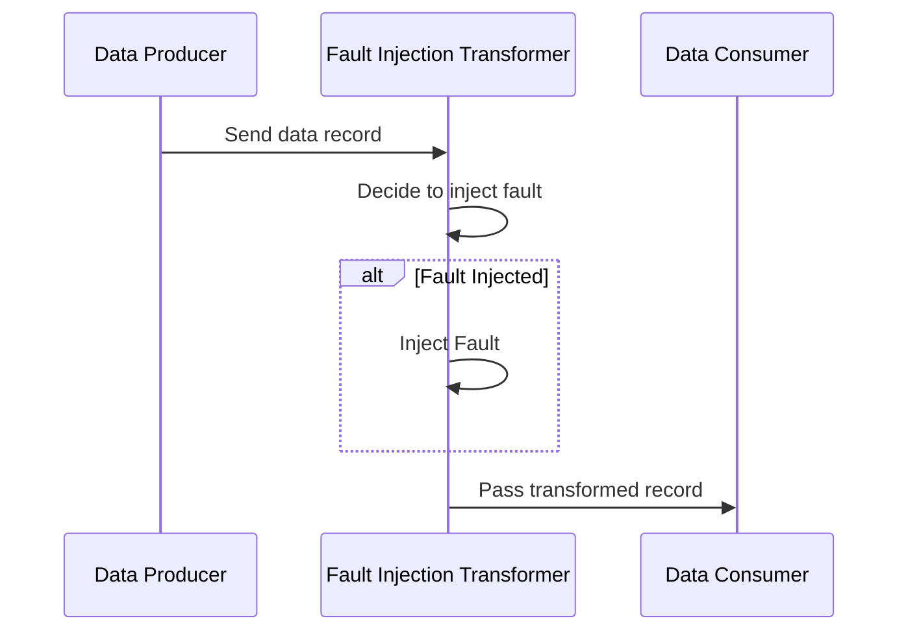

## Fault Injection Transformation

### Overview
The Fault Injection Transformation pattern involves deliberately introducing errors or anomalies into a data stream to test and evaluate how well a system can handle unexpected or erroneous conditions. This practice is crucial in developing robust stream processing systems by validating their capability to maintain service levels under stress or failure conditions.

### Context
In a distributed stream processing environment, systems must cope with a variety of data anomalies, hardware failures, and network issues. Robustness and reliability are critical for these systems, which often operate in real-time and need to deliver consistent service despite unexpected disruptions.

### Problem
Ensuring system resilience requires evaluating how systems behave in the presence of faulty data or operational conditions. Without properly stressing the system, hidden bugs or performance bottlenecks may not surface during regular operation.

### Solution
Implement a fault injection framework to simulate errors such as data corruption, data loss, delayed processing, and unexpected input formats. This can be achieved programmatically within the data stream transformation layer.

### Implementation
1. **Fault Injection Module**: Develop a module that intercepts the data stream and injects predetermined faults based on specified rules.
2. **Observation and Analysis**: Monitor the system behavior during the fault injection procedure to understand its resilience and error handling.
3. **Guardrails and Controls**: Ensure that fault injections do not affect the production environment by testing in controlled settings or using feature flags to enable fault injection in specific testing environments.

#### Example Code
```scala
val faultInjectionTransformer: (Stream<String>) => Stream<String> = stream => {
  stream.map(record => {
    if (shouldInjectFault()) {
      simulateFault(record)
    } else {
      record
    }
  })
}

def shouldInjectFault(): Boolean = {
  // Logic to decide whether to inject a fault
  Math.random() < 0.1
}

def simulateFault(record: String): String = {
  // Simulate a fault, e.g., corrupt data or delay
  corruptData(record)
}

def corruptData(record: String): String = {
  s"CORRUPTED_$record"
}
```

### Diagram



### Related Patterns
- **Error Handling Pattern**: Strategies for managing and processing errors within a stream.
- **Circuit Breaker Pattern**: Preventing a system from attempting an operation likely to fail.
- **Bulkhead Pattern**: Isolation of components to avoid cascading failures.

### Additional Resources
- [Chaos Engineering Principles](https://principlesofchaos.com/)
- [Resilience Engineering Literature](https://resilience.com/)
- Microservices by Design: Resilience Patterns

### Summary
The Fault Injection Transformation pattern is a powerful tool for evaluating the resilience of stream processing systems by simulating errors deliberately. By incorporating fault injection strategies, organizations can identify weaknesses and bolster the robustness of their data pipelines, ultimately ensuring smoother and more reliable operations under various conditions.
