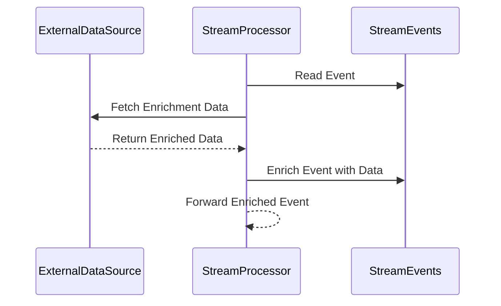

## Enrichment Transformation

### Introduction

In the realm of stream processing, the Enrichment Transformation pattern is pivotal for adding valuable context to data-in-motion. By integrating external data into stream events, businesses can derive more meaningful insights, enhance analytical capabilities, and improve decision-making processes. This pattern is especially useful when inbound data is rich in transactional information but lacks contextual nuances, such as user profiles, transaction histories, or geographic mappings.

### Problem Statement

In real-time data processing, stream events often contain limited data attributes. For effective decision-making or detailed analytics, it is crucial to have additional context. However, continuously fetching this data on-the-fly can be resource-intensive and non-trivial due to latency constraints and potential data inconsistencies.

### Solution Overview

The Enrichment Transformation pattern addresses these issues by systematically coupling stream events with relevant external datasets. This enrichment involves performing database queries, API interactions, or referencing in-memory caches to gather the additional data corresponding to each incoming event.

### Example Scenario

Consider a financial application where transaction streams—a series of events each representing a financial transaction—need to be enriched with customer loyalty status to enable personalized offers. The incoming transaction event contains only the transaction details, such as amount, timestamp, and customer ID. The enrichment process involves joining each transaction with a customer database to append the corresponding loyalty status, which is then used downstream for promotional or analytical purposes.

### Architectural Approach

1. **Data Sources**: Identify internal or external data sources necessary for enrichment. This could be databases, RESTful APIs, cached datasets, or even other data streams.
   
2. **Enrichment Layer**: Implement a reliable, low-latency mechanism to join or enrich the rolling stream of events. This layer can leverage technologies like Apache Kafka Streams, Apache Flink, or Google Cloud Dataflow.
   
3. **Data Joining Mechanism**: Depending on the nature of the external data, choose an appropriate method to retrieve it:
   - Batch or prefetch when the data is static or seldom changes.
   - On-demand API calls if the data is dynamic.
   - Cached lookups if response times are critical.

4. **Error Handling**: Implement fallback strategies for temporary failures in data retrieval, such as retries, fallback defaults, or queuing.

### Example Code

Here's an example using Apache Kafka Streams in Java to illustrate how an Enrichment Transformation can be implemented:

```java
Properties props = new Properties();
props.put(StreamsConfig.APPLICATION_ID_CONFIG, "enrichment-app");
props.put(StreamsConfig.BOOTSTRAP_SERVERS_CONFIG, "localhost:9092");

StreamsBuilder builder = new StreamsBuilder();
KStream<String, Transaction> transactions = builder.stream("transactions");

KTable<String, Customer> customers = builder.table("customers");

KStream<String, EnrichedTransaction> enrichedTransactions = transactions
    .join(customers,
        (transaction, customer) -> new EnrichedTransaction(transaction, customer.getLoyaltyStatus()),
        Joined.with(Serdes.String(), /* Key type */
                    Serdes.serdeFrom(Transaction.class), /* Value type 1 */
                    Serdes.serdeFrom(Customer.class) /* Value type 2 */
));

enrichedTransactions.to("enriched-transactions");

KafkaStreams streams = new KafkaStreams(builder.build(), props);
streams.start();
```

### Diagrams

Below is a Mermaid UML Sequence Diagram showcasing the Enrichment Transformation process:



### Related Patterns

- **Filter Transformation**: A pattern that allows for condensing stream data by removing irrelevant events based on defined criteria.
- **Aggregation Transformation**: Performing computations over a window of events to create summary statistics.

### Additional Resources

- [Confluent: Join Streams and Tables in Kafka Streams](https://www.confluent.io/blog/joining-tables-and-streams-with-kafka-streams)
- [Google Cloud: Stream Processing Pattern with Data Enrichment](https://cloud.google.com/dataflow/patterns/enrichment)

### Summary

The Enrichment Transformation pattern is essential in elevating the value of stream processing by embedding meaningful context into each event. By strategically leveraging external data sources, businesses can enhance the granularity of insights and apply this augmented information across various facets of operational, analytical, and transactional domains.
