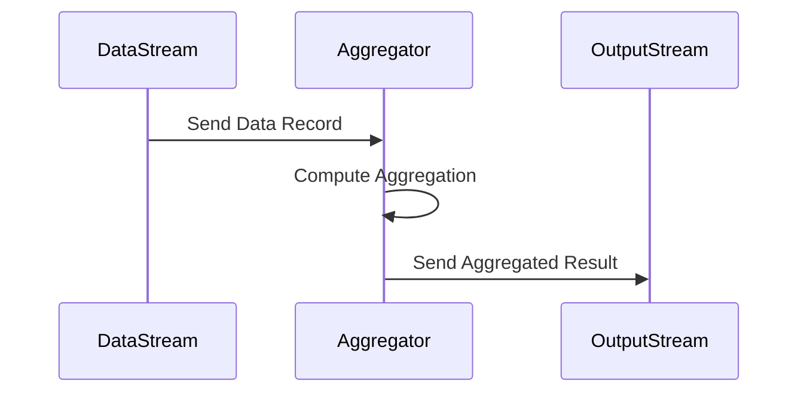

## Aggregation Transformation

The Aggregation Transformation pattern is a fundamental concept in stream processing that involves summarizing data over specified time windows or groups. This pattern helps in deriving meaningful insights by computing various metrics such as counts, sums, averages, and more. It's a key pattern for real-time data analytics, allowing businesses to track and respond to data in motion.

### Architectural Approach

In the context of stream processing, Aggregation Transformation requires an architecture capable of handling continuous streams of data and performing stateful computations. Key components of this architecture include:

1. **Data Streams**: Continuous flows of data records from which information can be aggregated.
2. **Aggregators**: Functions or processes that perform the computations such as sum, count, or average.
3. **Stateful Processing**: Maintains state between records or batches to compute across defined windows (time-based or count-based).

### Best Practices

- **Windowing Techniques**: Use appropriate windowing strategies, like tumbling, sliding, session windows, depending on your data characteristics and analytics needs.
- **State Management**: Ensure robust state management to handle data loss, recomputation, and to prevent state bloat.
- **Scalability**: Employ distributed processing engines capable of scaling horizontally to manage varying data rates.
- **Data Integrity**: Use exactly-once semantics where necessary to ensure the correctness of aggregation results.

### Example Code

Here is a simple illustration using Apache Kafka Streams in Java to perform an aggregation:

```java
KStream<String, PageView> views = builder.stream("page-views");
KGroupedStream<String, PageView> viewsByUser = views.groupByKey();
KTable<Windowed<String>, Long> viewCountsByUser = viewsByUser
    .windowedBy(TimeWindows.of(Duration.ofHours(1)))
    .count();

viewCountsByUser.toStream().to("user-aggregates-output", Produced.with(WindowedSerdes.timeWindowedSerdeFrom(String.class), Serdes.Long()));
```

### UML Sequence Diagram



### Related Patterns

- **Filter Transformation**: Selects a subset of data from a stream based on a condition.
- **Join Transformation**: Combines data from two streams into a unified view, often necessary before further aggregation.
- **Utilize Event Sourcing**: Maintain a persistent log of events to recreate or update aggregates as needed.

### Additional Resources

- [Apache Kafka Streams Documentation](https://kafka.apache.org/documentation/streams/)
- [The Art of Event-Driven Systems](https://book-url),
- [Stream Processing with Apache Flink](https://flink.apache.org/)

### Summary

The Aggregation Transformation pattern is essential for any system that processes real-time data streams. By leveraging proper windowing techniques and state management, it enables the computation of valuable metrics for analytics, monitoring, and other decision-making processes. Adopting this pattern facilitates timely insights which are crucial for competitive advantage in data-driven industries.
