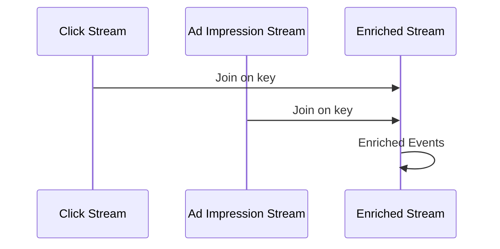

## Overview

The **Join Transformation** pattern is crucial in stream processing systems where there is a need to combine multiple input streams based on a shared key or set of conditions, effectively creating a new, enriched output stream. This pattern is instrumental for systems requiring real-time data composition, such as correlating user activity with metadata, enhancing log data with additional attributes, or fusing sensor data with contextual information.

## Problem

In many applications, data required for calculations or analysis is not stored in a single stream. Instead, relevant information is distributed across multiple streams. For example, web applications might need to merge and analyze user click events with ad impression data to determine advertising effectiveness. Performing such operations requires an efficient and reliable mechanism to join data from disparate sources.

## Solution

The Join Transformation pattern addresses this problem by using stream processing engines capable of merging streams on-the-fly. The essential operations include selecting the appropriate join strategy and defining key selectors. Various types of joins can be employed, each suited to different scenarios:

- **Inner Join**: Merging only matching records between streams.
- **Outer Join (Left, Right, Full)**: Combining records while preserving unmatched records from one or both streams.
- **Windowed Join**: Performing joins over time-based windows to handle streaming data efficiently.

Here are some vital considerations for implementing Join Transformations:

- **Key Selector**: Determines the common key or correlation id between streams.
- **Window Strategy**: Defines how data is grouped over time, especially for asynchronous streams.
- **Latency and Consistency**: Ensures data is processed with desired latencies while maintaining consistency.

## Example Code

Here is a simplified example using Apache Kafka Streams API in Java, demonstrating an inner join between a click stream and an ad impression stream:

```java
KStream<String, ClickEvent> clickStream = builder.stream("clicks-topic");
KStream<String, AdImpression> impressionStream = builder.stream("impressions-topic");

KStream<String, EnrichedClick> enrichedClickStream = clickStream.join(
    impressionStream,
    (clickValue, impressionValue) -> new EnrichedClick(clickValue, impressionValue),
    JoinWindows.of(Duration.ofMinutes(5)),
    Joined.with(Serdes.String(), ClickEventSerde, AdImpressionSerde)
);

enrichedClickStream.to("enriched-clicks-topic");
```

## Diagram



## Related Patterns

- **Windowing Pattern**: Handles stateful computations by grouping stream records into fixed-size windows.
- **Aggregation Pattern**: Combines multiple records into summary information.
- **Filter Pattern**: Selects records of interest before or after attempting a join to reduce data volume.

## Additional Resources

1. Books:
   - "Designing Data-Intensive Applications" by Martin Kleppmann
2. Blogs:
   - "Stream Processing Design Patterns" on Confluent Blog
3. Courses:
   - Apache Kafka Fundamentals by Confluent

## Summary

The Join Transformation pattern is vital in creating complex analytical frameworks in stream processing. By enabling the combination of logically related streams, it provides a mechanism to enhance data visibility and insight in real time. Choosing the right join type and managing window strategies are critical aspects of effectively implementing this pattern. As organizations lean more toward real-time data processing, mastering join operations becomes increasingly consequential.
