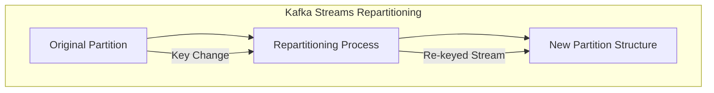

## Overview

Repartitioning is a design pattern used in distributed stream processing systems to change how data is partitioned across multiple nodes or processes. The primary purpose of repartitioning is to balance the load across the system and ensure co-located data required for computation is grouped efficiently. Repartitioning can play a critical role in scaling applications seamlessly as workloads and data distribution change.

## Architectural Approach

In distributed systems, data is often partitioned based on specific keys. Over time, the distribution of the data may become uneven due to changes in access patterns, an increase in data volume, or skew introduced by particular key-value frequency. Repartitioning allows you to dynamically adjust the partitioning strategy to alleviate hot spots and optimize resource utilization.

- **Key Redistribution**: Initially, data is partitioned by an initial key. Over time, a new key might be more appropriate to balance the processing load effectively. This involves examining the current load distribution and selecting a repartitioning strategy.
  
- **Load Balancing**: By redistributing partitions, the system can better spread the workload evenly across all nodes, ensuring that no single node becomes a bottleneck.

- **Data Co-location**: Using repartitioning to place related data close together can help optimize tasks like join operations, thus reducing data shuffling overhead.

## Example Code

Here's an example of how you might implement repartitioning in a stream processing application using Apache Kafka Streams for a retail scenario:

```kotlin
import org.apache.kafka.streams.KafkaStreams
import org.apache.kafka.streams.StreamsBuilder
import org.apache.kafka.streams.kstream.KStream
import org.apache.kafka.streams.kstream.Serialized

fun main() {
    val builder = StreamsBuilder()

    // Original stream of purchase events
    val purchases: KStream<String, Purchase> = builder.stream("purchase-topic")

    // Repartition the stream based on the product ID instead of customer ID
    val repartitionedStream: KStream<String, Purchase> = purchases
        .selectKey { _, purchase -> purchase.productId }
        .through("repartitioned-purchase-topic", Produced.with(Serialized.`with`(Serdes.String(), SerdesObject(Purchase))))

    // Continue processing with repartitioned stream
    repartitionedStream.foreach { _, purchase -> println("Processing purchase of product: ${purchase.productId}") }

    val streams = KafkaStreams(builder.build(), Properties())
    streams.start()
}
```

## Diagrams



## Related Patterns

- **Partitioning**: Initial partitioning strategy to distribute data across nodes.
- **Sharding**: Distributing database data across multiple nodes based on a shard key.
- **Data Skew Mitigation**: Techniques to reduce imbalance in data distribution.

## Additional Resources

- [Apache Kafka: Streams Architecture](https://kafka.apache.org/documentation/streams)
- [Designing Data-Intensive Applications by Martin Kleppmann](https://dataintensive.net)

## Summary

Repartitioning is a vital pattern in managing dynamic load in distributed stream processing applications. By changing the key on which data is partitioned, systems can achieve better resource utilization, reduce bottlenecks, and improve overall performance. Repartitioning deals effectively with the challenges posed by data skew and evolving data distribution models, ensuring systems remain scalable and responsive to demand.

Following the practice of proactive monitoring, container environment metrics, and real-time data feedback loops can enhance the efficiency of repartitioning strategies in any cloud-based or hybrid architecture.
