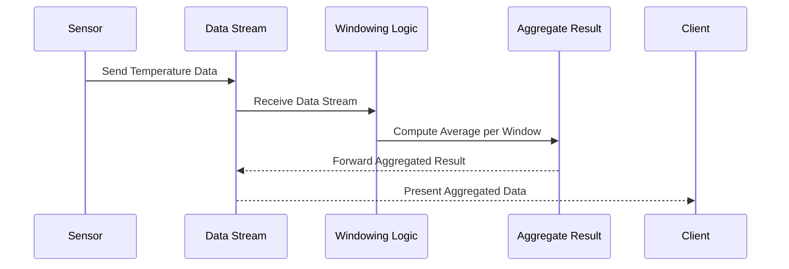

## Description

Windowed Transformation is a stream processing pattern where computations are performed over elements in a streaming data source within specified time windows. This approach is essential for applications requiring time-bounded operations, such as calculating averages, sums, or counts over continuous data streams.

The two common types of windows utilized are:

1. **Tumbling Windows**: Non-overlapping, fixed-size windows where each event is processed only once.
2. **Sliding Windows**: Overlapping windows that move at a specified interval, allowing events to be included in multiple windows.

Windowed transformations are fundamental in analyzing sensor data, financial ticks, or user activity where data aggregation and analysis over specific time frames are crucial.

## Architectural Approaches

Windowed Transformations can be implemented using several architectural approaches:

- **Data Stream Processing Frameworks**: Utilize frameworks such as Apache Kafka Streams, Apache Flink, and Apache Spark Streaming. Each provides built-in support for windowing transformations.

- **Cloud Managed Services**: Employ cloud services like Google Cloud Dataflow and AWS Kinesis Data Analytics that offer native support for stream processing and windowing operations.

- **Custom Implementations**: For specific use cases, custom implementations using low-level APIs like Akka Streams or RxJava can provide more control and efficiency.

## Best Practices

- **Choose the Right Window Size**: It's crucial to select window sizes that align with the application's latency and throughput requirements.
  
- **Handle Late Arrivals**: Incorporate mechanisms to handle late-arriving data, often using watermark strategies in stream processing frameworks.
  
- **Optimize Resource Utilization**: Adjust instances and parallelism to manage scalability and resource usage efficiently.

- **Monitor and Debug**: Implement observability practices to monitor windowed operations and quickly troubleshoot issues.

## Example Code

```java
import org.apache.flink.streaming.api.environment.StreamExecutionEnvironment;
import org.apache.flink.streaming.api.windowing.time.Time;
import org.apache.flink.streaming.api.windowing.assigners.TumblingEventTimeWindows;
import org.apache.flink.streaming.api.datastream.DataStream;

public class WindowedTransformationExample {
    public static void main(String[] args) {
        StreamExecutionEnvironment env = StreamExecutionEnvironment.getExecutionEnvironment();

        DataStream<SensorData> sensorStream = env.addSource(new SensorSource());

        DataStream<Double> averageTemperatures = sensorStream
            .map(SensorData::getTemperature)
            .windowAll(TumblingEventTimeWindows.of(Time.minutes(1)))
            .reduce((temp1, temp2) -> (temp1 + temp2) / 2);

        averageTemperatures.print();

        env.execute("Windowed Transformation Example");
    }
}
```

## Diagrams



## Related Patterns

- **Batch Processing**: This design pattern involves processing data in batches rather than continuous streams, suitable for non-time-sensitive workloads.
  
- **Event-Driven Architecture**: Utilize event-driven messaging patterns for real-time data processing and responsiveness.
  
- **Stateful Stream Processing**: Involves maintaining state between processing operations to handle complex aggregation, joins, and pattern detection.

## Additional Resources

- [Apache Flink Documentation](https://flink.apache.org/flink-docs-release-1.14/)
- [Stream Processing with Apache Kafka](https://kafka.apache.org/documentation/streams)
- [Google Cloud Dataflow](https://cloud.google.com/dataflow/docs/)

## Summary

Windowed Transformation is an essential pattern in stream processing systems, enabling real-time computation over data streams. By applying transformations within specified time windows, developers can create powerful analytic applications for real-time insights. The use of appropriate frameworks and tools ensures efficient and effective implementation, made scalable and reliable through best practices and observability.
