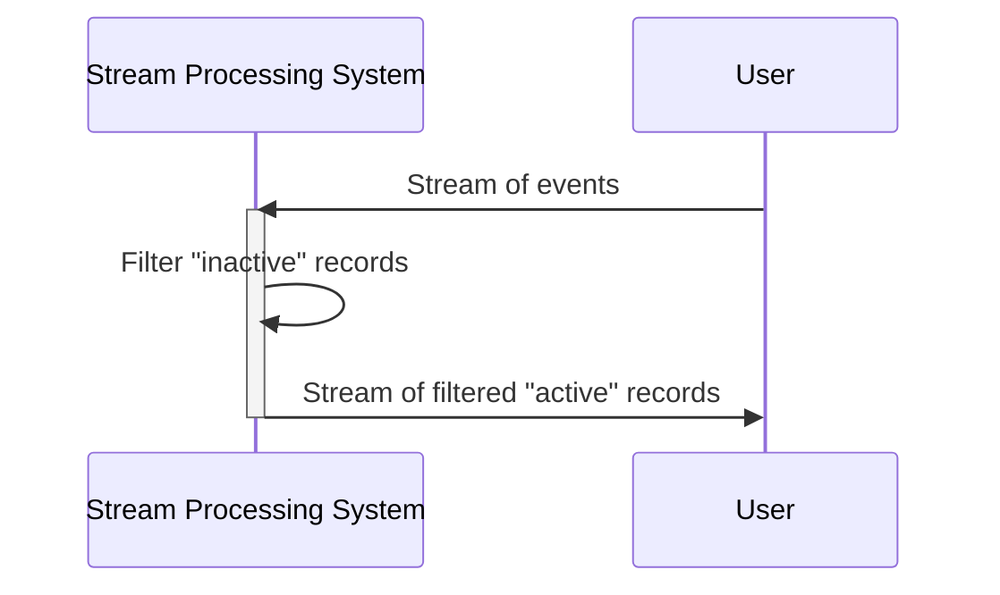

## Introduction

Stateless filtering is a fundamental design pattern in stream processing systems allowing each incoming event to be processed independently from others. This independence makes it ideal for tasks that do not require memory of previous states, such as simple filtering or mapping operations.

## Key Characteristics

- **Independence**: Each event in the stream is processed independently, without the need for shared state or maintaining records of past data.
- **Simplicity**: Operations like filtering or transformation (e.g., changing data format) can be easily applied to the stream.
- **Scalability**: Due to its stateless nature, it's easier to parallelize and distribute across nodes in a cluster.

## Use Cases

- Filtering out events based on certain attributes (e.g., removing records where the "status" field is "inactive").
- Simple transformations such as data serialization or changing data fields.
- Logging or pass-through operations that require no modification to the stream data but might perform side operations like exporting.

## Example Code

Here's an example of stateless filtering using Java and the Kotlin language for functional-style stream processing:

### Java

```java
import java.util.stream.Stream;

public class StatelessFilteringExample {

    public static void main(String[] args) {
        Stream<String> events = Stream.of("active:record1", "inactive:record2", "active:record3");

        events.filter(event -> event.startsWith("active"))
              .forEach(System.out::println);
    }
}
```

### Kotlin

```kotlin
fun main() {
    val events = listOf("active:record1", "inactive:record2", "active:record3")

    events.filter { it.startsWith("active") }
          .forEach(::println)
}
```

Both examples demonstrate a simple stateless filtering operation where events marked "inactive" are removed.

## Mermaid UML Sequence Diagram



## Related Patterns

- **Stateful Processing**: Unlike stateless filtering, where no past event data is required, stateful processing maintains data across events to perform operations like aggregations or sessionization.
- **Data Transformation Patterns**: Encompassing both simple stateless transformations and more complex patterns requiring state.

## Additional Resources

- *Stream Processing with Apache Kafka*: A comprehensive guide to processing streams, including stateless and stateful processing.
- *Functional Programming in Java*: Leveraging the power of functional paradigms for scalable data processing.

## Summary

Stateless filtering provides an essential toolset for operating on streaming data where event independence is maintained. This pattern facilitates significant scalability and simplicity in implementation, making it a Ccore building block for any stream processing application that requires straightforward data transformations without persistent states.
