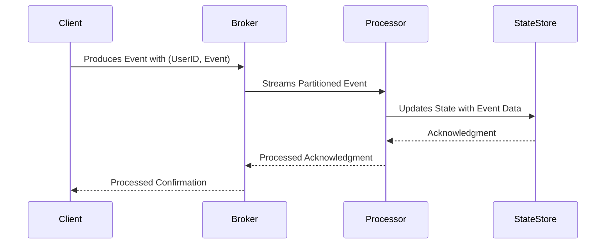
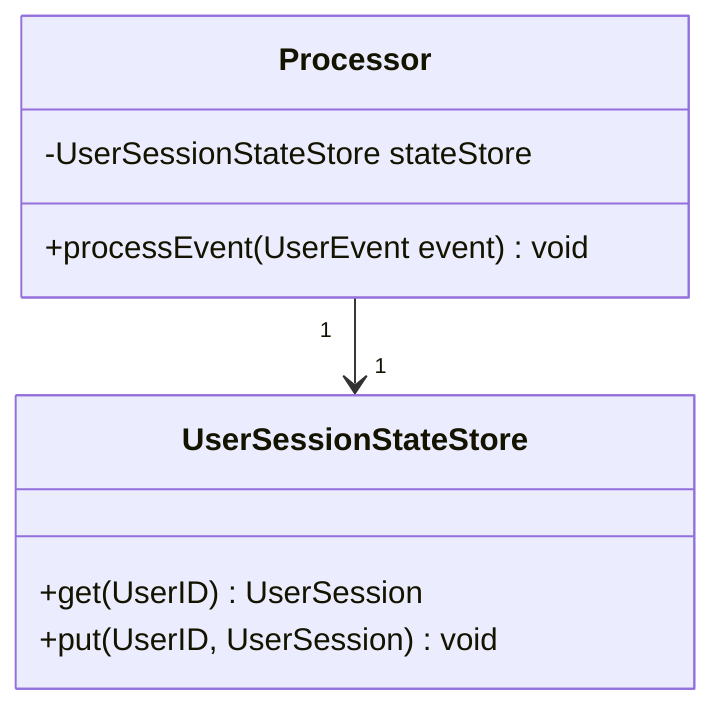

## Overview

State Partitioning is a fundamental design pattern in distributed stream processing systems that focuses on distributing state across nodes or partitions. This pattern ensures scalability and enables efficient state management by processing all events related to a specific key on the same instance.

### Key Concepts

- **Key-Based Distribution**: Events and their corresponding state are partitioned based on a key, ensuring that related events are processed and stored together.
  
- **Scalability**: Allows processors to be scaled horizontally by spreading load based on keys, improving both performance and fault tolerance.

- **Stateful Processing**: Enables operations that require remembering past information, such as aggregates or sessions.

## Example Use Case

Consider a streaming application that tracks user sessions. Each user's session state is partitioned by `userID`, which means that all events related to a particular user are processed by the same instance. This separation facilitates parallel processing and independent management of each user's session data.

### Example Code (Java with Apache Kafka Streams)

Below is an example of partitioning state by user ID using Kafka Streams, a popular stream processing platform:

```java
StreamsBuilder builder = new StreamsBuilder();
KStream<String, UserEvent> userEvents = builder.stream("user-events");

KGroupedStream<String, UserEvent> groupedByUserId = userEvents.groupByKey();

groupedByUserId.aggregate(
    UserSession::new,  // initializer
    (userId, event, session) -> session.updateWith(event),  // aggregator logic
    Materialized.<String, UserSession, KeyValueStore<Bytes, byte[]>>as("user-sessions-store")
        .withKeySerde(Serdes.String())
        .withValueSerde(new UserSessionSerde())
);

KafkaStreams streams = new KafkaStreams(builder.build(), new Properties());
streams.start();
```

## Architectural Diagrams





## Related Patterns

- **CQRS (Command Query Responsibility Segregation)**: Separates the read and write models, which can be aligned with state partitioning to scale different aspects of the application separately.
  
- **Data Sharding**: Similar principle of distributing data based on keys, used primarily in database systems to manage data partitioning.

- **Event Sourcing**: Works well with state partitioning by storing each state transition as an event, allowing easy reconstruction of state or even repartitioning if needed.

## Best Practices

- **Consistent Hashing**: Use consistent hashing or similar techniques to evenly distribute load across partitions to minimize hot spots.
  
- **State Backups and Recovery**: Implement state backup and recovery strategies to ensure data durability and availability during failure scenarios.
  
- **Monitor and Adjust Partitioning Strategy**: Continuously monitor the system to adjust the partitioning strategy per system load and usage patterns. Dynamic rebalancing may be necessary to adapt to changing workloads.

## Additional Resources

- [Kafka Streams Documentation](https://kafka.apache.org/documentation/streams/)
- [Distributed Systems: Principles and Paradigms by Andrew S. Tanenbaum](https://www.pearson.com/uk/educators/higher-education-educators/program/Tanenbaum-Distributed-Systems-2nd-Edition/PGM1095569.html)

## Summary

State Partitioning is a key enabler for distributed stateful processing, allowing applications to scale horizontally while managing complex stateful logic efficiently. By adopting key-based distribution mechanisms and following best practices, systems can maintain high throughput and resilience in handling data at scale.
