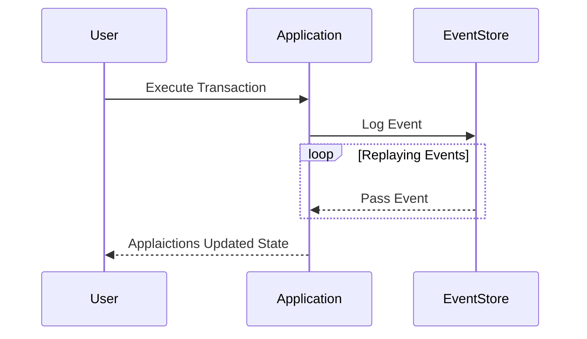

## Overview

Event Sourcing is a design pattern wherein state-changing operations are stored as a sequence of events. Unlike traditional persistence methods where only the current state is retained, event sourcing records each and every change as a discrete event. These events can then be replayed to reconstruct past states and achieve consistency across distributed systems.

## Detailed Explanation

### Benefits of Event Sourcing

1. **Auditability**: Each change to the system is captured, allowing for a complete audit trail. 
2. **Reproducibility**: State can be reconstructed at any point in time by replaying relevant events. 
3. **Decoupled Scalability**: Microservices can independently listen to relevant events and maintain materialized views.
4. **Flexibility in State Representation**: As new features are added, new projections can be constructed without altering the original event log.
5. **Temporal Query Capability**: By analyzing historical events, one can derive insights into how state evolved over time.

### Example Use Case

Consider a banking application where each transaction (deposit, withdrawal, transfer) is stored as an event:

- User A withdraws $100: An event `{ type: 'withdraw', amount: 100, user: 'A' }` is logged.
- User A deposits $200: An event `{ type: 'deposit', amount: 200, user: 'A' }` is logged.
  
The current balance of User A can be determined by replaying these events, i.e., starting from a base state (e.g., a zero or initial deposit) and applying each event sequentially.

### Related Architectural Approaches

- **Command Query Responsibility Segregation (CQRS)**: Event Sourcing is often paired with CQRS to separate write operations (commands) from read operations (queries), optimizing for task-specific efficiency and scalability.
  
- **Event-Driven Architecture**: Leverages events to decouple services, promoting an asynchronous communication model.

## Example Code

Below is an idealized example of how event sourcing might be implemented in a Java application:

```java
public class Event {
    private String type;
    private double amount;
    private String userId;

    // Constructors, getters, and setters
}

public class EventStore {
    private List<Event> eventLog = new ArrayList<>();

    public void addEvent(Event event) {
        eventLog.add(event);
    }

    public double replayEvents(String user) {
        double balance = 0;
        for (Event event : eventLog) {
            if (event.getUserId().equals(user)) {
                if ("deposit".equals(event.getType())) {
                    balance += event.getAmount();
                } else if ("withdraw".equals(event.getType())) {
                    balance -= event.getAmount();
                }
            }
        }
        return balance;
    }
}
```

This example demonstrates a simple event log and a replay function to calculate a user's balance.

## Diagrams

### Event Sourcing Flow



## Related Patterns

- **Saga Pattern**: To manage complex transactions across distributed services.
- **Replay Pattern**: Used for reprocessing or reapplying historic data.
  
## Additional Resources

- [Martin Fowler on Event Sourcing](https://martinfowler.com/eaaDev/EventSourcing.html)
- [CQRS and Event Sourcing in Microservices](https://microservices.io/patterns/data/cqrs.html)
- [Cloud Patterns for Event-Driven Architectures](https://cloudpatterns.io/event-driven-architectures)

## Summary

Event Sourcing redefines how data is managed and stored by capturing every state transition as an event. Beyond ensuring consistency, this pattern offers substantial benefits in auditability, reproducibility, and system evolution. By aligning with CQRS and event-driven architectures, organizations can build scalable and flexible systems that meet demand and foster innovation.
