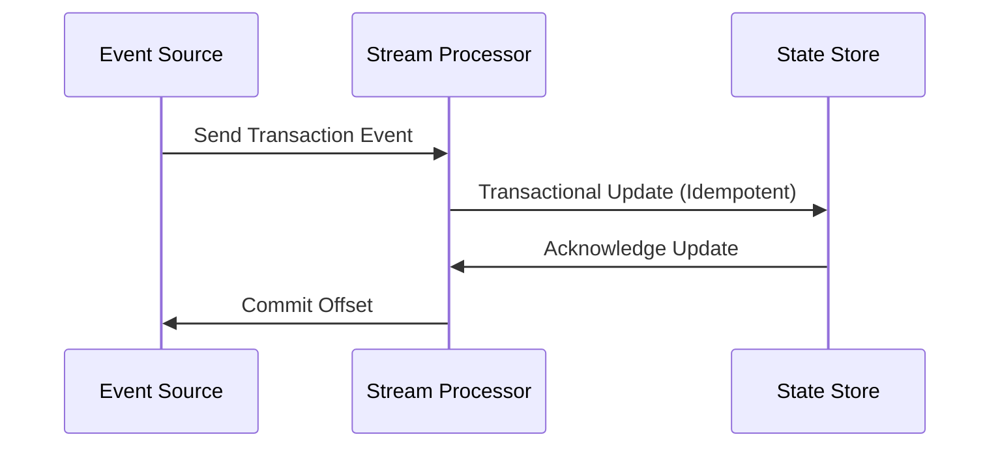

## Overview

In the realm of stream processing, ensuring that each event updates the state exactly once is crucial to maintaining data integrity. This is especially significant in applications where duplicate or missed updates could result in severe discrepancies, such as financial transaction processing, inventory management, or real-time analytics.

## Problem Statement

The primary challenge in achieving exactly-once state updates lies in addressing the issues of at-least-once and at-most-once processing. In at-least-once scenarios, duplicates can occur, whereas in at-most-once scenarios, data can be lost. Exactly-once semantics ensure that each event is processed a single time without oversight or repetition, preventing both duplication and loss.

## Architectural Approach

Exactly-once state updates can be realized through a combination of the following strategies:

1. **Idempotent Operations**: Facilitate operations that safely produce the same results even if performed multiple times. The implication here is that your state updates must be idempotent on the application level.

2. **Distributed Transactions**: Use systems that support multi-node distributed transactions to commit stateful changes only upon successful event processing.

3. **Transactional Event Sourcing**: Maintain a sequence of immutable events that can be reprocessed deterministically, ensuring that the application state can be derived at any given time by replaying events.

4. **Checkpoints and Offsets**: Employ stream processing frameworks that manage checkpoints and offsets, such as Apache Kafka with Kafka Streams or Apache Flink. These systems keep track of what has been processed and commit these points atomically with state updates.

## Example: Financial Transactions

Consider a stream processing application responsible for processing financial transactions where each transaction represents either a deposit or withdrawal for user accounts. Here, the application must ensure that account balances reflect the transaction amounts exactly once, to avoid financial inconsistencies.

**Code Sample:**

```java
// Java example using Kafka Streams for exactly-once semantics
Properties props = new Properties();
props.put(StreamsConfig.APPLICATION_ID_CONFIG, "financial-transactions");
props.put(StreamsConfig.BOOTSTRAP_SERVERS_CONFIG, "localhost:9092");
props.put(StreamsConfig.PROCESSING_GUARANTEE_CONFIG, StreamsConfig.EXACTLY_ONCE);

// Define your stream processing logic
StreamsBuilder builder = new StreamsBuilder();

KStream<String, Transaction> transactions = builder.stream("transactions");

// Perform operations that ensure idempotency
KGroupedStream<String, Double> balanceUpdates = transactions
    .map((key, transaction) -> new KeyValue<>(transaction.accountId(), transaction.amount()))
    .groupByKey()
    .aggregate(
        () -> 0.0,
        (aggKey, newValue, aggValue) -> aggValue + newValue, // Idempotent operation
        Materialized.<String, Double, KeyValueStore<Bytes, byte[]>>as("balances-store")
            .withValueSerde(Serdes.Double())
    );

KafkaStreams streams = new KafkaStreams(builder.build(), props);
streams.start();
```

## Diagrams

### Sequence Diagram



## Related Patterns

- **Event Sourcing**: Provides a framework for rebuilding application state by replaying events from a log.
- **Saga Pattern**: Manages failures in distributed transactions, ensuring consistent state across services.
- **Idempotent Consumer**: Ensures operations in stream processing systems are idempotent, fortifying message processing reliability.

## Additional Resources

- [Kafka Streams Documentation](https://kafka.apache.org/documentation/streams/)
- [Apache Flink Documentation](https://nightlies.apache.org/flink/flink-docs-stable/)
- [Building Data-Intensive Applications](https://www.oreilly.com/library/view/designing-data-intensive-applications/9781491903063/)

## Summary

The Exactly-Once State Updates pattern ensures reliable data consistency in real-time stream processing applications. By enforcing idempotency and utilizing checkpointing mechanisms, this pattern prevents scenarios of duplicate processing or data loss, resulting in systems that are both robust and reliable. This is especially critical in domains demanding high accuracy, such as finance and inventory management. Embracing this pattern allows for precise state updates, fortifying data integrity across distributed systems.
