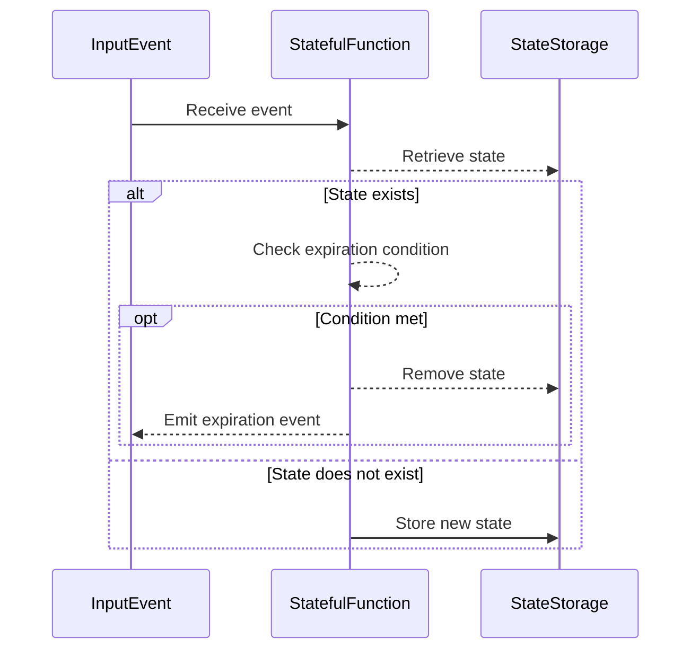

## Introduction

State management is integral to stream processing, offering the ability to maintain information about past data events. However, unregulated accumulation of state data can lead to resource depletion and impaired system performance. The State Expiration pattern provides a structured approach to efficiently manage state data by defining expiration rules to remove obsolete entries. This pattern ensures that state only persists for its useful lifespan, preventing stale data from impacting future processing.

## Architectural Approach

State expiration can be managed through several different architectural strategies:

1. **Time-Based Expiration**: Associates a timestamp with state entries, allowing automatic removal after a specified duration.
2. **Threshold-Based Expiration**: Limits the number of entries or their cumulative size, triggering expiration when these thresholds are surpassed.
3. **Event-Driven Expiration**: Ties state expiration to specific events, for example, user logout or completion of a batch job.
4. **Idle Time Expiration**: Removes state if no action has been recorded for a certain period, useful in session expiration.

## Example Code

### Timer-Driven State Expiration

The following is an example of how you might implement state expiration using a time-based approach in Scala with Apache Flink:

```scala
import org.apache.flink.api.common.state.{ValueState, ValueStateDescriptor}
import org.apache.flink.streaming.api.scala._
import org.apache.flink.streaming.api.windowing.time.Time

case class UserSession(userId: String, lastAccessedTime: Long)

class SessionManagementFunction extends RichFlatMapFunction[(String, Long), String] {

  lazy val state: ValueState[UserSession] =
    getRuntimeContext.getState(new ValueStateDescriptor[UserSession]("userSessionState", classOf[UserSession]))

  override def flatMap(input: (String, Long), out: Collector[String]): Unit = {
    val currentUserSession = state.value()

    if (currentUserSession == null) {
      val newUserSession = UserSession(input._1, input._2)
      state.update(newUserSession)
    } else {
      if (input._2 - currentUserSession.lastAccessedTime > Time.minutes(30).toMilliseconds) {
        out.collect(s"Session expired for user: ${input._1}")
        state.clear()
      } else {
        state.update(UserSession(input._1, input._2))
      }
    }
  }
}
```

## Diagrams

Below is a sequence diagram illustrating the state expiration flow:



## Related Patterns

1. **Stateful Processing**: Ensures that state persistence spans across multiple events, supporting complex computations over time.
2. **Event Sourcing**: Keeps a log of all changes as a sequence of events, supporting repeated evaluations or retrospective analysis.
3. **Cache-Aside Pattern**: Optimizes information retrieval by temporarily storing frequently accessed data closer to the processing logic.

## Additional Resources

- [Apache Flink Documentation - Stateful Stream Processing](https://flink.apache.org/)
- [Microsoft Azure Patterns - Cache-Aside Pattern](https://docs.microsoft.com/en-us/azure/architecture/patterns/cache-aside)
- [Cloud Native Patterns - Handling Stateful Data](https://cloudnativepatterns.com/stateful-patterns)

## Conclusion

State expiration is a vital design pattern for stream processing applications, providing an effective means to optimize resource utilization and uphold data relevance. By implementing expiration strategies like time-based, threshold-based, event-driven, and idle time expiration, applications can maintain a balanced approach to state management that supports efficient and accurate real-time analysis.
