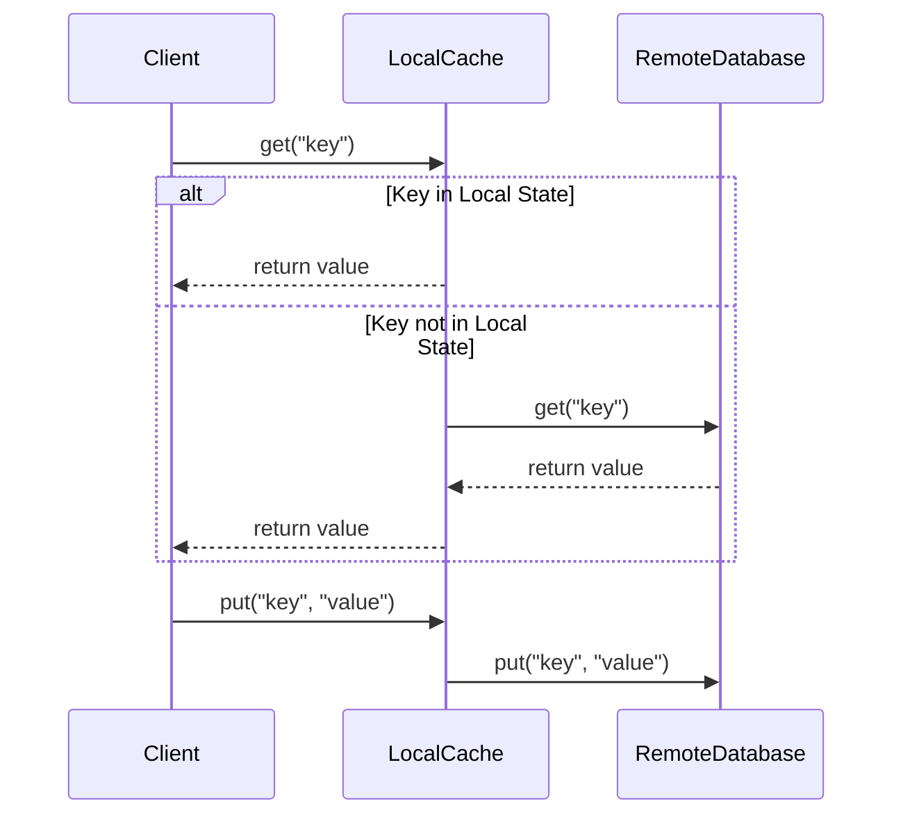

## Overview

The "Local vs. Remote State" pattern addresses a fundamental choice in designing systems that involve processing and storing stateful data. This pattern considers the trade-offs between high-speed local storage (such as in-memory caches) and highly available remote storage systems that provide durability and scalability, such as distributed databases or object stores in the cloud.

## Description

Modern applications and systems frequently handle significant volumes of stateful data, which can either be stored in-memory locally on the processing nodes or remotely in a distributed state store. The decision between local and remote state hinges on several key factors, including performance requirements, system architecture, failure resilience, and scalability demands.

### Local State

- **Advantages**:
  - **Low Latency**: Accessing state stored locally in the memory of the processing nodes can significantly reduce latency due to quicker data retrieval.
  - **High Throughput**: Systems benefit from increased throughput by minimizing the data transfer overhead often associated with network and I/O operations.
  
- **Disadvantages**:
  - **Data Loss Risk**: State is volatile, leading to potential data loss upon node failure unless there are additional mechanisms in place for state recovery.
  - **Limited Capacity**: In-memory storage is limited by the physical memory available on the node.

### Remote State

- **Advantages**:
  - **Durability**: With data stored in durable and often replicated distributed systems, recovery from failures is more straightforward.
  - **Elastic Scalability**: Remote data stores can scale independently of processing nodes, accommodating growing data with minimal changes.

- **Disadvantages**:
  - **Higher Latency**: Remote access introduces network latency, which might affect overall system responsiveness.
  - **Complexity**: Maintaining and managing distributed state can introduce additional architectural complexity.

## Architectural Approaches

1. **Hybrid Models**: Combine both local and remote state management. Frequently accessed data can be cached locally to speed up access, while other data remains in distributed storages.
   
2. **Replication**: Ensure that critical state stored in-memory is periodically synced with a remote data store to prevent data loss due to failures.

3. **Partitioning**: Partition state across nodes or data centers to leverage both local processing efficiency and the extensive capacity of distributed storages.

## Best Practices

- **Profiling & Monitoring**: Use analytics to understand data access patterns and optimize between local and remote state decisions based on access frequency, size, and update rates.
  
- **Redo Logs**: Implement a logging system to reconstruct in-memory state upon failure, thereby offering a trade-off between quick access and safety in case of data loss.

- **Cap Expenditure**: Regularly evaluate the cost implications of scaling local vs. distributed state solutions to align them with budgetary constraints effectively.

## Example Code

Here's an example using a hybrid approach with Java and a simple key-value store:

```java
import java.util.HashMap;
import java.util.Map;

public class LocalCache {
    private final Map<String, String> localState = new HashMap<>();

    // Assuming remote state is simulated via a remote database service
    private final RemoteDatabase remoteDb = new RemoteDatabase();

    public String get(String key) {
        // Check local cache first
        if (localState.containsKey(key)) {
            return localState.get(key);
        } else {
            // Fallback to remote DB if not found
            return remoteDb.get(key);
        }
    }

    public void put(String key, String value) {
        // Update both local and remote state for consistency
        localState.put(key, value);
        remoteDb.put(key, value);
    }
}

class RemoteDatabase {
    private final Map<String, String> remoteState = new HashMap<>();

    public String get(String key) {
        return remoteState.getOrDefault(key, null);
    }

    public void put(String key, String value) {
        remoteState.put(key, value);
    }
}
```

## Diagrams

Below is a simple UML Sequence Diagram illustrating the hybrid approach:



## Related Patterns

- **Caching**: Focuses on storing copies of data in a local cache to reduce access times and decrease load on the storage systems.
- **CQRS (Command Query Responsibility Segregation)**: Encourages separation of read and write operations which can impact state management decisions.

## Additional Resources

- *Designing Data-Intensive Applications* by Martin Kleppmann
- Online resources on distributed systems and state management architecture, like those available from cloud service providers.

## Summary

Choosing between local and remote state management is a critical architectural decision that impacts the performance, resilience, and scalability of a system. By understanding the trade-offs inherent to both approaches—and potentially blending them into a hybrid model—system architects and developers can optimize their designs to meet the specific demands of their applications.

For further exploration of this pattern, consider examining how modern systems like Kubernetes and cloud service providers handle stateful applications.
