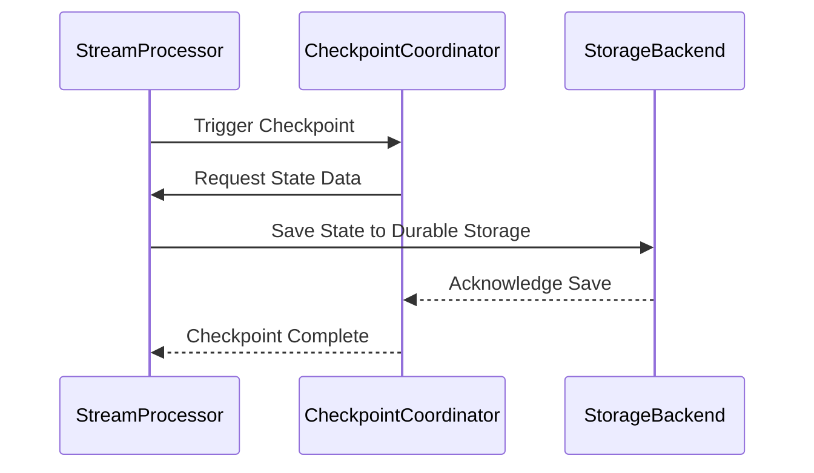

## Overview

State Checkpointing is a critical design pattern in the realm of stream processing, particularly for applications that demand high reliability and consistency. It involves periodically saving the state of a stream processing application to a durable storage medium, such as HDFS or S3. This practice ensures that in the event of application failures, recovery is possible without data loss or inconsistency, thus facilitating the resumption of processing from the last checkpointed state.

## Pattern Characteristics

### Goals

- **Fault Tolerance**: Enables systems to continue operating, or quickly resume operations, despite the occurrence of failures.
- **Data Consistency**: Maintains the integrity of the data being processed through checkpoints.
- **Minimal Data Loss**: Reduces the risk of losing processed data by saving the state at regular intervals.

### Problem Addressed

In distributed stream processing, applications often maintain state while processing data streams. Without checkpointing, any failure can lead to a loss of state or data inconsistency, demanding a mechanism to persist state periodically.

### Solution

The solution is to implement a checkpointing mechanism at regular intervals. This includes:

1. **Periodic Checkpoints**: Configure checkpoints at sensible intervals, balancing performance and reliability.
2. **Durable Storage**: Utilize robust storage solutions (e.g., AWS S3, Hadoop HDFS) that provide high durability and availability.
3. **State Backend Abstraction**: Employ a state backend that abstracts the storage interface for easy checkpointing.

### Components

- **Processing Nodes**: Nodes that carry out stream processing and temporarily store the state between checkpoints.
- **Storage Backend**: Persistent storage where checkpoints are saved. Choices include cloud storage solutions like S3, BigQuery, or on-premise setups like HDFS.
- **Checkpoint Coordinator**: Manages and coordinates the triggering of checkpoints amongst nodes.

### Architectural Approaches

- **Asynchronous Dumping**: State is saved asynchronously to prevent bottlenecks during processing.
- **Consistent Snapshotting**: Ensures that snapshots of processing state are taken consistently across distributed nodes.
- **Incremental Checkpointing**: Stores only changes since the last checkpoint, reducing storage overhead and improving checkpointing speed.

### Best Practices

- **Checkpoint Frequency**: Tune the frequency of checkpoints based on the acceptable data loss, system throughput, and recovery time objectives.
- **Monitoring and Alerts**: Implement monitoring for checkpointing operations to detect and rectify failures promptly.
- **Version Control for States**: Keep track of state versions to rollback if necessary.
- **Testing Recovery Procedures**: Regularly test the application’s ability to recover from checkpoints to ensure the reliability of the checkpointing mechanism.

## Example Code

Below is a Scala example using Apache Flink, a popular open-source stream processing framework that supports state checkpointing:

```scala
val env = StreamExecutionEnvironment.getExecutionEnvironment
env.enableCheckpointing(10000) // checkpoint every 10 seconds

val stream = env
  .fromElements("a", "b", "c", "a") 
  .map(value => (value, 1))
  .keyBy(0)
  .sum(1)

stream.print()

env.execute("Flink State Checkpointing Example")
```

In this code snippet, checkpoints are set every 10 seconds, enabling fault tolerance for reprocessing stateful data streams.

## Diagram

Here’s a simple sequence diagram showing how state checkpointing works within a stream processing environment:



## Related Patterns

- **Event Sourcing**: While State Checkpointing emphasizes periodic snapshots, Event Sourcing persists all changes as discrete events, allowing complex reconstructions and analyses.
- **Replayable Source**: Involves designing data sources that can replay data to support systems with state recovery methods like checkpointing.

## Additional Resources

- [Apache Flink Documentation on State Backends](https://flink.apache.org/state-backends.html)
- [AWS Checkpointing with Kinesis Data Analytics](https://aws.amazon.com/kinesis/data-analytics/)
- [The Importance of Kafka Streams Checkpointing](https://docs.confluent.io/platform/current/streams/architecture.html#checkpointing)

## Summary

State Checkpointing is an essential pattern within stream processing systems that helps in maintaining data integrity and application resilience. By regularly saving the state, applications can recover swiftly and consistently from disruptions. Implementing effective state checkpointing ensures minimal data loss and maintains robust, reliable data processing workflows within distributed stream processing systems.
