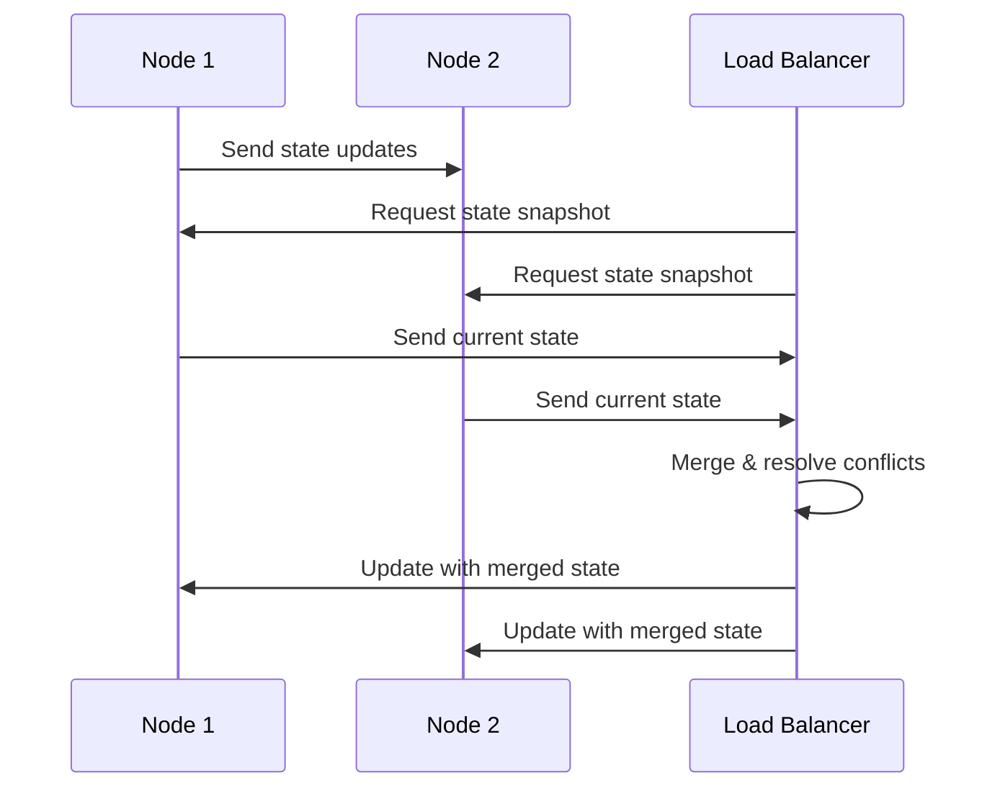

## Introduction

In the context of distributed systems and stream processing, maintaining state across distributed nodes is crucial for ensuring data consistency and system reliability. The **State Merging** pattern addresses the challenge of combining state from different sources or during operational changes like shard rebalancing. This process is particularly important in systems that employ dynamic scaling and load-balancing strategies.

## Design Pattern Explanation

State Merging involves several key steps and considerations:

1. **State Identification**: Identify which pieces of state need merging. This typically occurs when workloads are shifted due to scaling operations or failures.

2. **Data Consistency**: Ensure that merging operations do not lead to inconsistencies. This requires the use of conflict resolution strategies, such as last-write-wins or quorum-based solutions.

3. **Redistribution Algorithm**: Implement an algorithm to redistribute and merge the state across nodes. The strategy should minimize data movement to avoid excessive network overhead and latency.

4. **Concurrency Control**: Handle concurrency issues arising from multiple nodes attempting to access or modify state during the merging process.

5. **Failure Recovery**: Implement mechanisms to handle failures during the state merging process. This might involve retry mechanisms or checkpointing to restart from a known consistent state.

## Example Code

Here’s a simplified pseudo-code example of a state merging operation in a stream processing application using a functional programming approach:

```scala
case class State(value: Int, timestamp: Long)

def mergeState(currentState: State, newState: State): State = {
  if (newState.timestamp > currentState.timestamp) newState
  else currentState
}

val node1State = State(10, 1001)
val node2State = State(15, 1005)

val mergedState = mergeState(node1State, node2State)

println(s"Merged State: ${mergedState.value}, Timestamp: ${mergedState.timestamp}")
```

In this example, the state with the most recent timestamp wins, illustrating one conflict resolution strategy.

## Diagrams

To visualize the State Merging pattern, consider the following UML Sequence diagram representing the state combination process:



## Related Patterns and Concepts

- **Event Sourcing**: Captures state changes as a sequence of events, which can be replayed to rebuild state. This pattern complements State Merging by providing a history of state changes.
  
- **CQRS (Command Query Responsibility Segregation)**: Separates operations that read data from those that update data, potentially simplifying the state-merging process in distributed systems.

- **Leader Election**: Determines which node should coordinate the state merging process, ensuring smooth operation and conflict resolution.

## Additional Resources

- [Designing Data-Intensive Applications by Martin Kleppmann](https://dataintensive.net)
- [A Practitioner’s Guide to Api Design for Modern Systems by James Higginbotham](https://launchany.com/api-design)
- [Distributed Systems: Principles and Paradigms by Andrew S. Tanenbaum and Maarten Van Steen](https://www.distributed-systems.net/index.php/books/)

## Summary

The State Merging pattern is essential in ensuring the consistency and reliability of stateful operations across distributed nodes in streaming applications. By focusing on mechanisms for conflict resolution, efficient data redistribution, and robust recovery protocols, systems can maintain optimal performance and data integrity even as they scale dynamically. This pattern is a foundational concept for building resilient distributed computing architectures, especially those that must manage high-throughput, low-latency data streams in real-time.
