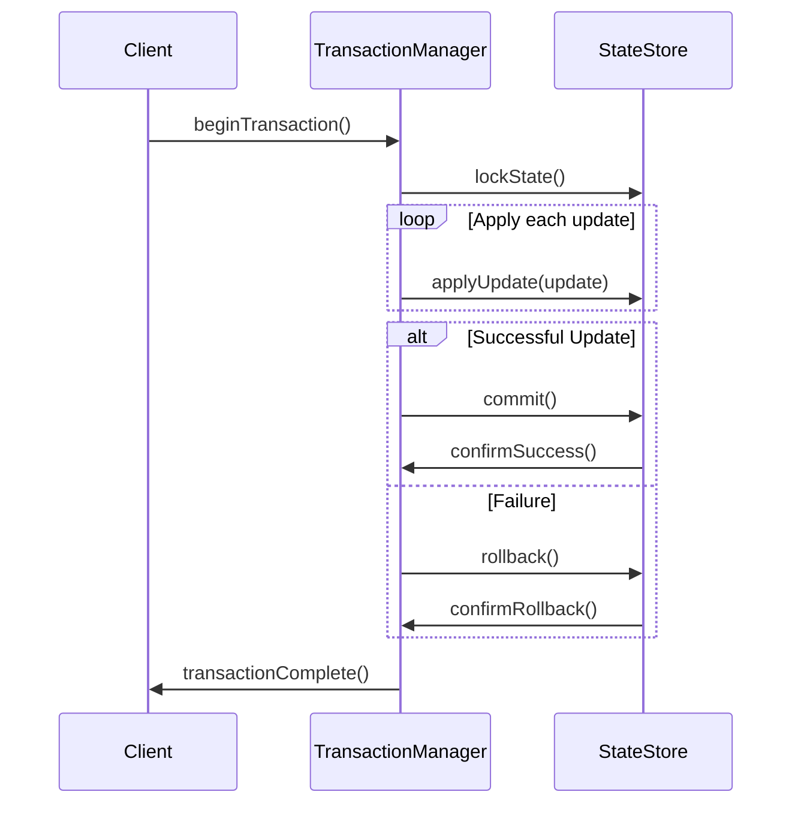

## Transactional State Updates

### Description

Transactional State Updates refer to the practice of utilizing transactions to ensure that state changes across a system are atomic and consistent. This is especially crucial in distributed systems where multiple components or nodes may be involved in a single operation. This pattern enforces that either all changes to the state are committed together or none at all, thereby maintaining the data integrity and reliability of the system.

### Architectural Approaches

1. **Distributed Transactions**: Utilize protocols like XA or two-phase commit to coordinate and manage transactions across different resources or services.
   
2. **Local Transactions with Compensating Actions**: Use local transactions and define compensating actions to handle failure scenarios. This approach is useful when global transaction management is too costly.

3. **Eventual Consistency with Idempotent Operations**: For systems where strict consistency might degrade performance, use eventual consistency along with idempotent operations to ensure reliable state.

4. **Saga Pattern**: Implement a sequence of transactions that can individually fail and roll-back using compensating transactions, providing a more granular control than traditional transactions.

### Best Practices

- **Idempotency**: Ensure that operations can be applied multiple times without changing the result beyond the initial application. This is particularly useful in retry logic.

- **State Partitioning**: Partition state data to reduce transaction conflicts and improve the efficiency of state updates.

- **Asynchronous Processing**: Where possible, leverage asynchronous state updates to minimize latency and enhance throughput.

- **Consistent Hashing**: Use consistent hashing to distribute state data evenly across a cluster, optimizing for both load balancing and failover scenarios.

### Example Code

Below is a pseudo-code example illustrating a simple transactional state update within a distributed stream processing architecture:

```scala
def updateStateWithinTransaction(stateStore: StateStore, updates: Seq[StateUpdate]): Boolean = {
  val transaction = stateStore.beginTransaction()

  try {
    updates.foreach(update => stateStore.applyUpdateWithinTransaction(transaction, update))
    transaction.commit()
    true
  } catch {
    case e: Exception =>
      transaction.rollback()
      false
  }
}
```

In this example, `StateStore` represents the entity responsible for managing application state. The `beginTransaction` method starts a new transaction, `applyUpdateWithinTransaction` applies the updates within the confines of the transaction, and `commit` and `rollback` finalize the transaction based on the success or failure of applying the updates.

### Diagrams

#### Mermaid UML Sequence Diagram



### Related Patterns

- **Saga Pattern**: An approach to managing distributed transactions without the need for distributed locking.
  
- **Event Sourcing**: Captures all changes to the application state as a sequence of events.

- **Command Query Responsibility Segregation (CQRS)**: Separates reads and writes into different models to optimize processing.

### Additional Resources

- _Designing Data-Intensive Applications_ by Martin Kleppmann
- Distributed Systems: Principles and Paradigms by Andrew S. Tanenbaum
- Event Sourcing pattern at Microsoft Docs

### Summary

The Transactional State Updates pattern is pivotal in ensuring data consistency and integrity across distributed systems. By utilizing transactions, applications can perform reliable and atomic state changes even in complex architectures. Despite the challenges involved in managing distributed transactions, adopting approaches such as the Saga Pattern and using idempotent operations can offer scalable and resilient solutions. Understanding and leveraging these practices can significantly enhance the robustness of complex applications faced with maintaining shared state.
