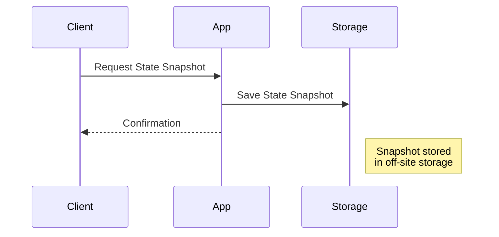

Stateful systems, particularly in stream processing, often hold critical application state that influences computational results. **State Backups** is a crucial design pattern that ensures the safeguarding of this state by regularly creating backups. These backups help prepare for disaster recovery scenarios, allowing applications to restore their state to a previous stable point following unexpected failures or data corruption.

## Detailed Explanation

In a distributed system, maintaining state consistency and availability is essential for resilience. Applications, especially those engaging in complex computations over streams of data, need mechanisms to recover swiftly from disruptions. State Backups represent a strategy where the application periodically captures a consistent snapshot of its state and saves it to a separate, often off-site, storage system.

**Objectives of State Backups:**

- **Disaster Recovery**: Ensure that applications can recover from catastrophic events by reviving state from backups.
- **Consistency**: Maintain data consistency across system failures.
- **Durability**: Protect state against both planned and unplanned outages.

The understanding of State Backups incorporates various factors:

1. **Snapshot Capture**: At set intervals or specific points in the application flow, capture the current state, creating a checkpoint.
2. **Off-Site Storage**: Transfer these snapshots to remote or distributed storage to protect against local hardware failures.
3. **Restoration Protocols**: Develop efficient protocols for quick recovery of state from backups when required.

## Example Code

Consider stream processing using Apache Kafka Streams, which supports the creation and maintenance of state stores:

```java
import org.apache.kafka.streams.KafkaStreams;
import org.apache.kafka.streams.KeyValue;
import org.apache.kafka.streams.StreamsBuilder;
import org.apache.kafka.streams.kstream.KStream;

public class StateBackupExample {
    
    public static void main(String[] args) {
        StreamsBuilder builder = new StreamsBuilder();
        KStream<String, String> stream = builder.stream("input-topic");

        stream
            .groupByKey()
            .reduce((aggValue, newValue) -> aggValue + newValue, "state-store")
            .toStream()
            .foreach((key, value) -> System.out.println("Key: " + key + ", Value: " + value));

        KafkaStreams streams = new KafkaStreams(builder.build(), new StreamsConfig());
        streams.setUncaughtExceptionHandler((thread, exception) -> {
            // Add logic to handle exceptions and possibly load state from a backup
        });

        Runtime.getRuntime().addShutdownHook(new Thread(streams::close));
        streams.start();
    }
}
```

In this example, `state-store` periodically saves intermediate states, which can be configured to back up to an external location using Kafka Streams' built-in support for state restoration.

## Diagrams

### Mermaid UML Sequence Diagram



## Related Patterns

- **Checkpointing**: Similar to state backups, checkpointing captures the application's state but focuses on it at specific events or intervals to ensure minimal data loss.
- **Stateless Processing**: A contrasting approach where applications are designed to minimize or eliminate retained state altogether.

## Additional Resources

- **Apache Kafka Documentation** on state stores and changelog topics.
- **Amazon S3** for durable, off-site storage, often used for state snapshot storage.
- **Strategies for Implementing Stateful Stream Processing** blog articles and white papers.

## Summary

The **State Backups** design pattern is a fundamental aspect of modern stream processing architectures that prioritize resilience and error recovery. By maintaining reliable state backups, systems improve their ability to withstand and recover from failures, ensuring seamless continuity in data processing workflows. Adopting practices such as periodic snapshot creation and efficient restoration procedures enhance overall system robustness, helping safeguard critical business operations against unforeseen events.
