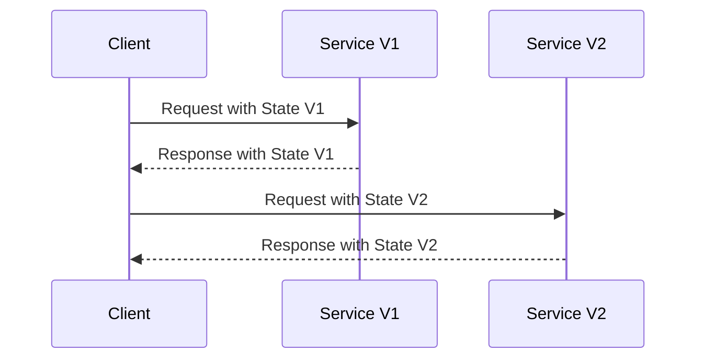

## Introduction

In the dynamic landscape of stream processing, applications frequently undergo transformations, either due to schema evolution or the need for application feature upgrades. The State Versioning pattern addresses these challenges by enabling systems to manage different state versions gracefully, ensuring backward compatibility and seamless transitions.

## Detailed Explanations

### What is State Versioning?

State Versioning is a pattern that allows the management of different versions of state structures in stream processing systems. This is particularly crucial during:

1. **Schema Evolution**: When the data schema changes, but the system must still process historical data based on older schemas.
2. **Application Updates**: During rolling upgrades where some components may still utilize older versions of state, while others use the new version.

### Architectural Approaches

State Versioning can be implemented using several architectural techniques:

- **Serialization with Metadata**: Include version metadata within serialized state data. This technique helps during deserialization to determine which class or schema version to use.

- **State Conversion Logic**: Implement logic that can convert state from one version to another. This is often necessary when the structure of the state changes significantly between versions.

- **State Sharding by Version**: Maintain separate storage for different state versions, thereby isolating changes and minimizing the risk of corruption during state transitions.

### Example Code

Here is a simplified example in Scala illustrating how one might handle state versioning using Akka Streams:

```scala
import akka.{ Done, NotUsed }
import akka.stream.scaladsl.{ Flow, Sink, Source }
import scala.concurrent.Future

case class StateV1(data: String)
case class StateV2(data: String, timestamp: Long)

val v1Processor: Flow[StateV1, StateV1, NotUsed] = Flow[StateV1].map { state =>
  // Some processing logic for version 1
  state.copy(data = state.data.toUpperCase)
}

val v2Processor: Flow[StateV2, StateV2, NotUsed] = Flow[StateV2].map { state =>
  // Some processing logic for version 2
  state.copy(data = state.data.toLowerCase)
}

val stateSource: Source[Any, NotUsed] = Source(List(StateV1("dataV1"), StateV2("dataV2", System.currentTimeMillis())))

val stateSink: Sink[Any, Future[Done]] = Sink.foreach(println)

// Demo processing logic handling state versioning
stateSource
  .collect {
    case state: StateV1 => v1Processor.runWith(Source.single(state), stateSink)
    case state: StateV2 => v2Processor.runWith(Source.single(state), stateSink)
  }
```

### Diagrams

Below is a conceptual Mermaid sequence diagram showing how state versioning is managed:



### Best Practices

1. **Backward Compatibility**: Always ensure that the system can still process data using old state structures during schema changes.

2. **Testing**: Implement thorough testing for all state versions to minimize risk during upgrades or schema evolutions.

3. **Clear Versioning Policy**: Adopt clear versioning practices in the schema to avoid confusion and enhance maintainability.

## Related Patterns

- **Schema Registry**: Managing the metadata of schemas centrally, to ensure applications interact with data in a compatible manner.
- **Rolling Upgrades**: Helps in transitioning to new versions without taking the system offline.

## Additional Resources

- [Stream Processing with Apache Kafka](https://kafka.apache.org/documentation/streams/)
- [Schema Evolution in Data Lakes](https://www.databricks.com/blog/2021/04/01/simplifying-change-data-capture-with-delta-lake.html)

## Summary

The State Versioning pattern is an essential practice for managing the complexities associated with state schema changes and application updates in distributed stream processing systems. Implementing State Versioning ensures that your system remains robust, reliable, and capable of evolving without disruptions.
