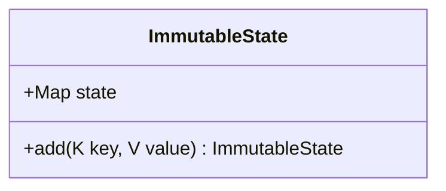

## Introduction to Immutable State Management

Immutable State Management is a design pattern employed in stream processing and software architecture where state changes are treated immutably. This means each state change results in a new state instance rather than altering existing state, ensuring safer concurrent data access and simpler rollback mechanisms.

## Detailed Explanation

In traditional state management, modifying state directly can lead to complex issues, especially in concurrent applications. Immutable State Management simplifies this by ensuring that any update to the state results in a new version of the state, leaving the original state unchanged. This approach employs immutable data structures, which are inherently thread-safe, removing the need for locks or complex synchronization.

### Key Components

1. **Immutable Data Structures**:
   - Use data structures that do not allow modification after creation.
   - Any “change” operation returns a new data structure, preserving the original.

2. **Concurrency Safety**:
   - Multiple threads can read the shared state without requiring locks.
   - Locks or other synchronization mechanisms are only necessary for state transitions.

3. **Rollback Capabilities**:
   - Returning to previous states is as simple as maintaining pointers to old states.
   - Useful in systems like event sourcing, where understanding how current state arrived at its present condition requires preserving past states.

### Architectural Approaches

- **Functional Programming**: Languages like Scala and Clojure natively support immutability, which makes implementing this pattern easier.
- **Event Sourcing**: Design systems where changes are logged as discrete events, capturing the state changes needed for rebuilding past states.
- **Snapshotting**: Regularly save complete snapshots of the state alongside the event log for efficient restoration.

## Example Code

### Scala Example with Immutable Collections

```scala
// Define an immutable map representing state
val initialState = Map("accountBalance" -> 100)

// Updating the state through new instance creation
val updatedState = initialState + ("accountBalance" -> (initialState("accountBalance") + 150))

println(s"Initial State: $initialState")
println(s"Updated State: $updatedState")
```

In this example, the state remains unchanged in `initialState`, while `updatedState` contains the modification.

## Diagrams



## Related Patterns

- **Event Sourcing**: Complements immutable state by storing each change event instead of altering state directly.
- **CQRS (Command Query Responsibility Segregation)**: Separates read and update operations, which pairs well with immutable data strategies.

## Additional Resources

- [Functional Programming in Scala](https://www.manning.com/books/functional-programming-in-scala)
- [Immutable.js Documentation](https://immutable-js.github.io/immutable-js/)
- [Event Sourcing on Martin Fowler's Website](https://martinfowler.com/eaaDev/EventSourcing.html)

## Summary

The Immutable State Management pattern revolutionizes state handling in concurrent applications by emphasizing the immutability of state changes. This not only optimizes concurrency handling but also simplifies rollback processes. Adopting this pattern, especially when using languages and frameworks that inherently support immutability, leads to robust, maintainable, and easily understandable systems, particularly in stream processing architectures.
