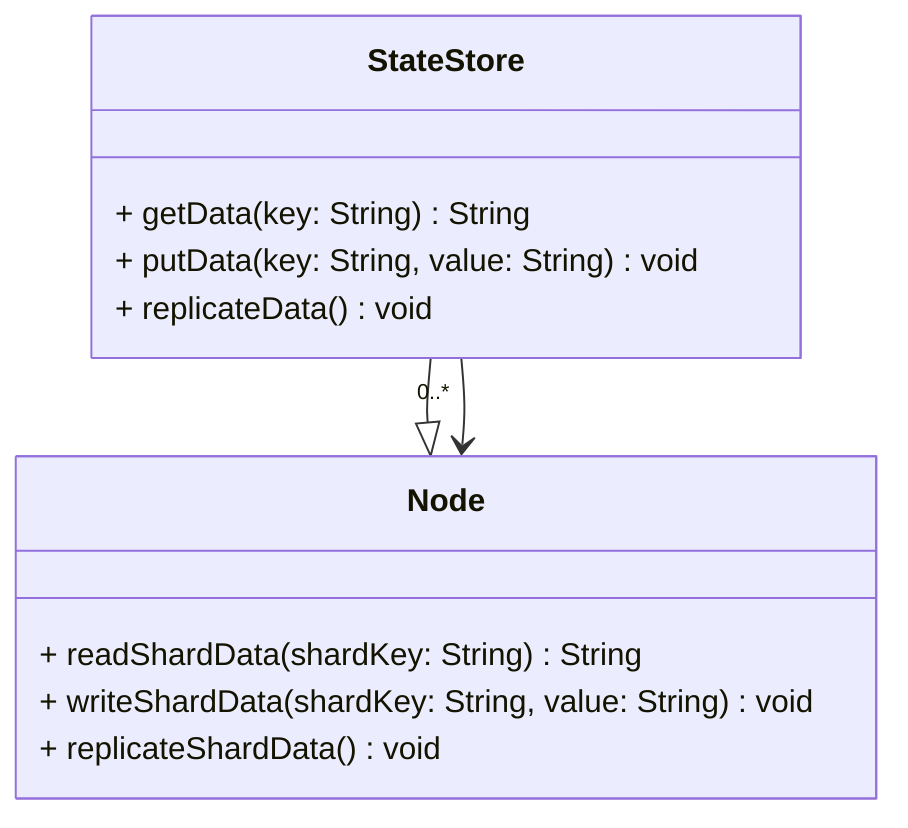

State management plays a critical role in stream processing and distributed systems, where applications often need to maintain and access state information that's dynamically changing. Distributed State Stores enable such applications to manage state across multiple nodes in a cluster, ensuring both scalability and fault tolerance, key considerations for modern, high-availability systems.

## Key Concepts

Distributed State Stores provide an efficient way to manage and access shared state in distributed environments. This pattern focuses on using distributed storage systems, such as Apache Ignite or Redis Cluster. These systems distribute state data across nodes, allowing concurrent access and updates while distributing load and mitigating failure impacts.

### Main Components

- **State Store**: This is the central component where the actual state is managed. In distributed setups, these stores may comprise several nodes acting together to present a unified state store.
- **State Partitioning**: To ensure scalability, state data is partitioned across multiple nodes. Each partition can independently handle read and write requests.
- **Replication**: For fault tolerance, state data is often replicated across nodes. This ensures that system state can be recovered in case of a node failure.
- **Consistency Model**: The store must define a consistency model that governs how updates are performed—whether they must be immediately visible across the entire cluster (strong consistency) or can be gradually propagated (eventual consistency).

## Architectural Approaches

1. **Sharded Architecture**: Divides the state into shards, with each node responsible for one or more shards. This balances the load and allows horizontal scaling.
2. **Master-Slave Replication**: A primary node handles writes while replicating changes to other nodes (slaves) to handle reads and provide redundancy.
3. **Active-Active Replication**: Enables concurrent write operations across multiple nodes, enhancing availability but requiring sophisticated conflict resolution mechanisms.

## Best Practices

- **Choose the Right Consistency**: Depending on your application's needs, choose between strong and eventual consistency. Trading off consistency can lead to improved availability and partition tolerance.
- **Optimize Read/Write Patterns**: Analyze the usage patterns to design state stores tailored for high read loads vs. high write loads.
- **Use Caching Layers**: Implement caching to reduce the load on the state store and improve access times. This is particularly useful in read-heavy scenarios.
- **Regular State Clearing**: Implement strategies to manage and purge stale or unnecessary state to maintain efficient storage utilization.

## Example Code

Here's an example of setting up a distributed state store using Redis Cluster:

```javascript
const redis = require("redis");
const client = redis.createCluster({
  rootNodes: [
    { url: "redis://localhost:6379" }
  ]
});

async function run() {
  await client.connect();

  await client.set('key', 'value');
  const value = await client.get('key');

  console.log(value); // Outputs 'value'

  await client.disconnect();
}

run().catch(console.error);
```

## Diagram



## Related Patterns

- **Event Sourcing**: Maintains state by storing sequences of state-changing events instead.
- **CQRS (Command Query Responsibility Segregation)**: Segregates data modification from retrieval to optimize read and write operations.
- **Saga Pattern**: Manages long-lived transactions and state over microservices.

## Additional Resources

- **Apache Ignite Documentation**: [Ignite Documentation](https://ignite.apache.org/docs/latest)
- **Redis Cluster Specification**: [Redis Cluster](https://redis.io/topics/cluster-tutorial)

## Summary

Distributed State Stores are a critical component in the architecture of resilient and scalable distributed systems. They address the challenges of state synchronization and reliability across different nodes, facilitating effective load distribution and failure recovery. This pattern allows developers to design systems that handle significant state volumes efficiently, maintaining consistency and high availability in ever-evolving cloud environments.
