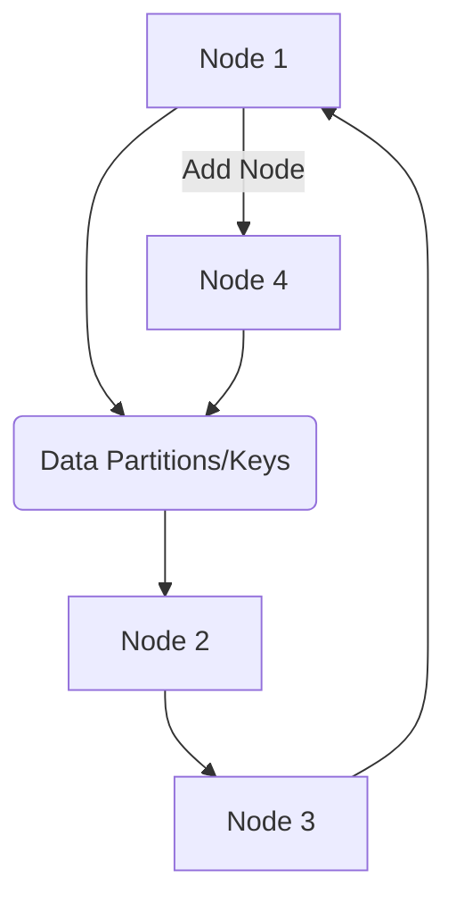

## Introduction

In distributed systems, particularly those designed for stream processing, maintaining state efficiently across nodes is crucial. Consistent hashing is a design pattern that enables the assignment of partitions or keys to nodes in such a way that minimizes data movement when scaling (adding or removing nodes). This characteristic is critical in cloud environments where scalability and high availability are routine requirements.

## Design Pattern Explanation

Consistent hashing maps nodes and data to the same hash space using a ring-like structure. Rather than reassigning all data when the number of nodes changes, only the smallest possible amount of data is reassigned. This is achieved by strategically placing nodes around the hash ring and mapping data partitions or keys to this ring's nearest nodes.

### Advantages

1. **Minimized Reassignment**: When a node enters or leaves, only a small portion of the keys need to be reassigned. Practically, this means less data movement and increased efficiency.
   
2. **Scalability**: The system can grow or shrink dynamically with ease, an important trait for handling varying loads in a cloud environment.

3. **Load Balancing**: Ensures that each node only handles a portion of the data, thereby enabling better load distribution.

## Architectural Design

The architecture based on consistent hashing typically involves the following steps:

1. **Hash Space Definition**: Define a hash space, usually a fixed-size circle (the consistent hash ring).

2. **Node Assignment**: Assign nodes to positions in the hash space using a hash function.

3. **Data Mapping**: Map data partitions or state keys to points on the hash ring. Data responsibility falls to the first node that occurs in a clockwise direction on the ring.

4. **Rebalancing**: When nodes are added or removed, adjust only the adjacent nodes' data.

### Diagram Example

Below is a simple illustration using Mermaid to highlight how keys and nodes are mapped in a consistent-hash ring:



## Example Code

Here's a simple conceptualized snippet demonstrating creating a consistent hashing mechanism in Java:

```java
import java.util.SortedMap;
import java.util.TreeMap;

public class ConsistentHashing {
    private final SortedMap<Integer, String> circle = new TreeMap<>();

    public void addNode(String node) {
        int hash = node.hashCode();
        circle.put(hash, node);
    }

    public void removeNode(String node) {
        int hash = node.hashCode();
        circle.remove(hash);
    }

    public String getNodeForKey(String key) {
        if (circle.isEmpty()) {
            return null;
        }
        int hash = key.hashCode();
        SortedMap<Integer, String> tailMap = circle.tailMap(hash);
        Integer target = !tailMap.isEmpty() ? tailMap.firstKey() : circle.firstKey();
        return circle.get(target);
    }
}
```

## Related Patterns and Paradigms

- **Sharding**: Distributes data across multiple databases to enhance scalability.
- **Partitioning**: Similar to sharding, often used in databases to split large data tables based on certain fields.

## Additional Resources

- [Consistent Hashing in Distributed Systems: Proof of Concept](https://dl.acm.org)
- [Amazon Dynamo: Amazon’s Highly Available Key-value Store](https://amazon.com/dynamo)

## Summary

Consistent hashing stands as a robust method for managing distributed state with minimal data movement in ever-changing cloud environments. Its utility in stream processing systems helps in maintaining a balance of workloads while ensuring the system remains responsive as nodes scale in response to demand. Implementing consistent hashing effectively can solve challenges associated with dynamically-scaled, distributed computing environments.

With the right blend of architectural patterns and design principles, consistent hashing enhances system performance, reliability, and scalability to meet modern cloud computing needs.
