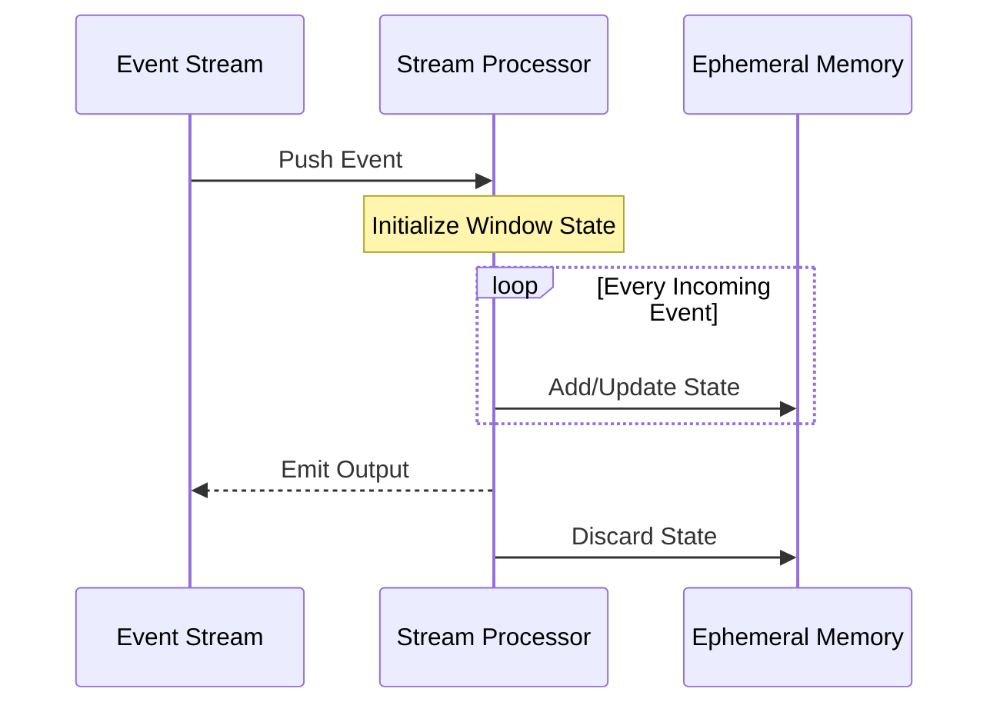

---

linkTitle: "Ephemeral State"
title: "Ephemeral State: Management of Temporary Processing State"
category: "Stateful and Stateless Processing"
series: "Stream Processing Design Patterns"
description: "Ephemeral State refers to the use of transient storage to retain computation state temporarily during processing, designed specifically for short-lived, non-persistent computation requirements."
categories:
- cloud-computing
- stream-processing
- state-management
tags:
- ephemeral-state
- stream-processing
- state-management
- temporary-storage
- design-pattern
date: 2024-07-07
type: docs

canonical: "https://softwarepatternslexicon.com/101/3/26"
license: "© 2024 Tokenizer Inc. CC BY-NC-SA 4.0"
---

## Introduction to Ephemeral State

Ephemeral State refers to state that is created, used, and discarded within the bounds of a single computation or a brief period during stream processing. Unlike persistent state, ephemeral state is not stored beyond its immediate use, making it ideal for computations where state retention beyond processing lifecycle offers no value.

This pattern is essential in high-throughput, low-latency environments where the overhead of managing persistent state storage is undesirable, and where processing logic focuses on transient data characteristics.

## Design Pattern Overview

The Ephemeral State pattern leverages in-memory data structures for temporary state management. By using ephemeral state, systems can efficiently process data streams without the latency or resource costs associated with durable storage mechanisms. Key considerations include the temporal scope of data, the constraints imposed by the computation logic, and the performance requirements of the system.

### When to Use

- **Short-lived computations**: When processing logic requires temporary state that aligns with episodic events, such as windowed aggregations in stream processing.
- **Transitional state storage**: Where state is used to mediate between stages of a computation and not needed after processing completes.
- **Performance optimization**: In scenarios where reducing the overhead of state persistence can lead to significant performance improvements.

## Example Scenario

Consider a stream processing application designed to analyze event logs for real-time trend detection. Within this application, specific processing windows may utilize ephemeral state to calculate aggregate metrics, such as counting unique events within a one-minute window. Once the window closes, the results are output, and the ephemeral state is discarded:

```java
public void processEvent(Stream<Event> eventStream) {
    eventStream
        .window(ZephyrWindows.of(TumblingDurations.ofMinutes(1)))
        .apply(new WindowFunction() {
            Map<String, Integer> ephemeralState = new HashMap<>();

            @Override
            public void apply(String key, Window window, Iterable<Event> events, Collector<Output> out) {
                for (Event event : events) {
                    ephemeralState.put(event.getType(), ephemeralState.getOrDefault(event.getType(), 0) + 1);
                }
                out.collect(new Output(key, ephemeralState));
                ephemeralState.clear();
            }
        });
}
```

In this Java-based stream processing example, we see the effective use of ephemeral state to temporarily store event counts within a processing window.

## Diagrams

### Ephemeral State Management Sequence Diagram



## Related Patterns

- **Stateful Stream Processing**: Unlike ephemeral state, this pattern requires the persistence of state over longer durations and typically utilizes durable storage.
- **Windowed Stream Processing**: Often uses ephemeral state to manage computations temporarily over bounded time frames.
- **Stateless Processing**: In contrast, completely devoid of state retention, focusing on transformations that rely solely on incoming events.

## Additional Resources

- [Stream Processing with Apache Flink](https://flink.apache.org/)
- [Stateful Stream Processing with Apache Kafka Streams](https://kafka.apache.org/documentation/streams/)
- [Designing Data-Intensive Applications by Martin Kleppmann](https://www.manning.com/books/designing-data-intensive-applications)

## Final Summary

The Ephemeral State pattern strategically uses in-memory state to support real-time processing needs without incurring the cost and complexity of persistent state management. Particularly well-suited for short-lived, high-volume data scenarios, it allows applications to leverage fast, transient storage to accelerate computations constrained within tight temporal boundaries, ensuring minimal latency and maximal performance.
