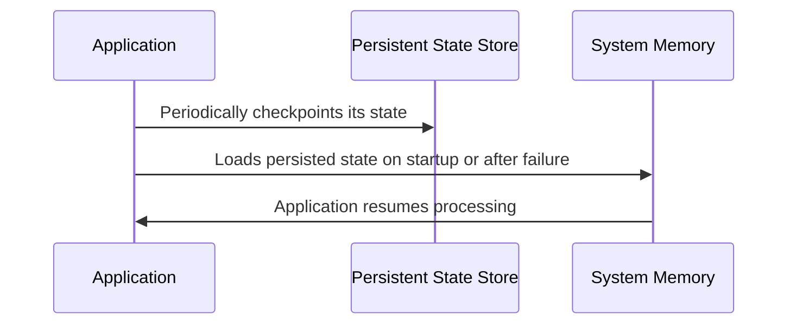

## State Rehydration

### Introduction

In distributed systems, particularly those dealing with stream processing, maintaining state across nodes is critical. When a node crashes or restarts, all in-memory states get lost. The State Rehydration pattern addresses this challenge by restoring state from persistent storage to allow systems to continue processing as if no disruption occurred.

### Architectural Overview

State Rehydration is pivotal in achieving fault tolerance and resilience. The architecture typically involves:

- **Persistent State Stores**: Leveraging databases or distributed file systems to persist state periodically.
- **Checkpointing Mechanisms**: Capturing application state at regular intervals.
- **State Recovery Logic**: On startup or recovery, loads the persisted state into the system's memory.

### Benefits

- **Improved Resilience**: Minimizes the data loss due to failures.
- **Consistent Processing**: Ensures that stream processing applications continue seamlessly after disruption.
- **Scalability**: Enables horizontal scaling by maintaining consistent state across distributed nodes.

### Example Code

Let's consider an example using Apache Kafka Streams for state rehydration:

```java
Properties props = new Properties();
props.put(StreamsConfig.APPLICATION_ID_CONFIG, "state-rehydration-example");
props.put(StreamsConfig.BOOTSTRAP_SERVERS_CONFIG, "localhost:9092");
props.put(StreamsConfig.STATE_DIR_CONFIG, "/tmp/kafka-streams");

StreamsBuilder builder = new StreamsBuilder();
KStream<String, String> stream = builder.stream("input-topic");

KTable<String, Long> countTable = stream
    .groupByKey()
    .count(Materialized.<String, Long, KeyValueStore<Bytes, byte[]>>as("counts-store"));

countTable.toStream().to("output-topic", Produced.with(Serdes.String(), Serdes.Long()));

KafkaStreams streams = new KafkaStreams(builder.build(), props);

// Application state is regularly checkpointed to '/tmp/kafka-streams/counts-store'
streams.setUncaughtExceptionHandler((thread, throwable) -> {
    // Custom logic to handle exceptions 
});

streams.start();
```

### UML Sequence Diagram



### Related Patterns

- **Checkpointing**: Focuses on capturing application state at fixed intervals.
- **Sharding**: Distributes state across shards in distributed databases or data stores.
- **Leader and Follower**: Uses leader nodes to manage state while followers act as replicas for failover scenarios.

### Best Practices

- **Frequent Checkpoints**: More frequent checkpoints lead to quicker recovery at the cost of increased storage I/O.
- **Efficient State Stores**: Ensure that the chosen state storage system can handle the volume and access patterns of your application.
- **Robust Error Handling**: Enhance fault tolerance by using robust exception handling strategies during the state rehydration process.

### Additional Resources

- [Kafka Streams Documentation](https://kafka.apache.org/documentation/streams/)
- [Flink Stateful Stream Processing](https://ci.apache.org/projects/flink/flink-docs-stable/dev/stream/state/state.html)
- [State Rehydration Concepts](https://www.cloudpatterns.org/?732-State-Rehydration)

### Summary

The State Rehydration design pattern is essential for building reliable and resilient stream processing systems. By leveraging persisted state stores and checkpointing mechanisms, applications can swiftly recover from failures, thus ensuring uninterrupted data processing and maintaining system integrity in distributed environments. This pattern, when combined with efficient architectural strategies, unfolds new dimensions of fault tolerance and scalability in cloud-native applications.
