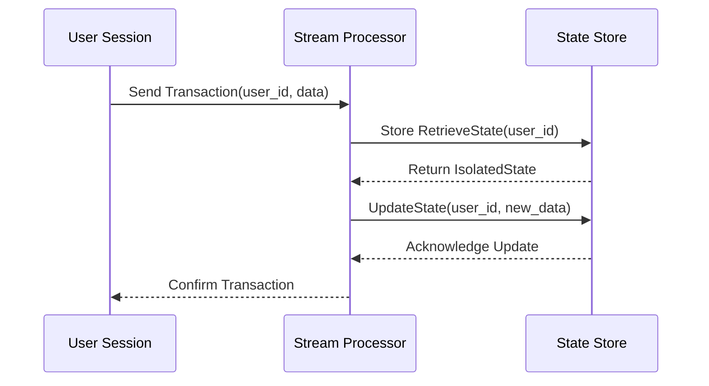

## Introduction

State Isolation is a critical design pattern in stream processing and cloud computing environments. It ensures that state is confined and isolated to individual users, sessions, or specific keys. This pattern plays a pivotal role in maintaining data privacy, security, and integrity. By preventing cross-user data leakage or interference, State Isolation enables personalized user experiences and helps safeguard sensitive information.

## Design Pattern Context and Problem

In systems where stateful processing is involved, each user or session typically interacts with their own unique state. For example, in e-commerce applications, each customer's shopping cart should be managed independently. Without proper isolation, states can become corrupted, leading to data breaches where one user's data could unintentionally affect others.

### Problems Addressed:
- Unintended data sharing between users.
- Data corruption due to shared state.
- Security vulnerabilities in multi-user environments.

## Architectural Approach

The State Isolation pattern is commonly implemented using mechanisms that ensure each user session or key has an independent state. This often involves:

- **Session-based Storage**: Storing state in session-dependent storage backends that are specifically keyed by user identifiers.
- **Partitioning**: Leveraging partitioning schemes in distributed data stores to maintain unique data spaces per key.
- **Multi-tenancy Aware Design**: Architecting systems that inherently support isolated tenant environments.

### Example Implementation

Consider an example in a stream processing framework like Apache Kafka Streams:

```java
StreamsBuilder builder = new StreamsBuilder();
KStream<String, String> orders = builder.stream("order_topic");

// Use the userId as a key to maintain separate states for each user
KGroupedStream<String, String> groupedOrders = orders.groupByKey();

// Aggregating order values for each user independently
KTable<String, Long> orderTotals = groupedOrders
    .aggregate(
        () -> 0L,
        (userId, orderValue, aggregate) -> aggregate + Long.parseLong(orderValue),
        Materialized.<String, Long, KeyValueStore<Bytes, byte[]>>as("state-store")
            .withKeySerde(Serdes.String())
            .withValueSerde(Serdes.Long())
    );
```

In this code snippet, each user's order total is aggregated separately, utilizing their user ID as the key to isolate the state in Kafka Streams.

## Diagrams

### State Isolation in Stream Processing



## Related Patterns

- **Circuit Breaker**: Can be used alongside State Isolation to prevent cascading failures by isolating states during error conditions.
- **Idempotent Consumers**: Ensures that processing is repeatable and has the same result each time which complements State Isolation by ensuring state transitions remain consistent.

## Best Practices

- **Data Encryption**: Ensure that isolated data is encrypted both at rest and in transit to further safeguard against unauthorized access.
- **Access Controls**: Implement strict access controls to state data, ensuring that it is only accessible by authorized user sessions.

## Additional Resources

- [Apache Kafka Streams Documentation](https://kafka.apache.org/documentation/streams/)
- [Understanding State in Stream Processing](https://some.blog/stream-processing-state)
- [Effective Multi-Tenancy](https://another.blog/multi-tenancy-best-practices)

## Summary

State Isolation is an essential pattern for any system dealing with stateful processing in multi-user environments. By ensuring that each user's or session's state is isolated and protected, developers can prevent data interference and enhance the security profile of cloud-based applications. Adhering to this pattern ensures a robust, secure, and privacy-compliant architecture.
