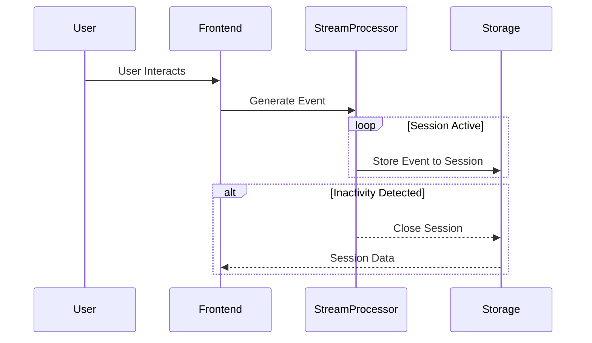

Sessionization is a stream processing design pattern focused on grouping events into sessions based on user activity. This process is essential for tracking user behavior over a period marked by start and end timelines, typically defined by a trailing measure of inactivity.

## Description

In stream processing, sessionization refers to the grouping of emitted events into logical, often contiguous, sessions associated with a specific user or entity. A session starts when user activity is detected and continues until an inactivity period exceeding a predefined threshold is reached. This pattern is paramount for applications needing insight into user behaviors and interactions over time, such as web analytics, transaction monitoring, and user engagement metrics.

For example, when analyzing website traffic, sessionization allows tracking visitor behavior by creating sessions whenever a user interacts with the website, like page views or clicks, and ending sessions when inactivity lasts beyond a configured time window.

## Architectural Approaches

1. **Stateful Stream Processing**: 
   - Utilize frameworks such as Apache Flink or Apache Kafka Streams that support stateful processing, which retains session states (e.g., active sessions and inactivity timers) despite stream continuation.
  
2. **Windowing**: 
   - Implement session windows with dynamic gaps in stream processing engines, which automatically recognize inactivity and decide session termination.

3. **Event Triggers**:
   - Configure triggers that fire on specific event patterns, contributing to the decision-making for starting or terminating sessions based on user activity patterns.

## Best Practices

- **Correct Session Definition**: Understand the domain to accurately define session boundaries (e.g., appropriate inactivity thresholds), as inadequate definitions may either discard significant activity as noise or aggregate distinct activities mistakenly.
- **State Management**: Efficient use of state storage with eviction policies for obsolete sessions ensures the system's scalability and relevance.
- **Resource Consideration**: Since sessions consume memory for state retention, resource allocation and optimized computation distribution across the processing cluster is necessary to avoid bottlenecks.
- **Data Deduplication**: Ensure mechanisms are in place to handle duplicate events due to network or system inconsistencies, preserving data integrity.

## Example Code

Below is an example of how sessionization might be configured using Apache Kafka Streams in Java:

```java
import org.apache.kafka.streams.KafkaStreams;
import org.apache.kafka.streams.StreamsBuilder;
import org.apache.kafka.streams.kstream.SessionWindows;
import org.apache.kafka.streams.kstream.KStream;

import java.time.Duration;

public class SessionizationExample {
    public static void main(String[] args) {
        StreamsBuilder builder = new StreamsBuilder();
        KStream<String, String> events = builder.stream("user-activity-topic");

        events.groupByKey()
              .windowedBy(SessionWindows.with(Duration.ofMinutes(30)))
              .count()
              .toStream()
              .foreach((windowedKey, count) -> {
                  String sessionInfo = String.format("Session for user %s lasted %d minutes with %d events",
                          windowedKey.key(), windowedKey.window().endTime().getEpochSecond(), count);
                  System.out.println(sessionInfo);
              });

        KafkaStreams streams = new KafkaStreams(builder.build(), new Properties());
        streams.start();
    }
}
```

## Diagrams

Below is a simplified UML sequence diagram illustrating how sessionization processes may function:



## Related Patterns

- **Event Sourcing**: Stores all state changes as a sequence of events, enabling traceability and reconstructions of session activities.
- **Time Windowed State Storage**: Manages state by aggregating events over fixed time intervals, which can complement sessionization by providing context to activities within a session.

## Additional Resources

- **Apache Flink Documentation**: Comprehensive resource on using Apache Flink for real-time stream processing. 
- **Kafka Streams Documentation**: Official documentation provides in-depth examples pertinent to implementing session states and windows in streaming applications.

## Summary

Sessionization is vital for aggregating and analyzing streams of user-generated events in real-time. It provides a clear-cut mechanism for detecting and understanding user sessions while accommodating both stateful and stateless processing needs. As an integral part of stream analytics, it aids in deriving meaningful insights and metrics, foundational for tailored user experiences and business decision-making.
