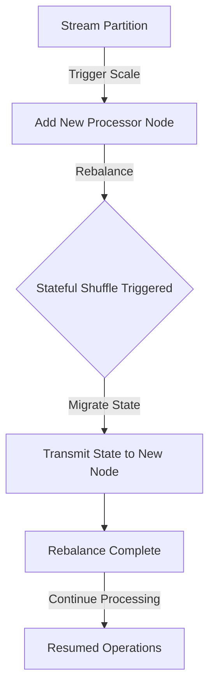

## Stateful Shuffle

### Description

The **Stateful Shuffle** pattern is critical in stream processing systems where the state needs to be reassigned during data reshuffling often prompted by scaling operations such as adding or removing processing nodes. This pattern ensures that the processing maintains access to relevant state data associated with specific keys as data is redistributed across new processing nodes.

### Detailed Explanation

Stream processing applications often operate with a key-based partitioning mechanism. When an application needs to scale, for instance, due to increased load, new processing nodes can be added. A critical challenge during this scale operation is ensuring that each key's associated state is transferred appropriately to match the new partitioning strategy.

**Stateful Shuffle** involves:

1. **State Tracking**: Keeping track of which keys have their state stored on which nodes.
2. **State Migration**: Efficiently transferring state data from one node to another during reshuffling without losing consistency or processing dynamics.
3. **State Consistency Assurance**: Ensuring that, during the transition period, the state remains consistent and queries against the state during shuffle return correct results.

### Example Code

Below is a pseudo example using a popular stream processing framework to highlight basic concepts. Let's illustrate state migration in a system using Apache Kafka Streams.

```java
public class StatefulShuffleExample {

    // Pseudo-code illustrating a stateful processing and shuffle

    public static void main(String[] args) {
        Properties props = new Properties();
        props.put(StreamsConfig.APPLICATION_ID_CONFIG, "stateful-shuffle-example");
        props.put(StreamsConfig.BOOTSTRAP_SERVERS_CONFIG, "localhost:9092");
        props.put(StreamsConfig.DEFAULT_KEY_SERDE_CLASS_CONFIG, Serdes.String().getClass());
        props.put(StreamsConfig.DEFAULT_VALUE_SERDE_CLASS_CONFIG, Serdes.String().getClass());

        StreamsBuilder builder = new StreamsBuilder();
        KStream<String, String> inputStream = builder.stream("input-topic");

        // Example of maintaining state
        KGroupedStream<String, String> groupedStream = inputStream.groupByKey();
        KTable<String, Long> aggregatedTable = groupedStream.count(Materialized.as("counts-store"));

        // Rebalancing logic involves Kafka Streams automatically relocating partitions
        // and ensuring state migration is synchronized when node assignments change

        KafkaStreams streams = new KafkaStreams(builder.build(), props);
        streams.start();

        // Add shutdown hook for proper state closure
        Runtime.getRuntime().addShutdownHook(new Thread(streams::close));
    }
}
```

### Diagram



### Related Patterns

- **State Management**: This pattern includes strategies like checkpoints to manage state.
- **Data Partitioning**: Addresses how data is logically divided to leverage parallel processing.
- **Load Balancing**: Distributing workloads across multiple computing resources efficiently.

### Best Practices

- **Ensure Idempotency**: Make processing logic idempotent to tolerate reprocessing during state transfers.
- **Monitor State Transitions**: Implement metrics and logs to monitor state migration and completion.
- **Consistent Hashing**: Use consistent hashing for key distribution which reduces the number of keys to be reassigned during a shuffle.

### Additional Resources

- [Kafka Streams Documentation](https://kafka.apache.org/documentation/streams/)
- [Stateful Stream Processing White Papers](https://example.com/whitepapers)
- [Distributed Data-Intensive Architecture](https://example.com/architecture-resources)

### Summary

The **Stateful Shuffle** pattern is fundamental in distributed stream processing for maintaining consistency and efficiency while rebalancing partitions during scaling. Through strategic state management, this pattern ensures smooth transitions and uninterrupted data stream processing.

By understanding and implementing this pattern, developers ensure that their streaming systems remain robust, adaptable, and capable of handling dynamic workloads in real time.
