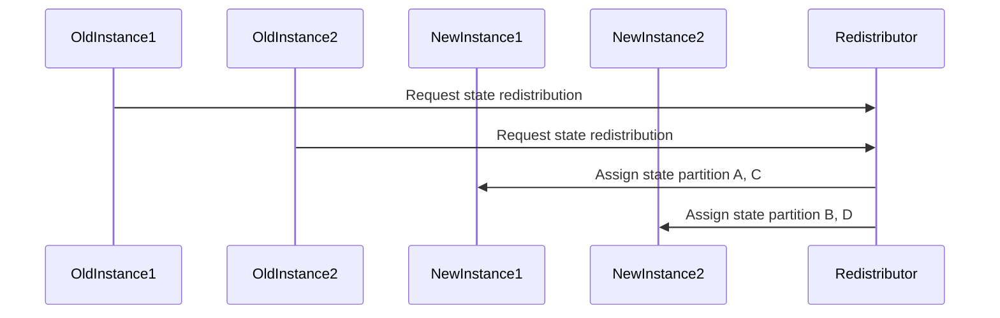

In a distributed system, especially in stream processing, maintaining state is crucial for tasks like aggregations, windowed operations, and joining streams. However, scaling stateful applications presents unique challenges because states must be preserved and accurately redistributed when the parallelism level changes. The "Scaling Stateful Processing" pattern addresses the strategies necessary to achieve efficient scalability in stateful stream processing systems.

## Understanding Stateful Processing

Stateful processing implies that an operation relies not just on an individual event but also on events processed previously. Typical stateful stream operations include:

- Windowed aggregations, where the results depend on the stream history within a time frame.
- Keyed state, where operations like joins, counting or tracking are conducted based on keys within the stream.

Maintaining and updating state efficiently and correctly, especially during scaling events, is a non-trivial task. 

## Key Strategies for Scaling Stateful Processing

### 1. State Partitioning and Distribution

State must be partitioned to ensure that it can be processed in parallel. Partitioning generally occurs based on a key, such as a user ID or another attribute of the data stream, allowing workloads to be distributed across different instances.

#### *Example Code for Keyed State*

Using Apache Flink, state partitioning can be achieved with keyed streams:
```scala
stream
  .keyBy(event => event.getUserId)
  .map(new RichMapFunction[Event, Result] {
    private var state: ValueState[SomeType] = _

    override def open(parameters: Configuration): Unit = {
      val descriptor = new ValueStateDescriptor[SomeType]("someDescriptiveName", classOf[SomeType])
      state = getRuntimeContext.getState(descriptor)
    }

    override def map(value: Event): Result = {
      // use or update the state
    }
  })
```

### 2. State Relocation during Scaling

When scaling up (or down), the system must redistribute the existing state among more (or fewer) nodes. Flink does this efficiently with state snapshots and state rescaling.

- **State Snapshot**: Periodically captures a snapshot of state which can be used for restoring upon failures or scaling events.
  
- **State Rescaling**: Upon scaling, the previous state snapshot is divided and reallocated to the new topology of nodes.

### 3. Handling Consistency and Disruptions

Scaling should maintain consistency of state, ensuring no duplication or data loss occurs. Systems like Kafka or Flink typically use mechanisms such as:

- **Changelog Capture**: Records incremental updates to state changes which can be replayed or audited during scaling.
  
- **Transactional State Management**: Transactions ensure that upon a scaling event, the state can be "moved" atomically.

### Best Practices

- **Regular State Cleanup**: Keep the state lean by discarding obsolete state information; use TTL (Time-To-Live) configurations where supported.
  
- **Monitor and Tune State Sizes**: Constantly monitor the state size and adjust configurations to prevent state blow-up.

- **Leverage Backpressure**: Use backpressure mechanisms to detect state build-up and apply load shedding or throttling.

## Diagrams

### State Redistribution on Scaling



## Related Patterns

- **CQRS (Command Query Responsibility Segregation)**: Separates read and write concerns which can assist in more simple state scaling strategies.
  
- **Event Sourcing**: Events capture the change in state, which aids in replaying and reconstructing state across distributed systems.

- **Sharding**: Distributes data across multiple storage instances, which closely relates to how state may be segmentally scaled.

## Additional Resources

- [Apache Flink: Stateful Computations](https://nightlies.apache.org/flink/flink-docs-master/docs/learn-flink/stateful-stream-processing/)
- [State Machines: Episode 71](https://www.realworlddeterminism.com/episode/71-stateful-stream-processing/)

## Summary

Scaling stateful processing in distributed systems requires careful attention to state partitioning, relocation, and consistency. By leveraging capabilities like state snapshots, efficient partitioning, and churn-free consistency mechanisms, systems can scale horizontally to accommodate rising loads while preserving the integrity and performance of stateful operations. The understanding and implementation of these strategies ensure that scaling operations enhance performance without sacrificing reliability or correctness.
