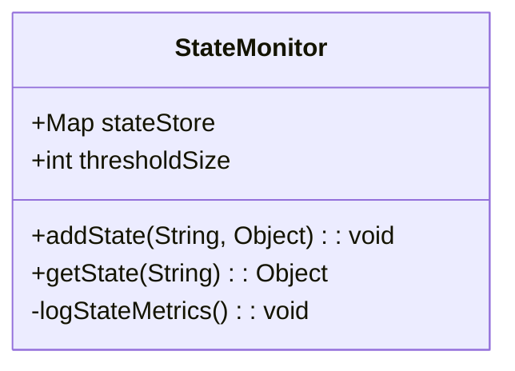

## Introduction

The **State Monitoring and Metrics** design pattern is crucial for stream processing systems, where the need to manage and monitor application state can significantly impact performance and resource allocation. This pattern involves tracking the size, growth, and performance of states to optimize these systems for better reliability and efficiency. Effective state management prevents issues such as memory leaks, mitigates against performance bottlenecks, and ensures that resources are used judiciously.

## Problem

Stream processing applications maintain state to process data continuously. Over time, the state can grow in size due to accumulating events, leading to potential performance degration or even out-of-memory errors if not managed properly. Without effective monitoring and metrics collection, these systems may suffer from unnoticed inefficiencies and reduced throughput.

## Solution

Implement mechanisms that continuously track metrics related to the state, such as state size, the number of state entries, and growth rate. These metrics should be monitored against defined thresholds to identify potential performance issues before they affect application stability. Employing tools and frameworks that provide real-time insights into state dynamics can facilitate proactive state management strategies.

### Components

1. **State Size Tracking**: Logs the physical size of state data held in memory or persisted in storage.
2. **State Growth Monitoring**: Monitors the rate of growth of application state over time to detect anomalies.
3. **Performance Metrics**: Tracks performance indicators such as processing latency, resource usage, and throughput in relation to the state.

### Techniques

- **Instrumenting Code**: Integrate logging and metrics collection tools within your stream processing application to capture necessary state information.
- **Threshold Alerts**: Define thresholds for state metrics that, when breached, trigger alerts to operators.
- **Auto-scaling Policies**: Use tracked metrics to adjust resources dynamically, scaling them up or down based on current state needs.

## Example Code

Here is a pseudocode example that reflects how you might integrate state monitoring in a Java-based stream processing application:

```java
import java.util.concurrent.ConcurrentHashMap;
import java.util.logging.Logger;

public class StateMonitor {

    private static final Logger logger = Logger.getLogger(StateMonitor.class.getName());
    private final ConcurrentHashMap<String, Object> stateStore;
    private final int thresholdSize;

    public StateMonitor(int thresholdSize) {
        this.stateStore = new ConcurrentHashMap<>();
        this.thresholdSize = thresholdSize;
    }

    public void addState(String key, Object value) {
        stateStore.put(key, value);
        logStateMetrics();
    }

    public Object getState(String key) {
        return stateStore.get(key);
    }

    private void logStateMetrics() {
        int currentSize = stateStore.size();
        logger.info("Current state size: " + currentSize);
        if (currentSize > thresholdSize) {
            logger.warning("State size threshold breached! Current size: " + currentSize);
        }
    }
}
```

## Diagrams

### State Monitoring Overview



## Related Patterns

- **Event Sourcing**: Maintains a history of state changes which can be replayed, aiding in diagnosing state growth issues.
- **Circuit Breaker**: Prevents downstream failure propagation due to incorrect state handling.
- **Backpressure**: Controls data inflow based on current state capacity to avoid overwhelming the system.

## Additional Resources

- Kafka Streams Documentation: Provides APIs for stateful stream processing.
- Flink State Backend Guide: In-depth look at managing states in Apache Flink.
- Prometheus: An open-source monitoring solution that can assist in gathering state metrics.

## Summary

The State Monitoring and Metrics pattern is essential for maintaining the robustness of stream processing systems. By actively tracking state characteristics and performance metrics, developers can prevent application errors due to excessive state growth and ensure optimal resource utilization. This proactive approach to state management is crucial in cloud environments where resource constraints and cost considerations are paramount.
