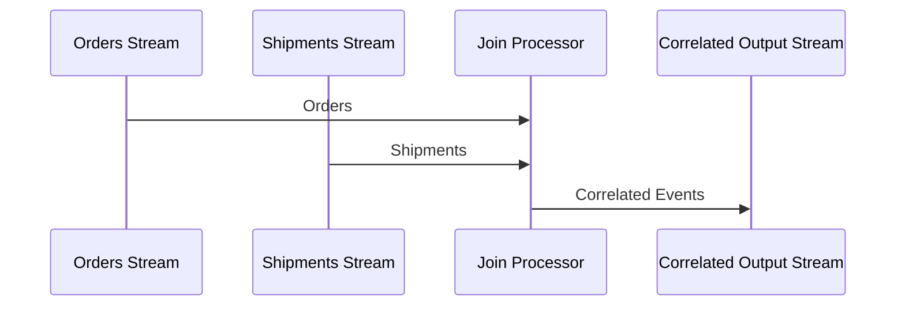

The **Stateful Join** pattern is a fundamental technique in stream processing where two or more streams of data are joined based on specific conditions, and maintaining state is essential to correctly correlate events that might not occur simultaneously. This pattern finds its utility in systems requiring real-time analytics and processing, such as matching orders with shipments or correlating user actions with system responses.

## Design Pattern Detail

### Architectural Approach

Stateful joins typically involve maintaining an in-memory state that stores unmatched events (e.g., orders) and waits for corresponding events from another stream (e.g., shipments). The state must be efficient and capable of handling large volumes of streams over time.

### Example Code

Here's a basic example using Apache Kafka Streams to perform a stateful join:

```java
StreamsBuilder builder = new StreamsBuilder();

// Define input streams
KStream<String, Order> ordersStream = builder.stream("orders");
KStream<String, Shipment> shipmentsStream = builder.stream("shipments");

// Join the streams with state
KStream<String, CorrelatedEvent> joinedStream = ordersStream.join(
    shipmentsStream,
    (order, shipment) -> new CorrelatedEvent(order, shipment),
    JoinWindows.of(Duration.ofMinutes(5)),
    Joined.with(
        Serdes.String(),
        orderSerde,
        shipmentSerde
    )
);

// Write the output to a Kafka topic
joinedStream.to("correlated-orders-shipments");
```

### Diagram



### Related Patterns

- **Windowed Joins**: Involves joining streams over sliding or tumbling time windows.
- **Event Sourcing**: Retains a sequence of events that can be used to refresh the state or replay the processing.

### Additional Resources

- [Kafka Streams Documentation](https://kafka.apache.org/documentation/streams)
- [Real-Time Stream Processing as Game-Changer in Big Data Analytics](https://www.scalablepath.com/blog/real-time-stream-processing)
- [Stateful Stream Processing: Applications and Challenges](https://dblp.org/conf/icws/xz2023)

## Best Practices

- **State Management**: Ensure efficient state management by using appropriate data structures and backing stores if required.
- **Event Time Semantics**: Use event time rather than processing time for accuracy in real-time applications.
- **Fault Tolerance**: Implement mechanisms for state recovery and fault tolerance to handle unexpected system failures.

## Summary

Stateful Join is instrumental in scenarios where streams must be correlated over time, demanding state retention to match and process events correctly. Appropriately managing the state can enhance the reliability and accuracy of the system, making it a vital consideration in streaming architectures.
