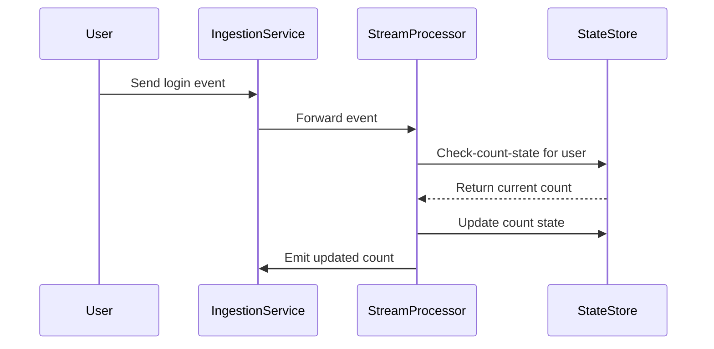

## Overview

The **Counting with State** design pattern is pivotal in scenarios where you need to maintain a running count of events in a streaming context. Traditional batch processing falls short in environments requiring low-latency results because data must be aggregated and counted in near real-time. By maintaining state, systems can instantaneously update and provide analytics, keeping track of event totals per unique identifier, such as user IDs or session IDs.

## Use Cases

- Counting user logins or actions within specific time windows or sessions.
- Monitoring click-through rates for online advertisements in real-time.
- Tracking transaction frequency for fraud detection in financial systems.
- Analyzing metrics from IoT devices such as sensor readings over time.

## Architectural Approach

### Key Components

1. **Event Stream**: The continuous flow of incoming events to the system. 
2. **State Storage**: A mechanism to retain the current count or state; this may be an in-memory store, a database, or a distributed state management system.
3. **Processor**: Consumes events, updates count state, and emits results as needed.

### Flow

1. **Event Ingestion**: Real-time data events are ingested into the system.
2. **State Checking**: For each incoming event, the system checks for existing state associated with the event's key.
3. **State Update**: If a state exists, the count is incremented. If not, a new state is initialized.
4. **Result Emission**: Based on requirements, results can be emitted either continuously or periodically, such as every completed window or specific interval.

## Implementation Example

Let's have a look at a basic implementation using Apache Flink, a popular stream processing framework:

```java
import org.apache.flink.api.common.functions.RichFlatMapFunction;
import org.apache.flink.api.common.state.ValueState;
import org.apache.flink.api.common.state.ValueStateDescriptor;
import org.apache.flink.configuration.Configuration;
import org.apache.flink.streaming.api.datastream.DataStream;
import org.apache.flink.streaming.api.environment.StreamExecutionEnvironment;
import org.apache.flink.util.Collector;

public class StatefulCountingExample {

    public static void main(String[] args) throws Exception {
        StreamExecutionEnvironment environment = StreamExecutionEnvironment.getExecutionEnvironment();

        DataStream<String> eventStream = environment.fromElements("user1", "user2", "user1", "user3", "user1");

        DataStream<String> counts = eventStream
            .keyBy(event -> event)
            .flatMap(new CountWithState());

        counts.print();

        environment.execute("Counting with State Example");
    }

    public static class CountWithState extends RichFlatMapFunction<String, String> {
        private transient ValueState<Integer> countState;

        @Override
        public void open(Configuration parameters) {
            ValueStateDescriptor<Integer> descriptor = new ValueStateDescriptor<>("count", Integer.class, 0);
            countState = getRuntimeContext().getState(descriptor);
        }

        @Override
        public void flatMap(String value, Collector<String> out) throws Exception {
            Integer currentCount = countState.value();
            currentCount += 1;
            countState.update(currentCount);
            out.collect("User: " + value + ", Count: " + currentCount);
        }
    }
}
```

## Diagram



## Related Patterns

- **Window-Based Counting**: Focuses on counting events within specific time windows rather than continuously.
- **Stateless Processing**: Operations which do not retain any information between processing calls, such as simple filtering.

## Additional Resources

- [Flink Documentation on State](https://nightlies.apache.org/flink/flink-docs-stable/docs/dev/datastream/state/)
- [Kafka Streams Developer Guide](https://kafka.apache.org/documentation/streams/)

## Conclusion

The **Counting with State** pattern is essential for systems requiring real-time aggregate insights over streaming data. Through efficient state management, this pattern enables scalable and resilient event counting, making it a fundamental cornerstone in the architecture of modern stream processing solutions.
