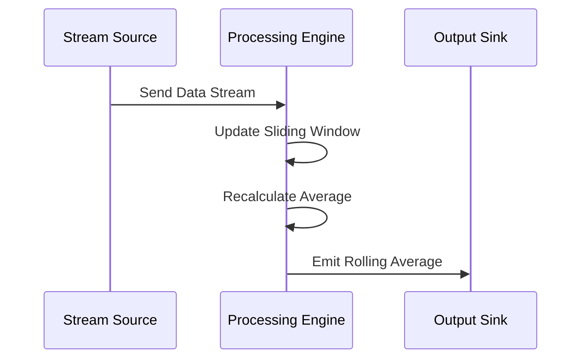

## Introduction

Rolling Averages is a stream processing design pattern that involves maintaining a moving average calculation over a dynamically updated data stream. It utilizes a sliding window to retain historical values for a specific time period or count, allowing the average to be recalculated as new data points are ingested. This pattern is particularly useful in real-time analytics and monitoring systems.

## Applicability

The Rolling Averages pattern is applicable in scenarios where continuous monitoring and up-to-date calculations of averages are required. Common use cases include:

- Monitoring system metrics such as CPU utilization, memory usage, or network traffic to identify trends and make informed decisions.
- Financial applications calculating moving averages of stock prices for technical analysis.
- IoT applications tracking sensor data to compute averages over time.

## Architectural Approach

The pattern architecture involves using a sliding window, which maintains a subset of the data stream for computation. There are two main types of windows:

1. **Time-based Window**: This type uses a fixed duration (e.g., 5 minutes) to determine the subset of data for average calculation.
2. **Count-based Window**: This window depends on a fixed number of latest data points (e.g., last 100 records).

A typical architectural flow for rolling averages includes:

- **Data Ingestion**: Stream of incoming data is ingested into the system.
- **Window Management**: A window manager retains the relevant data in the buffer.
- **Average Calculation**: The rolling average is recalculated whenever new data is added, or data expires from the window.

## Example Code

Here's an example using Apache Kafka Streams and Java to calculate rolling averages over a 5-minute window:

```java
StreamsBuilder builder = new StreamsBuilder();
KStream<String, Double> metricsStream = builder.stream("metrics-input");

// Aggregate CPU utilization over a time window
KTable<Windowed<String>, Double> rollingAverages = metricsStream
    .groupByKey()
    .windowedBy(TimeWindows.of(Duration.ofMinutes(5)))
    .aggregate(
        () -> 0.0,
        (key, newValue, aggValue) -> (aggValue + newValue) / 2,
        Materialized.with(Serdes.String(), Serdes.Double())
    );

// Output the rolling averages
rollingAverages.toStream().to("metrics-output", Produced.with(WindowedSerdes.String(), Serdes.Double()));
```

## Diagram

Here's a simplified Mermaid UML sequence diagram illustrating the Rolling Averages pattern:



## Related Patterns

- **Tumbling Window:** A pattern similar to sliding windows but without overlap between windows.
- **Event Time Processing:** Using timestamps for more precise calculations, especially in out-of-order data scenarios.
- **Micro-batching:** Efficient processing by batching small increments of data for better performance.

## Additional Resources

- "Kafka: The Definitive Guide" by Neha Narkhede, Gwen Shapira, and Todd Palino – Deep dive into stream processing with Kafka.
- Confluent's [Streams Documentation](https://docs.confluent.io/platform/current/streams/index.html) – For advanced usage and optimizations.

## Summary

The Rolling Averages pattern is pivotal for situations demanding real-time data analysis through sliding windows. By efficiently managing and calculating rolling averages, systems can continuously provide insights and adapt to changing data streams. Understanding its implementation and related architectural considerations allows developers to harness the full potential of streaming data.


